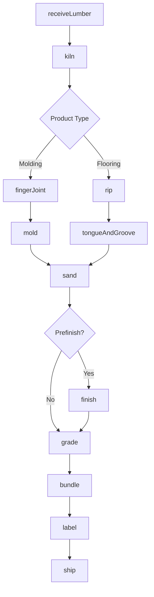
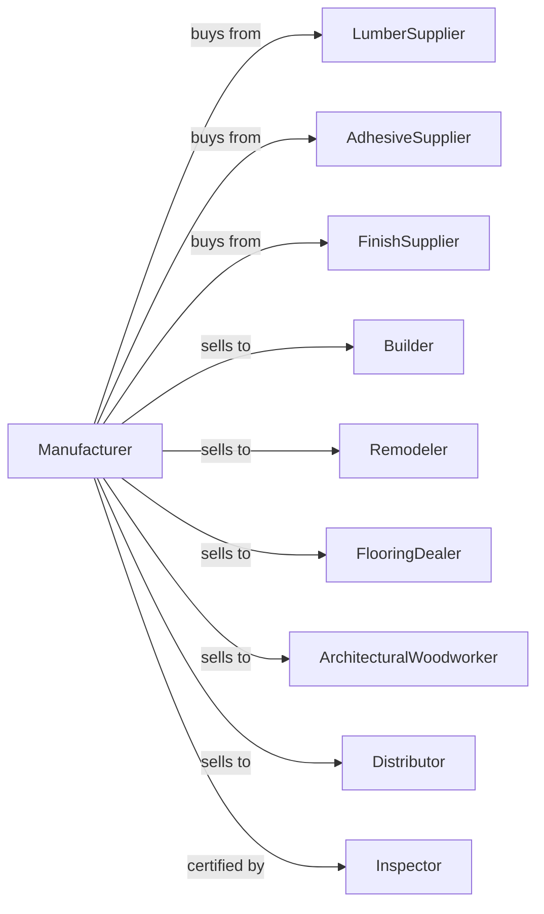

# Other Millwork (including Flooring)

> Business-as-Code definition for millwork and flooring manufacturing operations. Models the complete production process from lumber procurement through profiling, finishing, grading, and distribution of moldings, flooring, and architectural woodwork.

## Overview

This U.S. industry comprises establishments primarily engaged in manufacturing millwork (except wood windows, wood doors, and cut stock). Illustrative Examples: Clear and finger joint wood moldings manufacturing Decorative wood moldings (e.g., base, chair rail, crown, shoe) manufacturing Ornamental woodwork (e.g., cornices, mantel) manufacturing Planing mills, millwork Stairwork (e.g., newel posts, railings, stairs, staircases), wood, manufacturing Wood flooring manufacturing Wood shutters manuf

## Actors

| Actor | Description |
|-------|-------------|
| LumberSupplier | Provides clear and appearance-grade lumber |
| AdhesiveSupplier | Provides glues for finger-joint and lamination |
| FinishSupplier | Provides stains, sealers, and topcoats |
| Builder | Purchases millwork for new construction |
| Remodeler | Buys millwork for renovation projects |
| FlooringDealer | Distributes hardwood flooring products |
| ArchitecturalWoodworker | Purchases components for custom installations |
| Distributor | Wholesales millwork products |
| Inspector | Grades flooring and millwork to standards |

## Roles

| Role | Description |
|------|-------------|
| PlantOwner | Owns facility and directs business strategy |
| ProductionManager | Oversees daily manufacturing operations |
| MolderOperator | Operates molders for profile production |
| FlooringLineOperator | Runs flooring production equipment |
| FinishingTech | Applies stains and protective coatings |
| GradeSelector | Sorts products by appearance and quality |
| CNCProgrammer | Programs machines for custom profiles |

## Entities

| Entity | Description |
|--------|-------------|
| Lumber | Clear wood input for millwork production |
| Molding | Profiled trim piece for architectural use |
| Flooring | Tongue-and-groove wood floor material |
| Stairpart | Component for stair construction |
| Mantel | Decorative fireplace surround |
| Profile | Cross-sectional shape of molded product |
| Finish | Applied coating for protection and appearance |
| Grade | Quality classification by appearance |
| Species | Wood type affecting appearance and durability |
| Moisture | Water content critical for flooring stability |

## Actions

| Action | Description |
|--------|-------------|
| receiveLumber | Accept appearance-grade lumber shipments |
| kiln | Dry lumber to precise moisture content |
| fingerJoint | Join short pieces into longer lengths |
| rip | Cut lumber to required widths |
| mold | Run lumber through molder for profiles |
| tongueAndGroove | Mill flooring with interlocking edges |
| sand | Smooth surfaces to specified finish |
| finish | Apply stain, sealer, or topcoat |
| grade | Classify by appearance and defect criteria |
| bundle | Package products by grade and length |
| label | Mark bundles with grade and species |
| ship | Deliver products to customers |

## Events

| Event | Description |
|-------|-------------|
| lumberReceived | Raw material accepted and inventoried |
| lumberKilned | Target moisture content achieved |
| lumberJointed | Finger-joint lamination completed |
| lumberRipped | Width cutting completed |
| profileMolded | Molding profile completed |
| flooringMilled | Tongue-and-groove milling completed |
| productSanded | Surface smoothing completed |
| productFinished | Coating applied and cured |
| productGraded | Quality classification assigned |
| orderBundled | Products packaged for shipment |
| orderShipped | Products delivered to customer |

## Searches

| Search | Description |
|--------|-------------|
| findLumber | List available lumber by species and grade |
| getInventory | Retrieve millwork stock by profile and species |
| getFlooringInventory | Retrieve flooring by grade and width |
| getProfiles | List available molding profiles |
| findOrders | List pending customer orders |
| getCapacity | Check production capacity by product type |
| getGradeYield | Analyze grade distribution from lumber input |

## Workflow



## Actor Relationships



## Usage

### Calling Actions

```typescript
import { manufactureMillwork } from '@headlessly/manufacture-millwork'

const plant = manufactureMillwork()

// Receive premium hardwood
const lumber = await plant.receiveLumber({
  species: 'white-oak',
  grade: 'select',
  thickness: '4/4',
  quantity: 10000
})

// Dry to flooring moisture spec
await plant.kiln({
  lumberIds: lumber.ids,
  targetMoisture: 7,
  schedule: 'hardwood-standard'
})

// Mill tongue-and-groove flooring
const flooring = await plant.tongueAndGroove({
  lumberIds: lumber.ids,
  width: 3.25,
  thickness: 0.75,
  endMatch: true
})
```

### Event-Driven Automation

```typescript
// Auto-grade after milling
plant.flooringMilled(async ({ flooringIds, species, width }) => {
  for (const flooringId of flooringIds) {
    await plant.grade({
      productId: flooringId,
      standard: 'NWFA',
      criteria: ['color', 'grain', 'defects']
    })
  }
})

// Auto-finish select grades
plant.productGraded(async ({ productId, grade, productType }) => {
  if (grade === 'select' && productType === 'flooring') {
    await plant.finish({
      productId,
      process: ['sand-150', 'sealer', 'sand-220', 'topcoat-3x'],
      sheen: 'satin'
    })
  }
})
```
