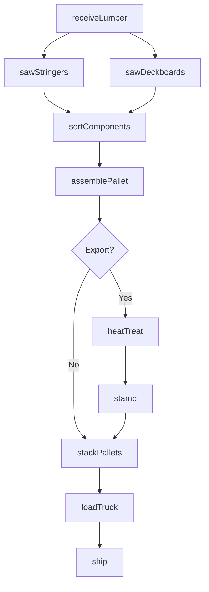
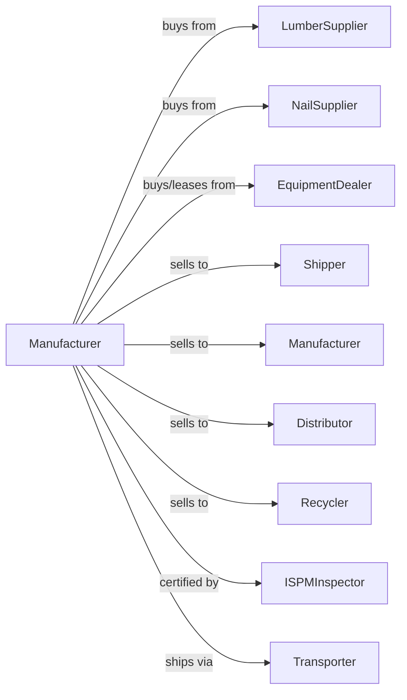

# Wood Container and Pallet Manufacturing

> Business-as-Code definition for wood container and pallet manufacturing operations. Models the complete production process from lumber procurement through cutting, assembly, heat treatment, and distribution of pallets, crates, and containers.

## Overview

This industry comprises establishments primarily engaged in manufacturing wood pallets, wood box shook, wood boxes, other wood containers, and wood parts for pallets and containers. Cross-References.

## Actors

| Actor | Description |
|-------|-------------|
| LumberSupplier | Provides pallet-grade lumber and cants |
| NailSupplier | Provides fasteners for pallet assembly |
| EquipmentDealer | Sells and services nailing equipment and saws |
| Shipper | Purchases pallets for logistics operations |
| Manufacturer | Buys pallets and crates for product shipping |
| Distributor | Warehouses and resells pallets regionally |
| Recycler | Buys damaged pallets for repair or recycling |
| ISPMInspector | Certifies heat treatment for export compliance |
| Transporter | Handles delivery of pallet products |

## Roles

| Role | Description |
|------|-------------|
| PlantOwner | Owns facility and directs business operations |
| ProductionManager | Oversees daily manufacturing schedule |
| SawOperator | Operates gang saws and cut-off equipment |
| NailerOperator | Runs automatic or manual nailing stations |
| HeatTreatOperator | Manages kiln for ISPM-15 compliance |
| QualityInspector | Checks pallet specifications and strength |
| YardWorker | Handles lumber and pallet inventory |

## Entities

| Entity | Description |
|--------|-------------|
| Lumber | Pallet-grade wood input |
| Cant | Squared timber for stringer production |
| Stringer | Load-bearing pallet component |
| Deckboard | Top and bottom pallet surface boards |
| Block | Support component for block-style pallets |
| Pallet | Finished shipping platform product |
| Crate | Enclosed wood shipping container |
| Shook | Pre-cut container components |
| HeatStamp | ISPM-15 certification marking |
| Specification | Customer requirements for dimensions and load |

## Actions

| Action | Description |
|--------|-------------|
| receiveLumber | Accept lumber and cant shipments |
| sawStringers | Cut lumber into stringer components |
| sawDeckboards | Cut lumber into deckboard components |
| sortComponents | Organize parts by size and quality |
| assemblePallet | Nail components into finished pallets |
| repairPallet | Fix damaged pallets for reuse |
| heatTreat | Process pallets for ISPM-15 export compliance |
| stamp | Apply certification mark to treated pallets |
| stackPallets | Organize finished pallets for storage |
| loadTruck | Prepare pallets for delivery |
| ship | Deliver pallets to customers |
| recycle | Process damaged pallets into components |

## Events

| Event | Description |
|-------|-------------|
| lumberReceived | Raw material accepted and inventoried |
| stringersCut | Stringer production completed |
| deckboardsCut | Deckboard production completed |
| componentsSorted | Parts organized for assembly |
| palletAssembled | Pallet construction completed |
| palletRepaired | Damaged pallet restored to use |
| palletTreated | Heat treatment cycle completed |
| palletStamped | ISPM-15 certification applied |
| palletsStacked | Inventory organized in yard |
| truckLoaded | Delivery prepared |
| orderShipped | Products delivered to customer |

## Searches

| Search | Description |
|--------|-------------|
| findLumber | List available pallet lumber inventory |
| getInventory | Retrieve pallet stock by size and type |
| findOrders | List pending customer orders |
| getProduction | Monitor daily assembly output |
| getTreatmentSchedule | Check heat treatment chamber availability |
| getRepairQueue | List pallets awaiting repair |
| getCustomerSpecs | Retrieve customer pallet specifications |

## Workflow



## Actor Relationships



## Usage

### Calling Actions

```typescript
import { manufactureWoodContainer } from '@headlessly/manufacture-wood-container'

const plant = manufactureWoodContainer()

// Create production order for standard pallets
const order = await plant.createOrder({
  customerId: 'logistics-co',
  palletType: 'GMA-48x40',
  quantity: 1000,
  treatment: 'heat-treated',
  deliveryDate: '2024-03-20'
})

// Cut components for order
await plant.sawStringers({
  orderId: order.id,
  length: 48,
  width: 1.5,
  thickness: 3.5,
  quantity: 3000
})

// Assemble pallets
await plant.assemblePallet({
  orderId: order.id,
  nailPattern: 'standard',
  nailsPerBoard: 2
})
```

### Event-Driven Automation

```typescript
// Auto-treat export pallets
plant.palletAssembled(async ({ palletIds, orderId }) => {
  const order = await plant.findOrders({ orderId })

  if (order.treatment === 'heat-treated') {
    await plant.heatTreat({
      palletIds,
      coreTemp: 56,
      duration: 30,
      chamber: 'kiln-1'
    })
  }
})

// Auto-stamp after treatment
plant.palletTreated(async ({ palletIds, treatmentLog }) => {
  if (treatmentLog.verified) {
    await plant.stamp({
      palletIds,
      mark: 'ISPM-15',
      countryCode: 'US',
      facilityId: 'HT-12345'
    })
  }
})
```
