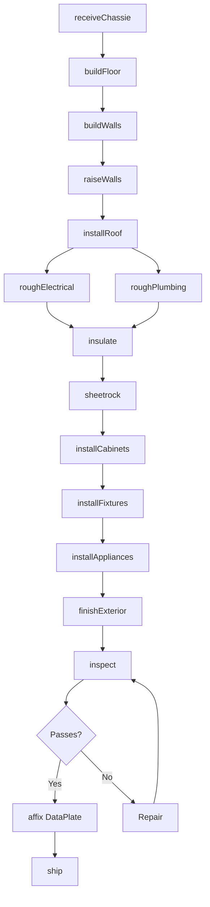
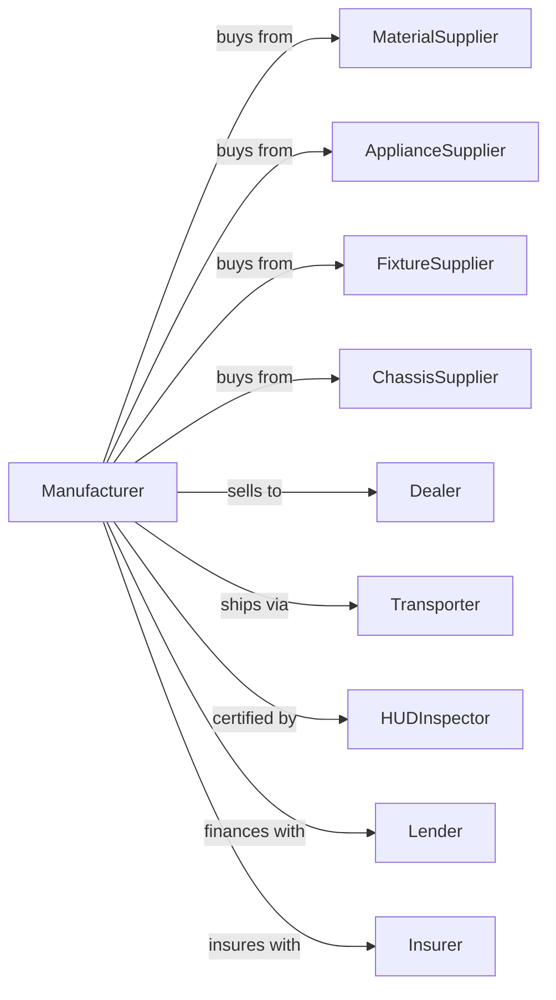

# Manufactured Home (Mobile Home) Manufacturing

> Business-as-Code definition for manufactured home production operations. Models the complete assembly line process from floor system construction through finishing, inspection, and transport to retail locations or homesites.

## Overview

This U.S. industry comprises establishments primarily engaged in making manufactured homes (i.e., mobile homes) and nonresidential mobile buildings. Manufactured homes are designed to accept permanent water, sewer, and utility connections and although equipped with wheels, they are not intended for regular highway movement. Cross-References. Establishments primarily engaged in--

## Actors

| Actor | Description |
|-------|-------------|
| MaterialSupplier | Provides lumber, steel, and construction materials |
| ApplianceSupplier | Provides HVAC, water heaters, and kitchen appliances |
| FixtureSupplier | Provides plumbing fixtures, cabinets, and trim |
| ChassisSupplier | Provides steel frame and running gear |
| Dealer | Sells manufactured homes to consumers |
| Transporter | Moves completed homes to lots or sites |
| HUDInspector | Certifies compliance with federal construction codes |
| Lender | Provides consumer financing for home purchases |
| Insurer | Provides warranty and liability coverage |

## Roles

| Role | Description |
|------|-------------|
| PlantOwner | Owns facility and directs business strategy |
| ProductionManager | Oversees assembly line operations |
| FloorBuilder | Constructs floor systems on chassis |
| WallBuilder | Assembles and raises wall sections |
| RoofInstaller | Installs roof trusses and decking |
| ElectricalTech | Installs wiring and electrical systems |
| PlumbingTech | Installs plumbing and fixtures |
| FinishCarpenter | Installs trim, cabinets, and interior finishes |
| QualityInspector | Verifies HUD code compliance at stations |

## Entities

| Entity | Description |
|--------|-------------|
| Chassis | Steel frame with axles and hitch |
| FloorSystem | Structural floor with insulation and decking |
| WallSection | Pre-built wall panel with openings |
| RoofTruss | Engineered roof structure |
| HomeSection | Single-wide or half of double-wide unit |
| DataPlate | HUD certification and specification label |
| BillOfMaterials | Component list for home model |
| FloorPlan | Layout design for home model |
| SerialNumber | Unique identifier for manufactured home |
| Warranty | Coverage for defects and systems |

## Actions

| Action | Description |
|--------|-------------|
| receiveChassie | Accept steel frame and running gear |
| buildFloor | Construct floor system with joists and decking |
| buildWalls | Assemble wall sections with sheathing |
| raiseWalls | Set and secure wall sections to floor |
| installRoof | Set trusses and apply roof decking |
| roughElectrical | Install wiring and electrical boxes |
| roughPlumbing | Install supply and drain lines |
| insulate | Install wall, floor, and ceiling insulation |
| sheetrock | Install and finish interior walls |
| installCabinets | Set kitchen and bath cabinetry |
| installFixtures | Mount plumbing and electrical fixtures |
| installAppliances | Set and connect major appliances |
| finishExterior | Apply siding, roofing, and trim |
| inspect | Verify HUD code compliance |
| affix DataPlate | Install certification label |
| ship | Transport home to dealer or site |

## Events

| Event | Description |
|-------|-------------|
| chassisReceived | Steel frame accepted for production |
| floorBuilt | Floor system construction completed |
| wallsRaised | Wall sections secured to floor |
| roofInstalled | Roof structure completed |
| roughInCompleted | Electrical and plumbing roughed in |
| insulationInstalled | Thermal envelope completed |
| interiorFinished | Walls, floors, and ceilings completed |
| cabinetsInstalled | Kitchen and bath cabinetry set |
| fixturesInstalled | Plumbing and electrical fixtures mounted |
| appliancesInstalled | Major appliances connected |
| exteriorFinished | Siding and roofing completed |
| homeInspected | HUD compliance verified |
| dataPlateAffixed | Certification label installed |
| homeShipped | Unit transported to destination |

## Searches

| Search | Description |
|--------|-------------|
| findMaterials | List available construction materials |
| getProduction | Monitor homes in production by station |
| getOrders | List dealer orders by model and delivery |
| getInventory | Retrieve completed homes awaiting shipment |
| getInspectionStatus | Check HUD inspection results |
| getFloorPlans | List available home models and options |
| getWarrantyStatus | Retrieve warranty claims and status |

## Workflow



## Actor Relationships



## Usage

### Calling Actions

```typescript
import { manufactureManufacturedHome } from '@headlessly/manufacture-manufactured-home'

const plant = manufactureManufacturedHome()

// Start production on dealer order
const home = await plant.startProduction({
  dealerOrderId: 'dlr-2024-001',
  model: 'summit-1680',
  floorPlan: '3BR-2BA',
  options: ['upgraded-appliances', 'vinyl-plank', 'dormers']
})

// Build floor system on chassis
await plant.buildFloor({
  homeId: home.id,
  chassisId: 'chs-5678',
  joistSpacing: 16,
  insulation: 'R-22'
})

// Install roof structure
await plant.installRoof({
  homeId: home.id,
  trussType: 'cathedral',
  pitch: '4/12',
  shingles: 'architectural'
})
```

### Event-Driven Automation

```typescript
// Auto-inspect at stations
plant.interiorFinished(async ({ homeId, station }) => {
  await plant.inspect({
    homeId,
    station,
    checkpoints: ['sheetrock', 'insulation', 'vapor-barrier']
  })
})

// Auto-ship when inspection passes
plant.homeInspected(async ({ homeId, passed, serialNumber }) => {
  if (passed) {
    await plant.affixDataPlate({
      homeId,
      serialNumber,
      hudLabel: generateHUDLabel(homeId)
    })

    const order = await plant.getOrders({ homeId })

    await plant.ship({
      homeId,
      destination: order.deliveryAddress,
      escortRequired: true
    })
  }
})
```
