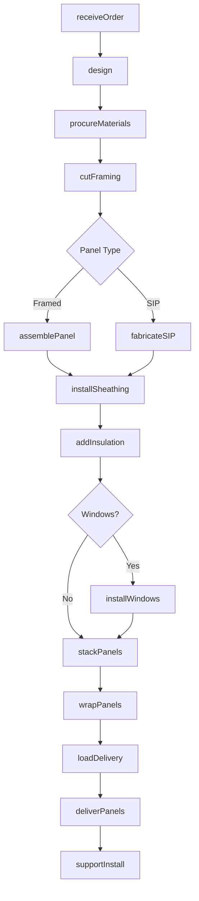
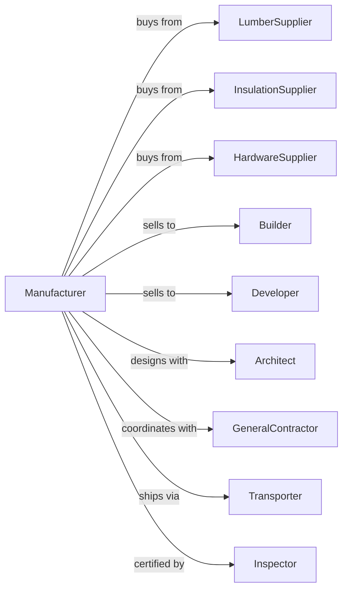

# Prefabricated Wood Building Manufacturing

> Business-as-Code definition for prefabricated wood building manufacturing operations. Models the complete production process from design through panel fabrication, pre-assembly, and delivery to construction sites.

## Overview

This U.S. industry comprises establishments primarily engaged in manufacturing prefabricated wood buildings and wood sections and panels for prefabricated wood buildings. Cross-References. Establishments primarily engaged in--

## Actors

| Actor | Description |
|-------|-------------|
| LumberSupplier | Provides framing lumber and sheathing panels |
| InsulationSupplier | Provides foam, fiberglass, and SIP cores |
| HardwareSupplier | Provides fasteners, connectors, and brackets |
| Builder | Purchases panels and buildings for projects |
| Developer | Orders prefab buildings for subdivisions |
| Architect | Designs buildings using prefab systems |
| GeneralContractor | Coordinates site work and panel installation |
| Transporter | Delivers panels and buildings to sites |
| Inspector | Certifies structural and energy compliance |

## Roles

| Role | Description |
|------|-------------|
| PlantOwner | Owns facility and directs business strategy |
| ProductionManager | Oversees daily manufacturing operations |
| DesignEngineer | Creates panel layouts and structural details |
| PanelBuilder | Assembles wall, floor, and roof panels |
| SIPFabricator | Manufactures structural insulated panels |
| QualityInspector | Verifies panel specifications and quality |
| LogisticsCoordinator | Plans delivery sequences for site assembly |

## Entities

| Entity | Description |
|--------|-------------|
| WallPanel | Pre-framed wall section with sheathing |
| FloorPanel | Pre-built floor cassette |
| RoofPanel | Pre-assembled roof section |
| SIP | Structural insulated panel with foam core |
| Module | Complete room or building section |
| ConnectorPlate | Hardware joining panels on site |
| Drawing | Engineering drawing for panel production |
| CutList | Component list for panel fabrication |
| DeliverySequence | Order of panels for site assembly |
| Building | Complete prefabricated structure |

## Actions

| Action | Description |
|--------|-------------|
| receiveOrder | Accept building or panel order with specs |
| design | Create panel layouts and cut lists |
| procureMaterials | Order lumber, sheathing, and components |
| cutFraming | Cut lumber to panel specifications |
| assemblePanel | Build wall, floor, or roof panels |
| fabricateSIP | Manufacture structural insulated panels |
| installSheathing | Apply OSB or plywood to panels |
| addInsulation | Install insulation in panel cavities |
| installWindows | Pre-install windows in wall panels |
| stackPanels | Organize panels for shipping sequence |
| wrapPanels | Protect panels for transport |
| loadDelivery | Load panels in site assembly order |
| deliverPanels | Transport to construction site |
| supportInstall | Provide technical support for site assembly |

## Events

| Event | Description |
|-------|-------------|
| orderReceived | Building specifications accepted |
| designCompleted | Panel drawings and cut lists finalized |
| materialsProcured | Construction materials received |
| framingCut | Lumber cut to specifications |
| panelAssembled | Individual panel completed |
| sipFabricated | SIP panel manufactured |
| sheathingInstalled | Panel sheathing applied |
| insulationAdded | Panel insulation installed |
| windowsInstalled | Window pre-installation completed |
| panelsStacked | Panels organized for delivery |
| panelsWrapped | Weather protection applied |
| deliveryLoaded | Panels loaded for transport |
| panelsDelivered | Panels arrived at site |
| installSupported | Technical assistance provided |

## Searches

| Search | Description |
|--------|-------------|
| getOrders | List pending building orders |
| getDesigns | Retrieve panel drawings by project |
| getInventory | Check materials and panel stock |
| getProduction | Monitor panels in production |
| getDeliverySchedule | List upcoming deliveries |
| getProjectStatus | Track project from order to delivery |
| getPanelSpecs | Retrieve specifications by panel type |

## Workflow



## Actor Relationships



## Usage

### Calling Actions

```typescript
import { manufacturePrefabricatedWood } from '@headlessly/manufacture-prefabricated-wood'

const plant = manufacturePrefabricatedWood()

// Accept building order
const order = await plant.receiveOrder({
  builderId: 'custom-homes-inc',
  projectName: 'mountain-cabin',
  buildingType: 'residential',
  sqft: 1800,
  panelSystem: 'SIP'
})

// Generate panel designs
const design = await plant.design({
  orderId: order.id,
  wallHeight: 9,
  roofPitch: '6/12',
  windowSchedule: order.windowSchedule
})

// Fabricate SIP panels
await plant.fabricateSIP({
  designId: design.id,
  coreThickness: 6.5,
  coreMaterial: 'EPS',
  skinMaterial: 'OSB-7/16'
})
```

### Event-Driven Automation

```typescript
// Auto-wrap after panel completion
plant.panelAssembled(async ({ panelId, projectId, panelType }) => {
  await plant.stackPanels({
    panelId,
    projectId,
    location: `staging-${projectId}`,
    sequence: await getDeliverySequence(panelId)
  })
})

// Auto-schedule delivery when project complete
plant.panelsStacked(async ({ projectId, totalPanels }) => {
  const project = await plant.getProjectStatus({ projectId })

  if (project.panelsCompleted === totalPanels) {
    await plant.wrapPanels({ projectId })

    await plant.loadDelivery({
      projectId,
      deliveryDate: project.siteReadyDate,
      sequence: 'assembly-order'
    })
  }
})
```
