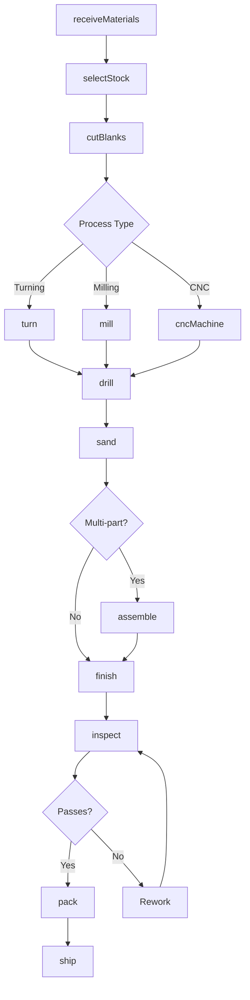
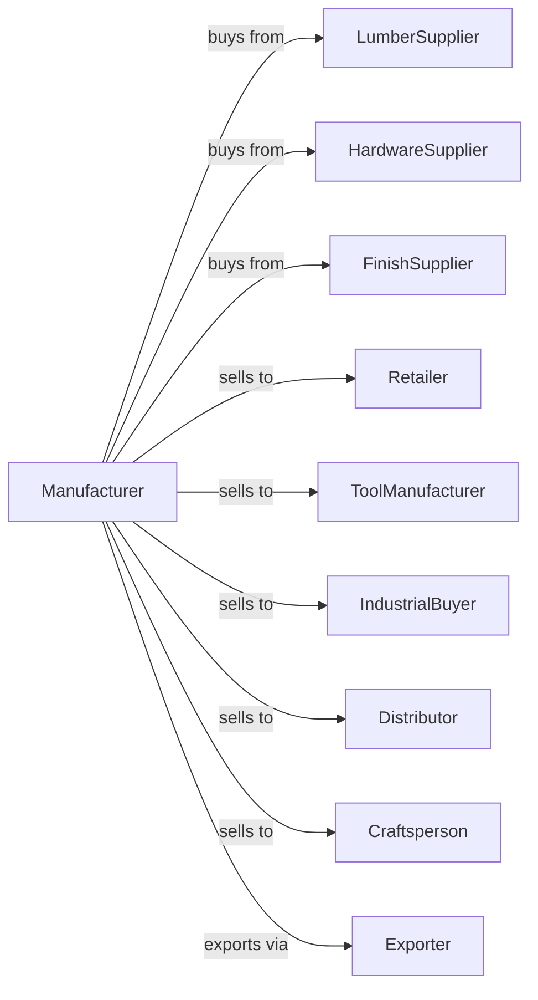

# All Other Miscellaneous Wood Product Manufacturing

> Business-as-Code definition for miscellaneous wood product manufacturing operations. Models the production of specialty wood products including tool handles, frames, ladders, and turned wood products.

## Overview

This U.S. industry comprises establishments primarily engaged in manufacturing wood products (except establishments operating sawmills and preservation facilities; establishments manufacturing veneer, engineered wood products, millwork, wood containers, pallets, and wood container parts; and establishments making manufactured homes (i.e., mobile homes) and prefabricated buildings and components). Illustrative Examples: Cabinets (i.e., housings), wood (e.g., sewing machines, stereo, television),

## Actors

| Actor | Description |
|-------|-------------|
| LumberSupplier | Provides hardwood and specialty lumber |
| HardwareSupplier | Provides fasteners, hinges, and metal parts |
| FinishSupplier | Provides stains, lacquers, and coatings |
| Retailer | Sells finished wood products to consumers |
| ToolManufacturer | Purchases handles for tools |
| IndustrialBuyer | Purchases wood components for assembly |
| Distributor | Wholesales wood products |
| Craftsperson | Purchases blanks and components |
| Exporter | Handles international sales |

## Roles

| Role | Description |
|------|-------------|
| ShopOwner | Owns facility and directs operations |
| ProductionManager | Oversees daily manufacturing |
| LatheOperator | Turns wood on lathe for handles and parts |
| CNCOperator | Programs and runs CNC machinery |
| AssemblyWorker | Assembles multi-component products |
| FinishingTech | Applies stains and protective coatings |
| QualityInspector | Verifies product specifications |

## Entities

| Entity | Description |
|--------|-------------|
| Lumber | Wood material input for products |
| Blank | Pre-cut piece ready for shaping |
| Handle | Turned or shaped tool handle |
| Frame | Picture frame or cabinet frame |
| Ladder | Portable climbing equipment |
| TurnedProduct | Lathe-produced item like spindles or legs |
| Dowel | Round wood rod for joining |
| Assembly | Multi-component finished product |
| Finish | Applied coating for protection |
| Specification | Product requirements and tolerances |

## Actions

| Action | Description |
|--------|-------------|
| receiveMaterials | Accept lumber and component shipments |
| selectStock | Choose appropriate lumber for products |
| cutBlanks | Prepare rough shapes for processing |
| turn | Shape wood on lathe |
| mill | Shape wood on molder or shaper |
| cncMachine | Process on CNC for complex shapes |
| drill | Create holes for fasteners or dowels |
| sand | Smooth surfaces to finish specification |
| assemble | Join components into finished products |
| finish | Apply stain, lacquer, or paint |
| inspect | Verify quality and specifications |
| pack | Prepare products for shipment |
| ship | Deliver products to customers |

## Events

| Event | Description |
|-------|-------------|
| materialsReceived | Lumber and supplies accepted |
| stockSelected | Appropriate material chosen |
| blanksCut | Rough shapes prepared |
| productTurned | Lathe operation completed |
| productMilled | Shaping operation completed |
| productMachined | CNC processing completed |
| productDrilled | Holes created |
| productSanded | Surface smoothing completed |
| productAssembled | Components joined |
| productFinished | Coating applied and cured |
| productInspected | Quality verified |
| orderPacked | Products prepared for shipment |
| orderShipped | Products delivered to customer |

## Searches

| Search | Description |
|--------|-------------|
| findMaterials | List available lumber by species |
| getInventory | Retrieve finished product stock |
| getOrders | List pending customer orders |
| getProduction | Monitor products in process |
| getSpecifications | Retrieve product requirements |
| getCapacity | Check production availability |
| getFinishSchedule | Monitor finishing queue |

## Workflow



## Actor Relationships



## Usage

### Calling Actions

```typescript
import { manufactureWoodProduct } from '@headlessly/manufacture-wood-product'

const shop = manufactureWoodProduct()

// Produce tool handles
const order = await shop.createOrder({
  customerId: 'hammer-co',
  product: 'hammer-handle',
  species: 'hickory',
  length: 14,
  quantity: 5000
})

// Cut blanks from lumber
const blanks = await shop.cutBlanks({
  orderId: order.id,
  dimensions: { length: 15, width: 1.5, height: 1.5 },
  grain: 'straight'
})

// Turn handles on lathe
await shop.turn({
  blankIds: blanks.ids,
  profile: 'hammer-14in',
  tolerance: 0.015
})
```

### Event-Driven Automation

```typescript
// Auto-sand after turning
shop.productTurned(async ({ productId, profile }) => {
  await shop.sand({
    productId,
    grits: [80, 120, 180],
    finish: 'smooth'
  })
})

// Auto-finish and pack
shop.productSanded(async ({ productId, orderId }) => {
  const order = await shop.getOrders({ orderId })

  await shop.finish({
    productId,
    type: order.finishType || 'lacquer',
    coats: 2
  })

  await shop.inspect({
    productId,
    criteria: ['dimensions', 'finish', 'grain']
  })
})
```
