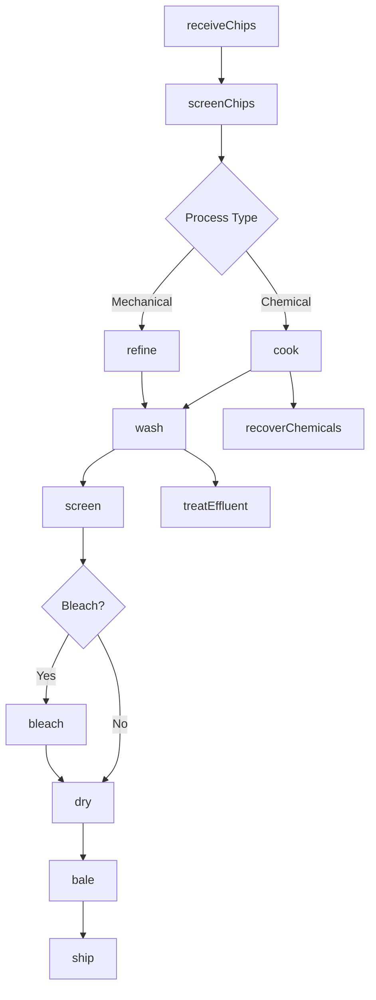
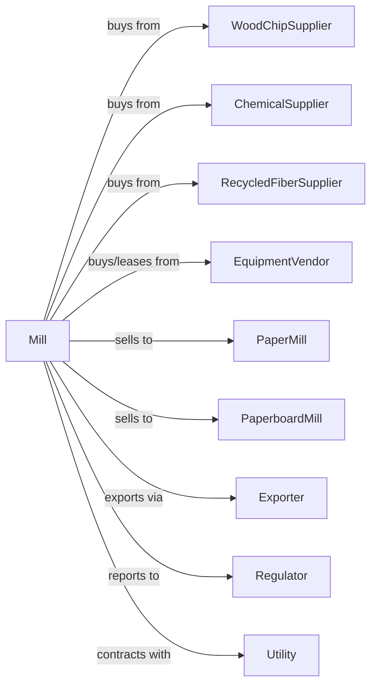

# Pulp Mills

> Business-as-Code definition for pulp mill operations. Models the complete pulping process from wood chip procurement through chemical or mechanical processing, bleaching, and pulp sales to paper manufacturers.

## Overview

This industry comprises establishments primarily engaged in manufacturing pulp without manufacturing paper or paperboard. The pulp is made by separating the cellulose fibers from the other impurities in wood or other materials, such as used or recycled rags, linters, scrap paper, and straw. Cross-References. Establishments primarily engaged in--

## Actors

| Actor | Description |
|-------|-------------|
| WoodChipSupplier | Provides wood chips from sawmills and logging |
| ChemicalSupplier | Provides pulping chemicals and bleaching agents |
| RecycledFiberSupplier | Provides recovered paper and recycled fiber |
| EquipmentVendor | Sells and services digesters and refiners |
| PaperMill | Purchases pulp for paper production |
| PaperboardMill | Purchases pulp for board production |
| Exporter | Handles international pulp sales |
| Regulator | Oversees environmental emissions and effluent |
| Utility | Provides power and steam |

## Roles

| Role | Description |
|------|-------------|
| MillOwner | Owns facility and directs business strategy |
| MillManager | Oversees daily production operations |
| PulpingOperator | Operates digesters and mechanical refiners |
| BleachOperator | Manages bleaching sequences and chemical dosing |
| RecoveryOperator | Operates chemical recovery systems |
| QualityTech | Tests pulp properties and consistency |
| EnvironmentalOfficer | Monitors emissions and effluent treatment |

## Entities

| Entity | Description |
|--------|-------------|
| WoodChip | Raw material input for pulping |
| Pulp | Cellulose fiber output for paper making |
| Liquor | Chemical solution for digesting wood |
| Digester | Pressure vessel for chemical pulping |
| Refiner | Equipment for mechanical pulping |
| Bleach | Chemical agent for whitening pulp |
| Brightness | Measure of pulp whiteness |
| Kappa | Measure of residual lignin content |
| Effluent | Wastewater from pulping process |
| RecoveryBoiler | Equipment for chemical and energy recovery |

## Actions

| Action | Description |
|--------|-------------|
| receiveChips | Accept wood chip deliveries |
| screenChips | Remove oversized and undersized chips |
| cook | Digest chips in chemical liquor under pressure |
| refine | Mechanically process chips into fiber |
| wash | Remove spent chemicals from pulp |
| screen | Remove knots and fiber bundles |
| bleach | Whiten pulp through multi-stage process |
| dry | Form and dry pulp sheets for market pulp |
| bale | Package dried pulp for shipping |
| recoverChemicals | Process spent liquor to recover chemicals |
| treatEffluent | Process wastewater before discharge |
| test | Analyze pulp properties and quality |
| ship | Deliver pulp to customers |

## Events

| Event | Description |
|-------|-------------|
| chipsReceived | Wood chips accepted and inventoried |
| chipsScreened | Chip sizing completed |
| cookCompleted | Digester batch finished |
| pulpRefined | Mechanical processing completed |
| pulpWashed | Chemical removal completed |
| pulpScreened | Knots and bundles removed |
| pulpBleached | Target brightness achieved |
| pulpDried | Pulp sheets formed and dried |
| pulpBaled | Pulp packaged for shipment |
| chemicalsRecovered | Liquor processing completed |
| effluentTreated | Wastewater treatment completed |
| orderShipped | Pulp delivered to customer |

## Searches

| Search | Description |
|--------|-------------|
| findChips | List available wood chip suppliers |
| getInventory | Retrieve pulp stock by grade |
| getProduction | Monitor daily production output |
| getQuality | Retrieve pulp quality test results |
| findBuyers | List paper mills with pulp requirements |
| getChemicalLevels | Check chemical inventory and recovery |
| getEmissionsData | Monitor environmental compliance metrics |

## Workflow



## Actor Relationships



## Usage

### Calling Actions

```typescript
import { millPulpMills } from '@headlessly/mill-pulp-mills'

const mill = millPulpMills()

// Receive wood chips
const chips = await mill.receiveChips({
  supplierId: 'forest-products-nw',
  species: 'softwood-mix',
  quantity: 10000,
  moistureContent: 50
})

// Cook in digester
const cook = await mill.cook({
  digesterId: 'dig-01',
  chipIds: chips.ids,
  process: 'kraft',
  targetKappa: 25,
  temperature: 170,
  duration: 180
})

// Bleach to target brightness
await mill.bleach({
  pulpId: cook.pulpId,
  sequence: 'ECF',
  stages: ['D0', 'EOP', 'D1', 'D2'],
  targetBrightness: 88
})
```

### Event-Driven Automation

```typescript
// Auto-wash after cooking
mill.cookCompleted(async ({ pulpId, digesterId, kappa }) => {
  await mill.wash({
    pulpId,
    stages: 4,
    dilutionFactor: 3.0
  })

  // Recover chemicals from spent liquor
  await mill.recoverChemicals({
    digesterId,
    liquorType: 'black'
  })
})

// Auto-ship when quality verified
mill.pulpBaled(async ({ baleIds, grade, brightness }) => {
  const testResult = await mill.test({
    baleIds,
    tests: ['brightness', 'viscosity', 'dirt', 'kappa']
  })

  if (testResult.meetsSpec) {
    const orders = await mill.findBuyers({ grade, minBrightness: brightness })

    if (orders.length > 0) {
      await mill.ship({
        baleIds,
        orderId: orders[0].id
      })
    }
  }
})
```
