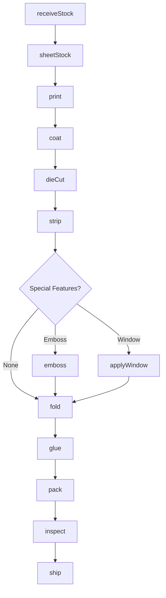
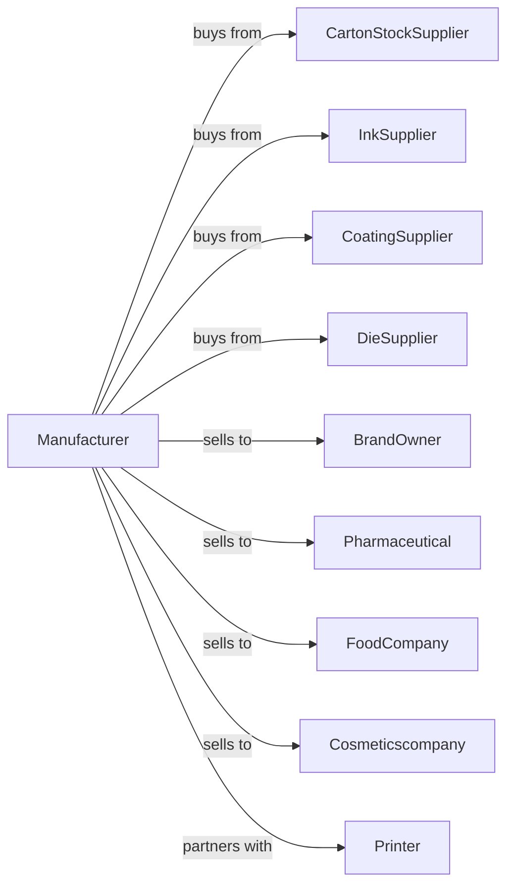

# Folding Paperboard Box Manufacturing

> Business-as-Code definition for folding paperboard box manufacturing operations. Models the complete production process from carton stock procurement through printing, die cutting, folding, gluing, and packaging for retail and consumer products.

## Overview

This U.S. industry comprises establishments primarily engaged in converting paperboard (except corrugated) into folding paperboard boxes without manufacturing paper and paperboard. Cross-References. Establishments primarily engaged in--

## Actors

| Actor | Description |
|-------|-------------|
| CartonStockSupplier | Provides SBS and recycled paperboard |
| InkSupplier | Provides offset and flexographic inks |
| CoatingSupplier | Provides varnishes and UV coatings |
| DieSupplier | Provides cutting and embossing dies |
| BrandOwner | Purchases cartons for consumer products |
| Pharmaceutical | Buys cartons for drug packaging |
| FoodCompany | Purchases cartons for food packaging |
| Cosmeticscompany | Buys cartons for beauty products |
| Printer | Provides overflow printing services |

## Roles

| Role | Description |
|------|-------------|
| PlantOwner | Owns facility and directs business strategy |
| PlantManager | Oversees daily production operations |
| StructuralDesigner | Creates carton structures and dies |
| GraphicDesigner | Prepares print-ready artwork |
| PressOperator | Runs offset and flexographic presses |
| DieOperator | Operates die cutting equipment |
| FolderGluerOperator | Runs carton folding and gluing lines |
| QualityInspector | Verifies print and carton quality |

## Entities

| Entity | Description |
|--------|-------------|
| CartonStock | Solid bleached or recycled board input |
| Sheet | Cut board sheet for printing |
| Carton | Finished folding box product |
| Die | Steel rule die for cutting and creasing |
| Blank | Cut and creased carton before folding |
| Print | Lithographic or flexographic graphics |
| Coating | Protective or decorative surface finish |
| Caliper | Board thickness affecting carton rigidity |
| Registration | Print alignment accuracy |
| Window | Clear film opening in carton |

## Actions

| Action | Description |
|--------|-------------|
| receiveStock | Accept carton stock shipments |
| sheetStock | Cut rolls into sheets for press |
| print | Apply graphics using offset or flexo press |
| coat | Apply varnish, UV, or aqueous coating |
| dieCut | Cut and crease carton blanks |
| strip | Remove waste matrix from blanks |
| emboss | Create raised or debossed features |
| applyWindow | Attach clear film windows |
| fold | Crease and fold carton blanks |
| glue | Apply adhesive and seal carton |
| pack | Package cartons for shipping |
| inspect | Verify print quality and carton integrity |
| ship | Deliver cartons to customers |

## Events

| Event | Description |
|-------|-------------|
| stockReceived | Carton stock accepted and inventoried |
| stockSheeted | Rolls cut into print-ready sheets |
| cartonsPrinted | Graphics applied to sheets |
| cartonsCoated | Surface coating applied |
| cartonsDieCut | Blanks cut and creased |
| cartonsStripped | Waste matrix removed |
| cartonsEmbossed | Decorative features created |
| windowsApplied | Clear film windows attached |
| cartonsFolded | Blanks folded on lines |
| cartonsGlued | Panels sealed with adhesive |
| cartonsPacked | Products packaged for shipping |
| cartonsInspected | Quality verification completed |
| orderShipped | Cartons delivered to customer |

## Searches

| Search | Description |
|--------|-------------|
| findStock | List available carton stock grades |
| getInventory | Retrieve carton stock by style and size |
| getOrders | List pending customer orders |
| getProduction | Monitor line output and efficiency |
| getDieLibrary | Retrieve die specifications |
| getColorStandards | Check brand color specifications |
| getQuality | Review inspection results |

## Workflow



## Actor Relationships



## Usage

### Calling Actions

```typescript
import { manufactureFoldingPaperboard } from '@headlessly/manufacture-folding-paperboard'

const plant = manufactureFoldingPaperboard()

// Print cartons on offset press
const printed = await plant.print({
  sheetId: 'sheet-batch-001',
  pressId: 'offset-40',
  colors: ['pantone-286C', 'pantone-485C', 'process-black'],
  impression: 15000,
  registration: 0.005
})

// Die cut carton blanks
const blanks = await plant.dieCut({
  sheetId: printed.id,
  dieId: 'die-tuckend-6x4x2',
  blanksPerSheet: 8,
  makeReady: true
})

// Fold and glue cartons
await plant.fold({
  blankIds: blanks.ids,
  lineId: 'folder-gluer-01',
  speed: 200
})
```

### Event-Driven Automation

```typescript
// Auto-coat after printing
plant.cartonsPrinted(async ({ sheetId, orderId }) => {
  const order = await plant.getOrders({ orderId })

  await plant.coat({
    sheetId,
    type: order.coatingType || 'aqueous',
    coverage: 'flood',
    gloss: order.glossLevel || 'satin'
  })
})

// Auto-inspect before shipping
plant.cartonsPacked(async ({ packId, orderId, quantity }) => {
  const inspection = await plant.inspect({
    packId,
    checks: ['color-match', 'registration', 'crease-depth', 'glue-integrity']
  })

  if (inspection.passed) {
    await plant.ship({
      packId,
      orderId,
      carrier: 'parcel-standard'
    })
  }
})
```
