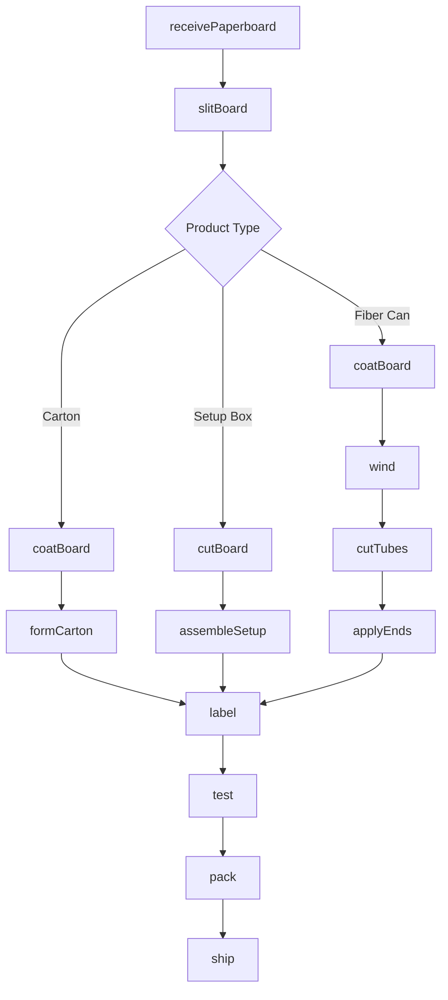
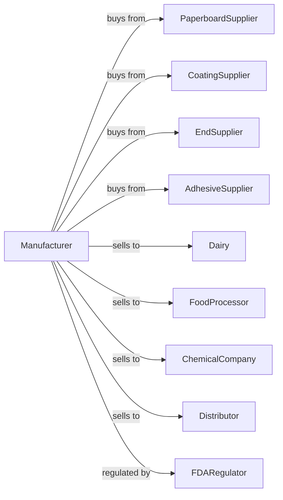

# Other Paperboard Container Manufacturing

> Business-as-Code definition for specialty paperboard container manufacturing operations. Models the production of fiber cans, drums, milk cartons, and sanitary food containers from purchased paperboard.

## Overview

This U.S. industry comprises establishments primarily engaged in converting paperboard into paperboard containers (except corrugated, solid fiber, and folding paperboard boxes) without manufacturing paperboard. Illustrative Examples: Fiber cans and drums (i.e., all-fiber, nonfiber ends of any material) made from purchased paperboard Milk cartons made from purchased paper or paperboard Sanitary food containers (except folding) made from purchased paper or paperboard Setup (i.e., not shipped flat)

## Actors

| Actor | Description |
|-------|-------------|
| PaperboardSupplier | Provides specialty board for container production |
| CoatingSupplier | Provides barrier coatings and laminates |
| EndSupplier | Provides metal and plastic ends for cans |
| AdhesiveSupplier | Provides glues for container assembly |
| Dairy | Purchases milk and juice cartons |
| FoodProcessor | Buys sanitary food containers |
| ChemicalCompany | Purchases fiber drums for materials |
| Distributor | Wholesales container products |
| FDARegulator | Oversees food contact compliance |

## Roles

| Role | Description |
|------|-------------|
| PlantOwner | Owns facility and directs business strategy |
| PlantManager | Oversees daily production operations |
| ContainerDesigner | Creates container structures and specifications |
| WindingOperator | Operates spiral and convolute winding |
| FormingOperator | Runs carton forming and sealing equipment |
| QualityTech | Tests barrier properties and integrity |
| ComplianceOfficer | Ensures FDA and food safety compliance |

## Entities

| Entity | Description |
|--------|-------------|
| Paperboard | Board input for container production |
| Coating | Barrier layer for moisture and oxygen |
| FiberCan | Spiral-wound cylindrical container |
| FiberDrum | Large capacity fiber container |
| Carton | Formed milk or juice container |
| SetupBox | Rigid non-collapsing box |
| End | Metal or plastic closure for cans |
| Mandrel | Form around which containers are wound |
| Barrier | Moisture and oxygen resistance property |
| Seam | Joined edge of container body |

## Actions

| Action | Description |
|--------|-------------|
| receivePaperboard | Accept board and coating materials |
| slitBoard | Cut rolls to winding widths |
| coatBoard | Apply barrier coatings |
| wind | Spiral or convolute wind tube body |
| cutTubes | Cut wound tubes to container lengths |
| applyEnds | Attach metal or plastic ends |
| formCarton | Shape and seal carton bodies |
| assembleSetup | Build rigid setup boxes |
| label | Apply labels or print to containers |
| test | Verify barrier and integrity properties |
| pack | Package containers for shipping |
| ship | Deliver products to customers |

## Events

| Event | Description |
|-------|-------------|
| paperboardReceived | Materials accepted and inventoried |
| boardSlit | Rolls cut to width |
| boardCoated | Barrier coating applied |
| tubesWound | Container bodies formed |
| tubesCut | Bodies cut to length |
| endsApplied | Closures attached |
| cartonsFormed | Carton bodies shaped |
| setupAssembled | Rigid boxes built |
| containersLabeled | Identification applied |
| containersTested | Quality verified |
| containersPacked | Products packaged |
| orderShipped | Products delivered |

## Searches

| Search | Description |
|--------|-------------|
| findPaperboard | List available board grades |
| getInventory | Retrieve container stock by type |
| getOrders | List pending customer orders |
| getProduction | Monitor line output |
| getBarrierSpecs | Retrieve coating requirements |
| getCompliance | Check FDA certification status |
| getQuality | Review test results |

## Workflow



## Actor Relationships



## Usage

### Calling Actions

```typescript
import { manufacturePaperboardContainer } from '@headlessly/manufacture-paperboard-container'

const plant = manufacturePaperboardContainer()

// Coat board with barrier
const coated = await plant.coatBoard({
  rollId: 'roll-sbs-018',
  coating: 'polyethylene',
  weight: 15,
  sides: 'both'
})

// Wind fiber cans
const tubes = await plant.wind({
  boardId: coated.id,
  method: 'spiral',
  mandrelDiameter: 3.5,
  plies: 3,
  adhesive: 'dextrin'
})

// Apply metal ends
await plant.applyEnds({
  tubeIds: tubes.ids,
  endType: 'steel-sanitary',
  seaming: 'double'
})
```

### Event-Driven Automation

```typescript
// Auto-test barrier after coating
plant.boardCoated(async ({ boardId, coatingType }) => {
  await plant.test({
    boardId,
    tests: ['moisture-vapor-transmission', 'oxygen-barrier', 'grease-resistance']
  })
})

// Auto-ship compliant containers
plant.containersTested(async ({ containerId, orderId, testResults }) => {
  if (testResults.allPassed && testResults.fdaCompliant) {
    await plant.pack({
      containerIds: [containerId],
      packaging: 'sanitary-wrap'
    })

    await plant.ship({
      containerId,
      orderId,
      certification: 'food-grade'
    })
  }
})
```
