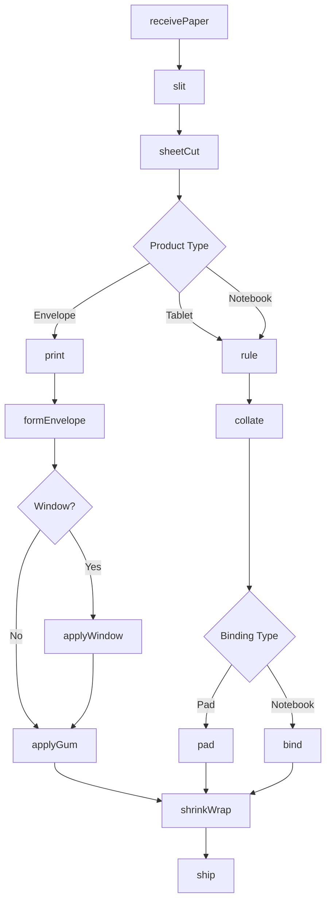
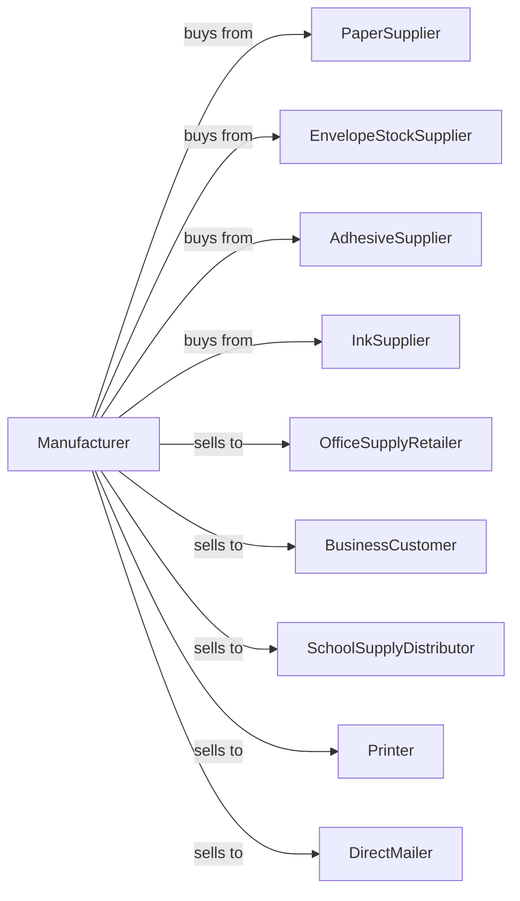

# Stationery Product Manufacturing

> Business-as-Code definition for stationery product manufacturing operations. Models the production of envelopes, notepads, tablets, and office paper products from purchased paper through cutting, binding, and packaging.

## Overview

This industry comprises establishments primarily engaged in converting paper or paperboard into products used for writing, filing, art work, and similar applications. Illustrative Examples: Computer paper, die-cut, made from purchased paper Die-cut paper products for office use made from purchased paper or paperboard Envelopes (i.e., mailing, stationery) made from any material Stationery made from purchased paper Tablets (e.g., memo, note, writing) made from purchased paper Tapes (e.g., adding m

## Actors

| Actor | Description |
|-------|-------------|
| PaperSupplier | Provides writing and bond papers |
| EnvelopeStockSupplier | Provides wove and kraft envelope paper |
| AdhesiveSupplier | Provides glues and seal gums |
| InkSupplier | Provides printing inks for ruled products |
| OfficeSupplyRetailer | Purchases stationery for retail sale |
| BusinessCustomer | Buys custom printed envelopes and letterhead |
| SchoolSupplyDistributor | Purchases notebooks and tablets |
| Printer | Buys blank stock for printing |
| DirectMailer | Purchases envelopes in volume |

## Roles

| Role | Description |
|------|-------------|
| PlantOwner | Owns facility and directs business strategy |
| PlantManager | Oversees daily production operations |
| EnvelopeOperator | Runs envelope forming machines |
| RulingOperator | Operates paper ruling equipment |
| BindingOperator | Manages padding and binding equipment |
| CuttingOperator | Operates guillotine and die cutters |
| PrintingOperator | Runs offset or flexo printing |
| QualityInspector | Verifies product specifications |

## Entities

| Entity | Description |
|--------|-------------|
| Paper | Writing or bond paper input |
| Envelope | Folded paper container for mailing |
| Tablet | Bound stack of sheets for writing |
| Notebook | Wire or sewn bound writing book |
| Letterhead | Printed business stationery |
| Ruling | Lines printed for writing guidance |
| Padding | Adhesive binding for tear-off sheets |
| Gum | Moisture-activated envelope seal |
| Window | Clear plastic panel in envelope |
| Size | Envelope or pad dimensions |

## Actions

| Action | Description |
|--------|-------------|
| receivePaper | Accept paper stock shipments |
| slit | Cut rolls to required widths |
| sheetCut | Cut rolls into sheets |
| rule | Print lines on writing paper |
| print | Apply letterhead or custom printing |
| formEnvelope | Fold and glue envelope blanks |
| applyWindow | Insert plastic windows in envelopes |
| applyGum | Add seal adhesive to envelope flaps |
| collate | Gather sheets for binding |
| pad | Apply adhesive to create tear-off pads |
| bind | Wire or sewn bind into notebooks |
| shrinkWrap | Package products for retail |
| ship | Deliver products to customers |

## Events

| Event | Description |
|-------|-------------|
| paperReceived | Paper stock accepted |
| paperSlit | Rolls cut to width |
| paperSheetCut | Sheets cut from rolls |
| paperRuled | Lines printed on sheets |
| productPrinted | Custom printing applied |
| envelopesFormed | Envelopes folded and glued |
| windowsApplied | Plastic windows inserted |
| gumApplied | Seal adhesive added |
| sheetsCollated | Sheets gathered for binding |
| padsBound | Adhesive padding completed |
| notebooksBound | Wire or sewn binding completed |
| productWrapped | Products packaged |
| orderShipped | Products delivered |

## Searches

| Search | Description |
|--------|-------------|
| findPaper | List available paper stock |
| getInventory | Retrieve product stock by type |
| getOrders | List pending customer orders |
| getProduction | Monitor line output |
| getEnvelopeSizes | Retrieve standard envelope dimensions |
| getPadSpecs | Retrieve tablet and pad specifications |
| getCustomPrinting | Check custom print job status |

## Workflow



## Actor Relationships



## Usage

### Calling Actions

```typescript
import { manufactureStationeryProduct } from '@headlessly/manufacture-stationery-product'

const plant = manufactureStationeryProduct()

// Form standard envelopes
const envelopes = await plant.formEnvelope({
  paperId: 'wove-24-white',
  size: '#10',
  style: 'commercial-flap',
  quantity: 100000
})

// Apply window for billing
await plant.applyWindow({
  envelopeIds: envelopes.ids,
  windowSize: '1.125x4.5',
  position: 'left-standard',
  material: 'polystyrene'
})

// Apply moisture-seal gum
await plant.applyGum({
  envelopeIds: envelopes.ids,
  gumType: 'remoistenable',
  pattern: 'diagonal'
})
```

### Event-Driven Automation

```typescript
// Auto-pad after ruling
plant.paperRuled(async ({ sheetIds, orderId, rulingType }) => {
  await plant.collate({
    sheetIds,
    sheetsPerPad: 50,
    sequence: 'alternating-chipboard'
  })
})

// Auto-ship when wrapped
plant.productWrapped(async ({ packId, orderId, productType }) => {
  const order = await plant.getOrders({ orderId })

  await plant.ship({
    packId,
    orderId,
    carrier: order.shippingMethod,
    tracking: true
  })
})
```
