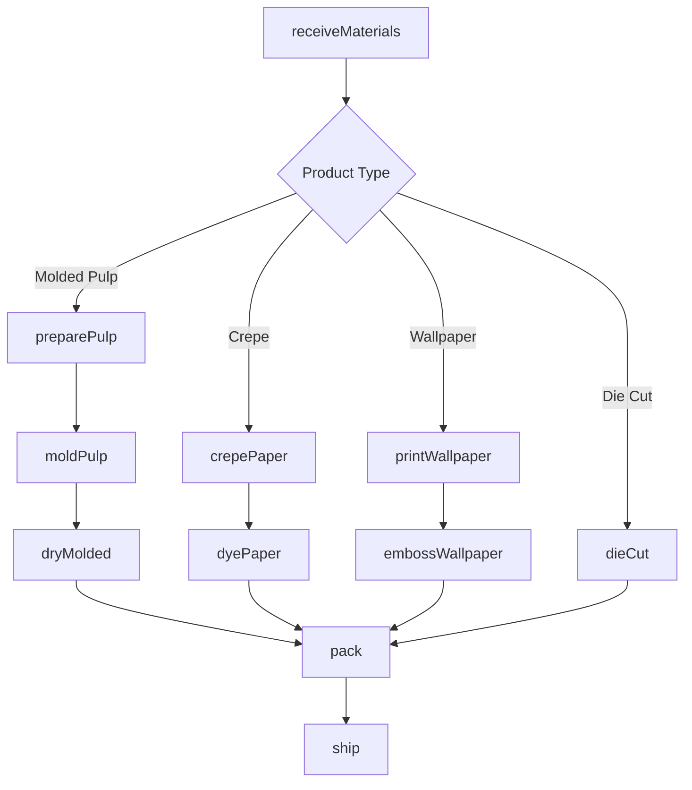
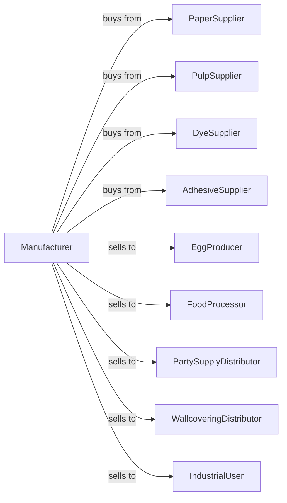

# All Other Converted Paper Product Manufacturing

> Business-as-Code definition for miscellaneous converted paper product manufacturing operations. Models the production of molded pulp products, crepe paper, wallpaper, and specialty paper products.

## Overview

This U.S. industry comprises establishments primarily engaged in converting paper or paperboard into products (except containers, bags, coated and treated paper, stationery products, and sanitary paper products) or converting pulp into pulp products, such as egg cartons, food trays, and other food containers from molded pulp. Illustrative Examples: Crepe paper made from purchased paper Die-cut paper products (except for office use) made from purchased paper or paperboard Molded pulp products (e.

## Actors

| Actor | Description |
|-------|-------------|
| PaperSupplier | Provides specialty papers for converting |
| PulpSupplier | Provides pulp for molded products |
| DyeSupplier | Provides colorants for crepe and decorative papers |
| AdhesiveSupplier | Provides laminating and coating adhesives |
| EggProducer | Purchases molded pulp egg cartons |
| FoodProcessor | Buys molded pulp food trays |
| PartySupplyDistributor | Purchases crepe and decorative papers |
| WallcoveringDistributor | Buys wallpaper products |
| IndustrialUser | Purchases specialty converted products |

## Roles

| Role | Description |
|------|-------------|
| PlantOwner | Owns facility and directs business strategy |
| PlantManager | Oversees daily production operations |
| MoldingOperator | Runs molded pulp forming equipment |
| CrepingOperator | Operates paper creping machines |
| PrintingOperator | Manages wallpaper and decorative printing |
| DieCutOperator | Operates die cutting equipment |
| QualityInspector | Verifies product specifications |

## Entities

| Entity | Description |
|--------|-------------|
| Paper | Base paper for converting |
| Pulp | Fiber slurry for molded products |
| MoldedPulp | Formed fiber product like egg carton |
| CrepePaper | Textured decorative paper |
| Wallpaper | Printed wall covering material |
| DieCutProduct | Shaped paper product |
| Mold | Form for pulp shaping |
| Texture | Surface characteristic of creped paper |
| Pattern | Printed design on wallpaper |
| Color | Dye or pigment applied to product |

## Actions

| Action | Description |
|--------|-------------|
| receiveMaterials | Accept paper, pulp, and supplies |
| preparePulp | Mix pulp slurry for molding |
| moldPulp | Form molded pulp products |
| dryMolded | Remove moisture from molded products |
| crepePaper | Apply creping texture to paper |
| dyePaper | Apply color to paper products |
| printWallpaper | Apply patterns to wallcovering |
| embossWallpaper | Create textured wallpaper surface |
| dieCut | Cut paper into shaped products |
| laminate | Bond layers for specialty products |
| pack | Package products for shipping |
| ship | Deliver products to customers |

## Events

| Event | Description |
|-------|-------------|
| materialsReceived | Paper and pulp accepted |
| pulpPrepared | Slurry mixed and ready |
| productsMolded | Pulp formed into shapes |
| productsDried | Moisture removed |
| paperCreped | Texture applied |
| paperDyed | Color applied |
| wallpaperPrinted | Pattern applied |
| wallpaperEmbossed | Texture created |
| productsDieCut | Shapes cut |
| productsLaminated | Layers bonded |
| productsPacked | Packaged for shipping |
| orderShipped | Products delivered |

## Searches

| Search | Description |
|--------|-------------|
| findMaterials | List available paper and pulp |
| getInventory | Retrieve product stock by type |
| getOrders | List pending customer orders |
| getProduction | Monitor line output |
| getMoldLibrary | Retrieve available mold specifications |
| getPatterns | List wallpaper design options |
| getQuality | Check product test results |

## Workflow



## Actor Relationships



## Usage

### Calling Actions

```typescript
import { manufactureConvertedPaper } from '@headlessly/manufacture-converted-paper'

const plant = manufactureConvertedPaper()

// Prepare pulp for molding
const pulp = await plant.preparePulp({
  fiberSource: 'recycled-newsprint',
  consistency: 1.5,
  additives: ['retention-aid', 'wet-strength']
})

// Mold egg cartons
const molded = await plant.moldPulp({
  pulpId: pulp.id,
  moldId: 'egg-carton-12',
  vacuum: 0.6,
  formingTime: 2.5
})

// Dry molded products
await plant.dryMolded({
  productIds: molded.ids,
  method: 'tunnel-oven',
  temperature: 350,
  targetMoisture: 8
})
```

### Event-Driven Automation

```typescript
// Auto-dry after molding
plant.productsMolded(async ({ productIds, moldType }) => {
  const dryingProfile = getDryingProfile(moldType)

  await plant.dryMolded({
    productIds,
    method: dryingProfile.method,
    temperature: dryingProfile.temp,
    duration: dryingProfile.time
  })
})

// Auto-ship when packed
plant.productsPacked(async ({ packId, orderId, productType }) => {
  const order = await plant.getOrders({ orderId })

  await plant.ship({
    packId,
    orderId,
    carrier: order.shippingMethod,
    palletize: productType === 'molded-pulp'
  })
})
```
