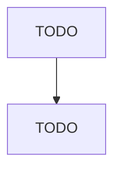

# Commercial Printing (except Screen and Books)

> TODO: Business-as-Code definition

## Overview

This U.S. industry comprises establishments primarily engaged in commercial printing (except screen printing, books printing) without publishing (except fabric grey goods printing). The printing processes used in this industry include, but are not limited to, lithographic, gravure, flexographic, letterpress, engraving, and various digital printing technologies. This industry includes establishments engaged in commercial printing on purchased stock materials, such as stationery, invitations, labe

## Actors

| Actor | Description |
|-------|-------------|
| TODO | TODO |

## Roles

| Role | Description |
|------|-------------|
| TODO | TODO |

## Entities

| Entity | Description |
|--------|-------------|
| TODO | TODO |

## Actions

| Action | Description |
|--------|-------------|
| TODO | TODO |

## Events

| Event | Description |
|-------|-------------|
| TODO | TODO |

## Searches

| Search | Description |
|--------|-------------|
| TODO | TODO |

## Workflow

## Actor Relationships

