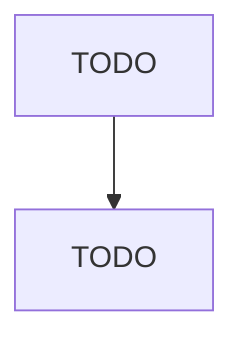

# Commercial Screen Printing

> TODO: Business-as-Code definition

## Overview

This U.S. industry comprises establishments primarily engaged in screen printing without publishing (except books, fabric grey goods, and manifold business forms). This industry includes establishments engaged in screen printing on purchased stock materials, such as stationery, invitations, labels, and similar items, on a job-order basis. Establishments primarily engaged in printing on apparel and textile products, such as T-shirts, caps, jackets, towels, and napkins, are included in this indust

## Actors

| Actor | Description |
|-------|-------------|
| TODO | TODO |

## Roles

| Role | Description |
|------|-------------|
| TODO | TODO |

## Entities

| Entity | Description |
|--------|-------------|
| TODO | TODO |

## Actions

| Action | Description |
|--------|-------------|
| TODO | TODO |

## Events

| Event | Description |
|-------|-------------|
| TODO | TODO |

## Searches

| Search | Description |
|--------|-------------|
| TODO | TODO |

## Workflow

## Actor Relationships

