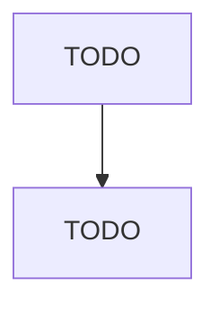

# Support Activities for Printing

> TODO: Business-as-Code definition

## Overview

This industry comprises establishments primarily engaged in performing prepress and postpress services in support of printing activities. Prepress services may include such things as platemaking, typesetting, trade binding, and sample mounting. Postpress services include such things as book or paper bronzing, die cutting, edging, embossing, folding, gilding, gluing, and indexing. Cross-References. Establishments primarily engaged in--

## Actors

| Actor | Description |
|-------|-------------|
| TODO | TODO |

## Roles

| Role | Description |
|------|-------------|
| TODO | TODO |

## Entities

| Entity | Description |
|--------|-------------|
| TODO | TODO |

## Actions

| Action | Description |
|--------|-------------|
| TODO | TODO |

## Events

| Event | Description |
|-------|-------------|
| TODO | TODO |

## Searches

| Search | Description |
|--------|-------------|
| TODO | TODO |

## Workflow

## Actor Relationships

