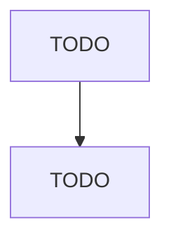

# Petroleum Refineries

> TODO: Business-as-Code definition

## Overview

This industry comprises establishments primarily engaged in refining crude petroleum into refined petroleum. Petroleum refining involves one or more of the following activities: (1) fractionation; (2) straight distillation of crude oil; and (3) cracking. Cross-References. Establishments primarily engaged in--

## Actors

| Actor | Description |
|-------|-------------|
| TODO | TODO |

## Roles

| Role | Description |
|------|-------------|
| TODO | TODO |

## Entities

| Entity | Description |
|--------|-------------|
| TODO | TODO |

## Actions

| Action | Description |
|--------|-------------|
| TODO | TODO |

## Events

| Event | Description |
|-------|-------------|
| TODO | TODO |

## Searches

| Search | Description |
|--------|-------------|
| TODO | TODO |

## Workflow

## Actor Relationships

