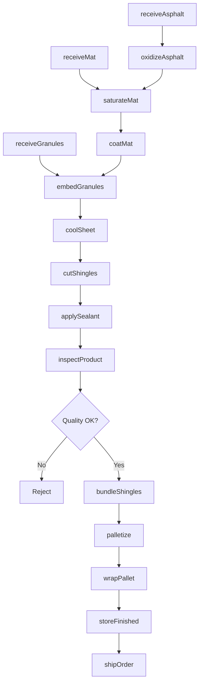
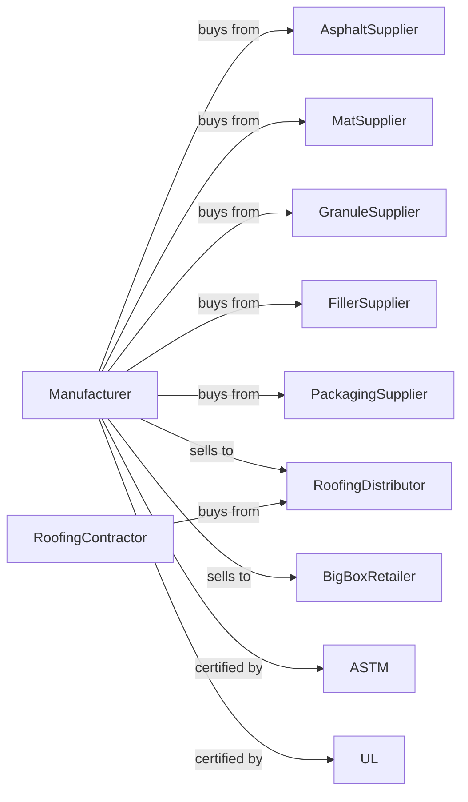

# Asphalt Shingle and Coating Materials Manufacturing

> Business-as-Code definition for roofing products manufacturing. Models the complete production workflow from raw materials through finished shingles and coatings.

## Overview

This U.S. industry comprises establishments primarily engaged in (1) saturating purchased mats and felts with asphalt or tar from purchased asphaltic materials and (2) manufacturing asphalt and tar and roofing cements and coatings from purchased asphaltic materials. Products include asphalt shingles, roll roofing, roofing felts, built-up roofing materials, and roof coatings.

## Actors

| Actor | Description |
|-------|-------------|
| AsphaltSupplier | Refinery providing roofing-grade asphalt |
| MatSupplier | Provides fiberglass or organic felt mats |
| GranuleSupplier | Quarry providing ceramic-coated mineral granules |
| FillerSupplier | Provides limestone and mineral fillers |
| PackagingSupplier | Provides pallets, shrink wrap, and cartons |
| RoofingDistributor | Wholesaler serving roofing contractors |
| BigBoxRetailer | Home improvement stores for consumer sales |
| RoofingContractor | Professional installer purchasing products |
| ASTM | Organization setting product standards |
| UL | Underwriters Laboratories for fire rating certification |

## Roles

| Role | Description |
|------|-------------|
| PlantManager | Oversees manufacturing facility operations |
| LineOperator | Runs shingle production line |
| CoatingOperator | Operates coating and saturating equipment |
| QualityTechnician | Tests products for specification compliance |
| MaintenanceEngineer | Maintains production equipment |
| ProductionScheduler | Plans runs and manages inventory |
| RandDEngineer | Develops new products and improves formulations |
| SafetyCoordinator | Manages plant safety programs |
| WarehouseManager | Manages finished goods storage and shipping |

## Entities

| Entity | Description |
|--------|-------------|
| AsphaltShingle | Finished roofing product with granule surface |
| RollRoofing | Continuous roofing material in rolls |
| Felt | Base mat material (organic or fiberglass) |
| Granule | Ceramic-coated crusite providing color and UV protection |
| Asphalt | Oxidized bitumen for saturation and coating |
| Filler | Mineral powder adding mass and stability |
| Coating | Liquid roof coating product |
| Sealant | Adhesive strip for shingle bonding |
| Pallet | Unit load of packaged shingles |
| Bundle | Individual package of shingles |

## Actions

| Action | Description |
|--------|-------------|
| receiveAsphalt | Accept asphalt delivery to heated storage |
| receiveMat | Accept mat material delivery |
| receiveGranules | Accept granule delivery to silos |
| oxidizeAsphalt | Process asphalt to roofing grade |
| saturateMat | Impregnate mat with asphalt |
| coatMat | Apply asphalt coating to saturated mat |
| embedGranules | Apply and press granules into coating |
| coolSheet | Cool coated sheet before cutting |
| cutShingles | Cut continuous sheet into individual shingles |
| applySealant | Add adhesive strips for installation |
| inspectProduct | Quality check shingles for defects |
| bundleShingles | Package shingles into bundles |
| palletize | Stack bundles on pallets |
| wrapPallet | Shrink wrap pallets for shipping |
| storeFinished | Warehouse finished pallets |
| shipOrder | Load and dispatch customer orders |

## Events

| Event | Description |
|-------|-------------|
| asphaltReceived | Asphalt delivery completed |
| matReceived | Mat material delivery completed |
| granulesReceived | Granule delivery completed |
| oxidationComplete | Asphalt processed to specification |
| lineStarted | Production line began operation |
| sheetSaturated | Mat fully impregnated |
| sheetCoated | Coating applied |
| granulesApplied | Surface granules embedded |
| shinglesCut | Individual shingles produced |
| bundleComplete | Package filled and sealed |
| palletComplete | Full pallet wrapped and labeled |
| qualityPassed | Product met specifications |
| qualityFailed | Product failed inspection |
| orderShipped | Customer shipment departed |
| inventoryLow | Stock level below reorder point |

## Searches

| Search | Description |
|--------|-------------|
| findInventory | Query raw material stock levels |
| getProductStock | Check finished goods by SKU and warehouse |
| findOrders | List customer orders by status |
| getLineStatus | View production line operating status |
| getQualityRecords | Retrieve test results by batch |
| findShipments | List shipments by customer or date |
| getProductionHistory | View output by product and period |

## Workflow

## Actor Relationships

