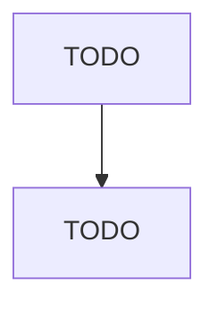

# All Other Petroleum and Coal Products Manufacturing

> TODO: Business-as-Code definition

## Overview

This U.S. industry comprises establishments primarily engaged in manufacturing petroleum products (except asphalt paving, roofing, and saturated materials and lubricating oils and greases) from refined petroleum and coal products made in coke ovens not integrated with a steel mill. Illustrative Examples: Biodiesel fuels not made in petroleum refineries and blended with purchased refined petroleum Coke oven products (e.g., coke, gases, tars) made in coke oven establishments Petroleum briquettes m

## Actors

| Actor | Description |
|-------|-------------|
| TODO | TODO |

## Roles

| Role | Description |
|------|-------------|
| TODO | TODO |

## Entities

| Entity | Description |
|--------|-------------|
| TODO | TODO |

## Actions

| Action | Description |
|--------|-------------|
| TODO | TODO |

## Events

| Event | Description |
|-------|-------------|
| TODO | TODO |

## Searches

| Search | Description |
|--------|-------------|
| TODO | TODO |

## Workflow

## Actor Relationships

