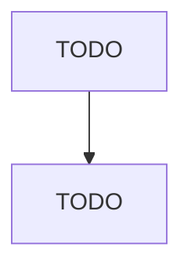

# Petrochemical Manufacturing

> TODO: Business-as-Code definition

## Overview

This industry comprises establishments primarily engaged in (1) manufacturing acyclic (i.e., aliphatic) hydrocarbons such as ethylene, propylene, and butylene made from refined petroleum or liquid hydrocarbons and/or (2) manufacturing cyclic aromatic hydrocarbons such as benzene, toluene, styrene, xylene, ethyl benzene, and cumene made from refined petroleum or liquid hydrocarbons. Cross-References. Establishments primarily engaged in--

## Actors

| Actor | Description |
|-------|-------------|
| TODO | TODO |

## Roles

| Role | Description |
|------|-------------|
| TODO | TODO |

## Entities

| Entity | Description |
|--------|-------------|
| TODO | TODO |

## Actions

| Action | Description |
|--------|-------------|
| TODO | TODO |

## Events

| Event | Description |
|-------|-------------|
| TODO | TODO |

## Searches

| Search | Description |
|--------|-------------|
| TODO | TODO |

## Workflow

## Actor Relationships

