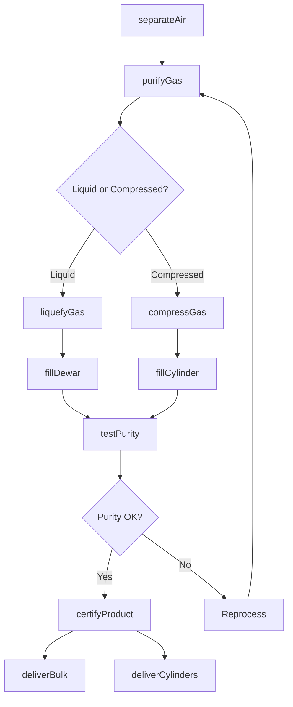
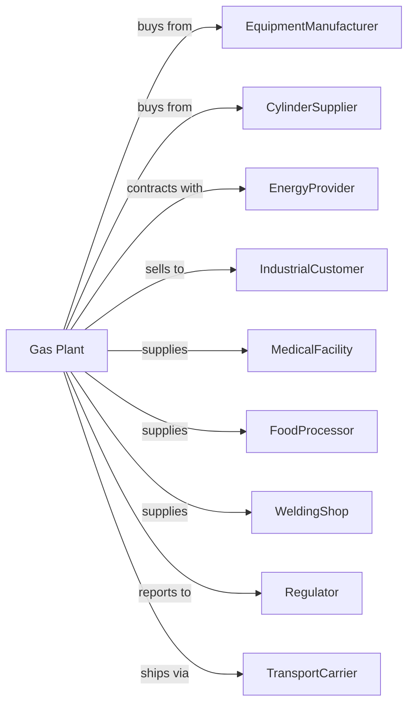

# Industrial Gas Manufacturing

> Business-as-Code definition for industrial gas production operations. Models the complete gas manufacturing lifecycle from air separation through cylinder distribution.

## Overview

Industrial gas manufacturing involves producing organic and inorganic gases in compressed, liquid, and solid forms. Products include oxygen, nitrogen, argon, hydrogen, carbon dioxide, helium, and specialty gas mixtures. This definition exposes actions for each phase of production, events for workflow automation, and searches for data retrieval.

## Actors

| Actor | Description |
|-------|-------------|
| EquipmentManufacturer | Supplies air separation units, compressors, and cryogenic equipment |
| CylinderSupplier | Provides high-pressure cylinders and cryogenic dewars |
| EnergyProvider | Supplies electricity for compression and refrigeration |
| IndustrialCustomer | Purchases bulk gases for manufacturing processes |
| MedicalFacility | Requires medical-grade oxygen and specialty gases |
| FoodProcessor | Uses gases for freezing, packaging, and carbonation |
| WeldingShop | Consumes shielding gases and fuel gases |
| Regulator | Oversees safety standards and gas handling compliance |
| TransportCarrier | Delivers cylinders and bulk cryogenic liquids |

## Roles

| Role | Description |
|------|-------------|
| PlantManager | Oversees facility operations and customer relations |
| ProcessEngineer | Optimizes air separation and purification processes |
| CryogenicTechnician | Operates and maintains cryogenic equipment |
| FillingOperator | Fills cylinders and dewars with compressed or liquid gas |
| QualityTechnician | Tests gas purity and certifies product specifications |
| DeliveryDriver | Transports cylinders and bulk loads to customers |
| SafetyOfficer | Ensures compliance with gas handling regulations |
| SalesRepresentative | Manages customer accounts and contracts |

## Entities

| Entity | Description |
|--------|-------------|
| AirSeparationUnit | Plant that separates atmospheric air into component gases |
| Compressor | Equipment that pressurizes gases for storage and transport |
| Cryogenic | Ultra-cold liquid form of gases for bulk storage |
| Cylinder | High-pressure vessel for gas storage and distribution |
| Dewar | Insulated container for liquid gas transport |
| Purity | Concentration level of target gas in product |
| BulkTank | Large on-site storage vessel for liquid gases |
| Manifold | Distribution system connecting multiple cylinders |
| MixingStation | Facility for creating custom gas blends |
| Certificate | Documentation of gas purity and compliance |

## Actions

| Action | Description |
|--------|-------------|
| separateAir | Extract oxygen, nitrogen, and argon from atmospheric air |
| liquefyGas | Cool gas to cryogenic temperatures for liquid storage |
| compressGas | Pressurize gas for cylinder filling |
| purifyGas | Remove impurities to achieve required purity levels |
| fillCylinder | Transfer gas into high-pressure cylinders |
| fillDewar | Load liquid gas into insulated transport containers |
| blendGases | Create custom gas mixtures for specific applications |
| testPurity | Analyze gas samples for composition and contaminants |
| certifyProduct | Issue certificates of analysis for shipments |
| deliverBulk | Transport liquid gas to customer bulk tanks |
| deliverCylinders | Distribute filled cylinders to customer locations |
| refillOnSite | Service customer bulk tanks with mobile delivery |

## Events

| Event | Description |
|-------|-------------|
| airSeparated | Component gases extracted from atmosphere |
| gasLiquefied | Gas converted to cryogenic liquid state |
| cylinderFilled | Cylinder pressurized to specification |
| purityVerified | Gas meets required specification standards |
| certificateIssued | Product documentation completed |
| bulkDelivered | Liquid gas transferred to customer tank |
| cylindersDelivered | Filled cylinders arrived at customer site |
| tankLevelLow | Customer bulk tank requires refill |
| equipmentAlarm | Air separation unit or compressor fault detected |
| leakDetected | Gas leak identified in storage or distribution |

## Searches

| Search | Description |
|--------|-------------|
| getInventory | Retrieve cylinder and bulk liquid stock levels |
| findCustomers | List customers with consumption patterns |
| checkPurity | Get purity test results for specific batches |
| getDeliverySchedule | List upcoming bulk and cylinder deliveries |
| findCylinders | Track cylinder locations and return status |
| getProductionMetrics | Retrieve throughput and efficiency data |
| getPricing | Get current prices by gas type and delivery method |
| getTankLevels | Monitor customer bulk tank fill levels |

## Workflow

## Actor Relationships

