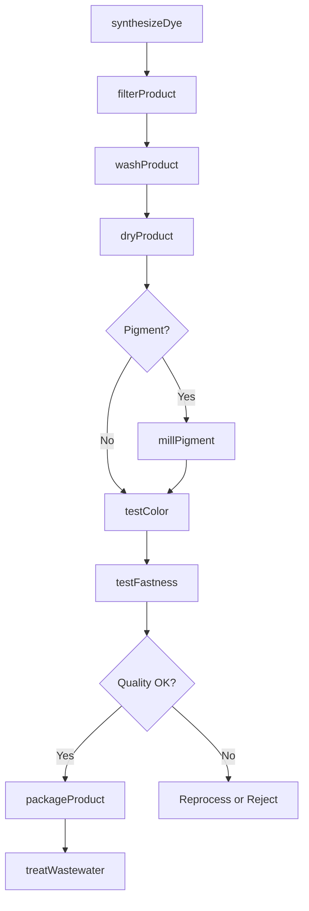
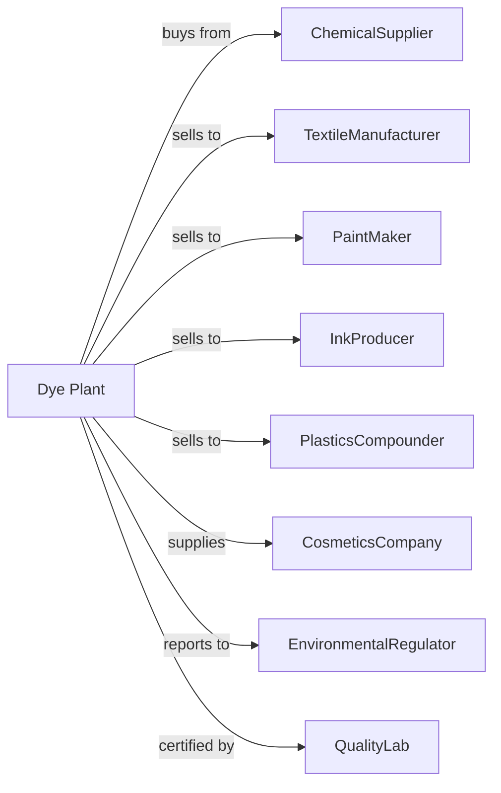

# Synthetic Dye and Pigment Manufacturing

> Business-as-Code definition for synthetic dye and pigment production operations. Models the complete colorant manufacturing lifecycle from chemical synthesis through product formulation.

## Overview

Synthetic dye and pigment manufacturing involves producing organic and inorganic colorants including dyes, pigments, lakes, and toners for textiles, plastics, paints, inks, and other applications. This definition exposes actions for each phase of production, events for workflow automation, and searches for data retrieval.

## Actors

| Actor | Description |
|-------|-------------|
| ChemicalSupplier | Provides intermediates, solvents, and raw materials |
| TextileManufacturer | Purchases dyes for fabric coloring |
| PaintMaker | Uses pigments in coating formulations |
| InkProducer | Incorporates colorants into printing inks |
| PlasticsCompounder | Adds pigments to polymer formulations |
| CosmeticsCompany | Uses certified colorants in personal care products |
| EnvironmentalRegulator | Oversees wastewater treatment and emissions |
| SafetyAgency | Regulates chemical handling and worker safety |
| QualityLab | Provides third-party color testing and certification |

## Roles

| Role | Description |
|------|-------------|
| PlantManager | Oversees production operations and business performance |
| SynthesisChemist | Develops and optimizes dye and pigment synthesis routes |
| ReactorOperator | Executes chemical reactions and monitors process conditions |
| ColorTechnician | Measures and matches color specifications |
| QualityAnalyst | Tests products for purity, strength, and stability |
| ApplicationSpecialist | Advises customers on colorant selection and use |
| EnvironmentalTechnician | Manages wastewater treatment and waste disposal |
| FormulationChemist | Develops dispersions and custom colorant blends |

## Entities

| Entity | Description |
|--------|-------------|
| Dye | Soluble colorant that bonds to substrate chemically |
| Pigment | Insoluble colorant dispersed in carrier medium |
| Lake | Pigment made by precipitating dye onto inert base |
| Toner | Fine pigment powder for specific applications |
| Intermediate | Chemical precursor used in dye synthesis |
| Dispersion | Pigment suspended uniformly in liquid carrier |
| ColorIndex | Standard classification system for colorants |
| Shade | Specific color variation within a product line |
| Fastness | Resistance to fading from light, washing, or heat |
| Batch | Quantity produced in single synthesis run |

## Actions

| Action | Description |
|--------|-------------|
| synthesizeDye | React intermediates to form dye molecule |
| precipitatePigment | Form solid pigment particles from solution |
| filterProduct | Separate solid colorant from reaction liquor |
| washProduct | Remove impurities and byproducts from colorant |
| dryProduct | Remove moisture to achieve target specifications |
| millPigment | Reduce particle size for optimal dispersion |
| blendShade | Combine colorants to match target color |
| dispersePigment | Suspend pigment in liquid carrier for application |
| testColor | Measure color properties against standards |
| testFastness | Evaluate resistance to fading and bleeding |
| packageProduct | Fill containers and prepare for shipment |
| treatWastewater | Process effluent before discharge |

## Events

| Event | Description |
|-------|-------------|
| synthesisCompleted | Dye or pigment reaction finished |
| productFiltered | Solid colorant separated from liquor |
| productDried | Moisture removed to specification |
| pigmentMilled | Particle size reduced to target range |
| colorMatched | Product matches reference standard |
| fastnessApproved | Durability tests passed |
| batchApproved | Product released for sale |
| batchRejected | Product fails quality specifications |
| wastewaterTreated | Effluent meets discharge limits |
| inventoryLow | Stock level below reorder point |

## Searches

| Search | Description |
|--------|-------------|
| findColorants | List products by color index, application, or properties |
| getInventory | Retrieve stock levels and batch availability |
| checkQuality | Get test results for specific batches |
| findApplications | List suitable products for specific end uses |
| getColorData | Retrieve spectral data and formulation guides |
| findCustomers | List customers by industry and purchase history |
| getPricing | Get current prices and volume discounts |
| getComplianceData | Retrieve regulatory status and certifications |

## Workflow

## Actor Relationships

