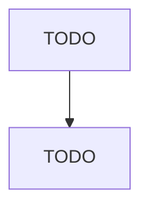

# Other Basic Inorganic Chemical Manufacturing

> TODO: Business-as-Code definition

## Overview

This industry comprises establishments primarily engaged in manufacturing basic inorganic chemicals (except industrial gases and synthetic dyes and pigments). Illustrative Examples: Alkalies manufacturing Aluminum compounds, not specified elsewhere by process, manufacturing Carbides (e.g., baron, calcium, silicon, tungsten) manufacturing Carbon black manufacturing Chlorine manufacturing Hydrochloric acid manufacturing Potassium inorganic compounds, not specified elsewhere by process, manufacturi

## Actors

| Actor | Description |
|-------|-------------|
| TODO | TODO |

## Roles

| Role | Description |
|------|-------------|
| TODO | TODO |

## Entities

| Entity | Description |
|--------|-------------|
| TODO | TODO |

## Actions

| Action | Description |
|--------|-------------|
| TODO | TODO |

## Events

| Event | Description |
|-------|-------------|
| TODO | TODO |

## Searches

| Search | Description |
|--------|-------------|
| TODO | TODO |

## Workflow

## Actor Relationships

