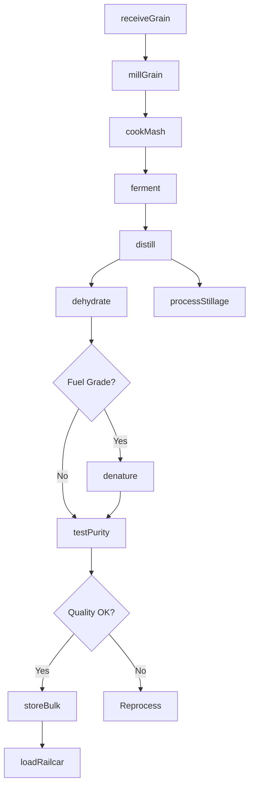
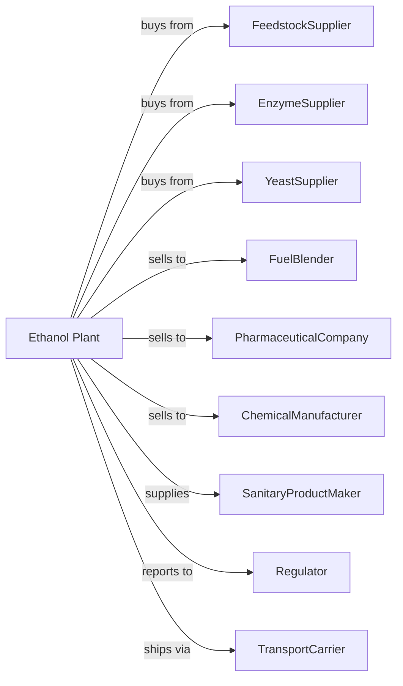

# Ethyl Alcohol Manufacturing

> Business-as-Code definition for nonpotable ethyl alcohol production operations. Models the complete manufacturing lifecycle from feedstock fermentation through industrial-grade ethanol distribution.

## Overview

Ethyl alcohol manufacturing involves producing nonpotable ethanol for industrial, fuel, pharmaceutical, and chemical applications. Feedstocks include corn, sugarcane, cellulosic biomass, and petrochemical sources. This definition exposes actions for each phase of production, events for workflow automation, and searches for data retrieval.

## Actors

| Actor | Description |
|-------|-------------|
| FeedstockSupplier | Provides corn, sugarcane, molasses, or cellulosic materials |
| EnzymeSupplier | Provides enzymes for starch conversion and fermentation |
| YeastSupplier | Supplies fermentation yeast strains |
| FuelBlender | Purchases ethanol for gasoline blending |
| PharmaceuticalCompany | Uses USP-grade alcohol in drug formulations |
| ChemicalManufacturer | Employs ethanol as solvent or chemical feedstock |
| SanitaryProductMaker | Uses ethanol in hand sanitizers and disinfectants |
| Regulator | Oversees production permits and denaturation requirements |
| TransportCarrier | Handles bulk ethanol shipments by rail and tanker |

## Roles

| Role | Description |
|------|-------------|
| PlantManager | Oversees facility operations and regulatory compliance |
| ProcessEngineer | Optimizes fermentation and distillation processes |
| FermentationTechnician | Monitors yeast activity and fermentation conditions |
| DistillationOperator | Controls rectification columns and dehydration systems |
| QualityAnalyst | Tests ethanol purity and denaturant levels |
| GrainReceiver | Manages feedstock intake and storage |
| EnvironmentalOfficer | Monitors emissions and wastewater treatment |
| ComplianceManager | Ensures adherence to alcohol production regulations |

## Entities

| Entity | Description |
|--------|-------------|
| Feedstock | Raw material such as corn, sugarcane, or biomass |
| Mash | Slurry of ground grain and water for fermentation |
| Enzyme | Catalyst that converts starch to fermentable sugars |
| Yeast | Microorganism that ferments sugars to ethanol |
| Beer | Fermented liquid containing ethanol before distillation |
| Distillate | Concentrated ethanol from rectification columns |
| Anhydrous | Water-free ethanol for fuel blending |
| Denaturant | Additive that renders ethanol undrinkable |
| Stillage | Residual material after distillation used as feed |
| ProofGallon | Measurement unit for alcohol production |

## Actions

| Action | Description |
|--------|-------------|
| receiveGrain | Accept and store feedstock deliveries |
| millGrain | Grind corn or grain to expose starch |
| cookMash | Heat mash with enzymes to convert starch to sugars |
| ferment | Add yeast to convert sugars to ethanol |
| distill | Separate ethanol from fermented beer |
| dehydrate | Remove remaining water using molecular sieves |
| denature | Add denaturant to render ethanol nonpotable |
| testPurity | Analyze ethanol concentration and quality |
| storeBulk | Transfer ethanol to storage tanks |
| loadRailcar | Fill rail tank cars for shipment |
| processStillage | Convert residue to distillers grains for animal feed |
| reportProduction | Submit required regulatory reports |

## Events

| Event | Description |
|-------|-------------|
| grainReceived | Feedstock delivered and inspected |
| mashCooked | Starch conversion completed |
| fermentationCompleted | Yeast finished converting sugars |
| distillationCompleted | Ethanol concentrated and collected |
| ethanolDehydrated | Anhydrous ethanol produced |
| ethanolDenatured | Product rendered nonpotable |
| qualityApproved | Product meets specification requirements |
| shipmentLoaded | Bulk ethanol ready for transport |
| stillageProcessed | Coproduct converted to animal feed |
| complianceReportFiled | Regulatory documentation submitted |

## Searches

| Search | Description |
|--------|-------------|
| getInventory | Retrieve ethanol stock by grade and tank |
| findFeedstock | List available feedstock sources and prices |
| checkQuality | Get purity and denaturant test results |
| getProductionMetrics | Retrieve yield and efficiency data |
| findBuyers | List customers by application and volume |
| getPricing | Get current ethanol market prices |
| getComplianceStatus | Retrieve permit and reporting status |
| getStillageInventory | Check coproduct availability |

## Workflow

## Actor Relationships

