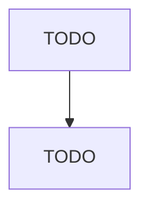

# Cyclic Crude, Intermediate, and Gum and Wood Chemical Manufacturing

> TODO: Business-as-Code definition

## Overview

This U.S. industry comprises establishments primarily engaged in one or more of the following: (1) distilling wood or gum into products, such as tall oil and wood distillates; (2) distilling coal tars; (3) manufacturing wood or gum chemicals, such as naval stores, natural tanning materials, charcoal briquettes, and charcoal (except activated); and (4) manufacturing cyclic crudes or cyclic intermediates (i.e., hydrocarbons, except aromatic petrochemicals) from refined petroleum or natural gas. Cr

## Actors

| Actor | Description |
|-------|-------------|
| TODO | TODO |

## Roles

| Role | Description |
|------|-------------|
| TODO | TODO |

## Entities

| Entity | Description |
|--------|-------------|
| TODO | TODO |

## Actions

| Action | Description |
|--------|-------------|
| TODO | TODO |

## Events

| Event | Description |
|-------|-------------|
| TODO | TODO |

## Searches

| Search | Description |
|--------|-------------|
| TODO | TODO |

## Workflow

## Actor Relationships

