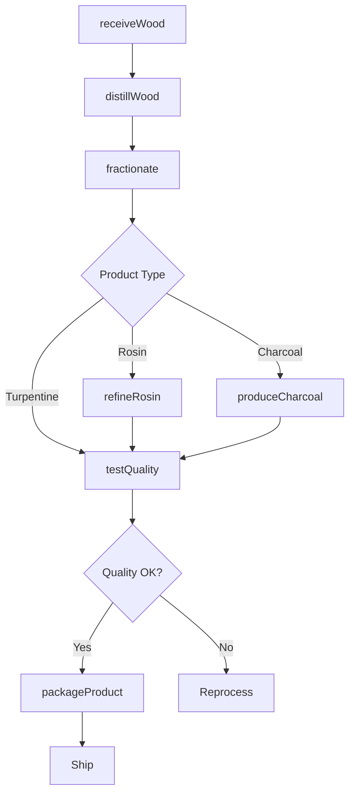
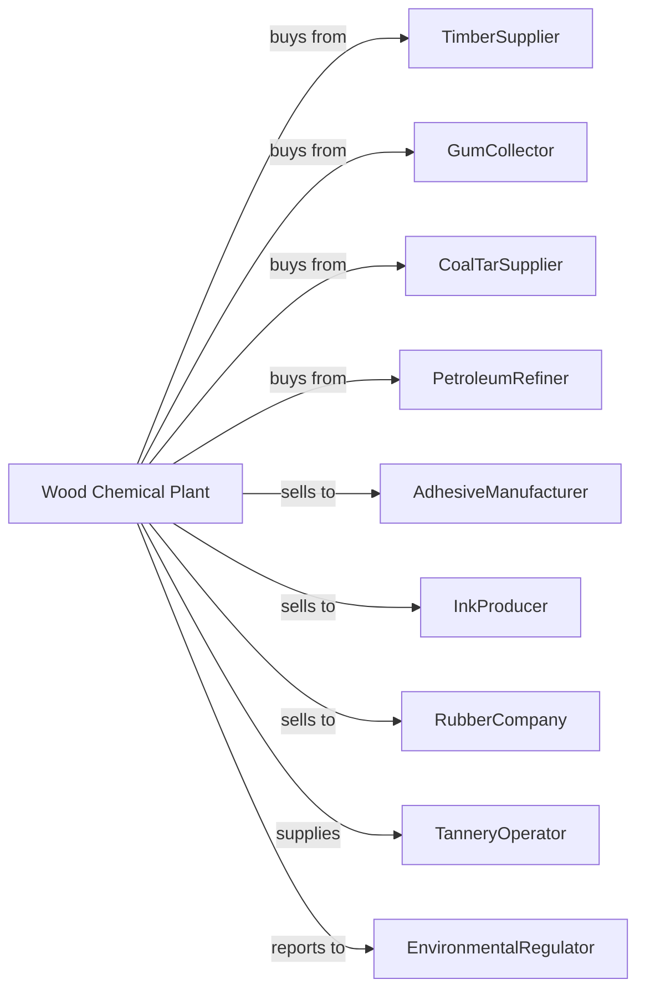

# Cyclic Crude, Intermediate, and Gum and Wood Chemical Manufacturing

> Business-as-Code definition for cyclic crude, wood chemical, and naval stores production operations. Models the complete manufacturing lifecycle from raw material distillation through specialty chemical distribution.

## Overview

This industry involves distilling wood or gum into products like tall oil and wood distillates, distilling coal tars, manufacturing naval stores and natural tanning materials, producing charcoal products, and manufacturing cyclic crudes and intermediates from refined petroleum or natural gas. This definition exposes actions for each phase of production, events for workflow automation, and searches for data retrieval.

## Actors

| Actor | Description |
|-------|-------------|
| TimberSupplier | Provides pine stumps, wood chips, and forestry residues |
| GumCollector | Harvests pine oleoresin from living trees |
| CoalTarSupplier | Provides coal tar from coke ovens |
| PetroleumRefiner | Supplies refined petroleum fractions |
| AdhesiveManufacturer | Purchases rosin and tall oil derivatives |
| InkProducer | Uses rosin esters in printing inks |
| RubberCompany | Employs tackifiers in rubber formulations |
| TanneryOperator | Purchases natural tanning extracts |
| EnvironmentalRegulator | Oversees emissions and waste disposal |

## Roles

| Role | Description |
|------|-------------|
| PlantManager | Oversees facility operations and raw material procurement |
| DistillationOperator | Controls wood and coal tar distillation processes |
| ExtractionTechnician | Operates solvent extraction and separation equipment |
| QualityAnalyst | Tests product specifications and purity |
| ForestryCoordinator | Manages relationships with timber and gum suppliers |
| ProcessEngineer | Optimizes distillation and purification processes |
| EnvironmentalTechnician | Monitors emissions and manages waste streams |
| LogisticsManager | Coordinates raw material intake and product shipment |

## Entities

| Entity | Description |
|--------|-------------|
| TallOil | Byproduct of kraft pulping containing rosin and fatty acids |
| Rosin | Solid resin from pine distillation for adhesives and inks |
| Turpentine | Volatile solvent distilled from pine oleoresin |
| CoalTar | Viscous liquid from coal carbonization |
| Creosote | Wood preservative distilled from coal tar |
| Charcoal | Carbon product from wood pyrolysis |
| NavalStores | Traditional term for pine-derived products |
| Tannin | Polyphenol extract for leather tanning |
| CyclicCrude | Cyclic hydrocarbon intermediates |
| Pitch | Residual material from distillation |

## Actions

| Action | Description |
|--------|-------------|
| collectGum | Harvest oleoresin from pine trees |
| receiveWood | Accept wood chips and stumps for processing |
| distillWood | Heat wood to extract volatile chemicals |
| fractionate | Separate distillate into component products |
| extractTallOil | Recover tall oil from kraft pulping liquor |
| refineRosin | Purify rosin by distillation or solvent treatment |
| distillCoalTar | Separate coal tar into fractions |
| produceCharcoal | Convert wood to charcoal through pyrolysis |
| extractTannin | Remove tannins from bark using water extraction |
| synthesizeCyclic | Produce cyclic intermediates from petroleum |
| testQuality | Analyze product specifications |
| packageProduct | Fill drums, tanks, or bags for shipment |

## Events

| Event | Description |
|-------|-------------|
| gumCollected | Oleoresin harvested from pine trees |
| woodReceived | Raw material delivered to facility |
| distillationCompleted | Volatile products separated and collected |
| tallOilExtracted | Tall oil recovered from pulping process |
| rosinRefined | Rosin purified to specification |
| charcoalProduced | Pyrolysis completed and charcoal cooled |
| qualityApproved | Product meets specification requirements |
| batchPackaged | Product containerized for shipment |
| inventoryLow | Stock level below reorder threshold |
| emissionAlert | Air quality limit exceeded |

## Searches

| Search | Description |
|--------|-------------|
| findProducts | List available chemicals by type and grade |
| getInventory | Retrieve stock levels and batch information |
| checkQuality | Get test results for specific batches |
| findSuppliers | List timber, gum, and coal tar sources |
| findCustomers | List buyers by application and volume |
| getProductionMetrics | Retrieve yield and throughput data |
| getPricing | Get current market prices |
| getComplianceData | Retrieve environmental monitoring results |

## Workflow

## Actor Relationships

