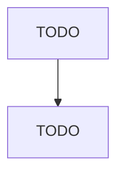

# All Other Basic Organic Chemical Manufacturing

> TODO: Business-as-Code definition

## Overview

This U.S. industry comprises establishments primarily engaged in manufacturing basic organic chemical products (except aromatic petrochemicals, industrial gases, synthetic organic dyes and pigments, gum and wood chemicals, cyclic crudes and intermediates, and ethyl alcohol). Illustrative Examples: Biodiesel fuels not made in petroleum refineries and not blended with petroleum Calcium organic compounds, not specified elsewhere by process, manufacturing Carbon organic compounds, not specified else

## Actors

| Actor | Description |
|-------|-------------|
| TODO | TODO |

## Roles

| Role | Description |
|------|-------------|
| TODO | TODO |

## Entities

| Entity | Description |
|--------|-------------|
| TODO | TODO |

## Actions

| Action | Description |
|--------|-------------|
| TODO | TODO |

## Events

| Event | Description |
|-------|-------------|
| TODO | TODO |

## Searches

| Search | Description |
|--------|-------------|
| TODO | TODO |

## Workflow

## Actor Relationships

