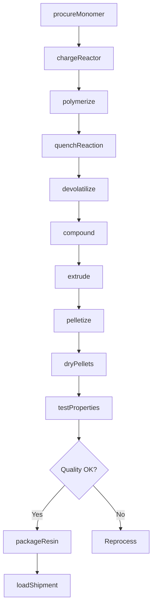
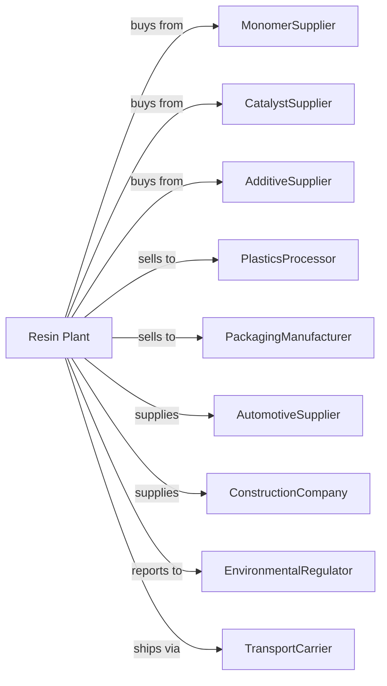

# Plastics Material and Resin Manufacturing

> Business-as-Code definition for plastics material and resin production operations. Models the complete polymer manufacturing lifecycle from monomer polymerization through resin pellet distribution.

## Overview

Plastics material and resin manufacturing involves producing resins, plastics materials, and nonvulcanizable thermoplastic elastomers including polyethylene, polypropylene, PVC, polystyrene, PET, and engineering plastics. This definition exposes actions for each phase of production, events for workflow automation, and searches for data retrieval.

## Actors

| Actor | Description |
|-------|-------------|
| MonomerSupplier | Provides ethylene, propylene, styrene, and other monomers |
| CatalystSupplier | Supplies polymerization catalysts and additives |
| AdditiveSupplier | Provides stabilizers, plasticizers, and colorants |
| PlasticsProcessor | Purchases resins for injection molding and extrusion |
| PackagingManufacturer | Uses resins for film, bottles, and containers |
| AutomotiveSupplier | Employs engineering plastics in vehicle components |
| ConstructionCompany | Uses PVC and other materials for building products |
| EnvironmentalRegulator | Oversees emissions and waste handling |
| TransportCarrier | Handles bulk resin shipments by rail and truck |

## Roles

| Role | Description |
|------|-------------|
| PlantManager | Oversees facility operations and production planning |
| PolymerEngineer | Develops and optimizes polymerization processes |
| ReactorOperator | Monitors and controls polymerization reactors |
| ExtrusionOperator | Operates pelletizing and packaging equipment |
| QualityAnalyst | Tests resin properties and specifications |
| ProcessEngineer | Optimizes throughput and energy efficiency |
| TechnicalSalesRep | Provides application support to customers |
| EnvironmentalTechnician | Monitors emissions and manages waste streams |

## Entities

| Entity | Description |
|--------|-------------|
| Monomer | Chemical building block for polymer chains |
| Polymer | Long-chain molecule formed from monomers |
| Resin | Solid or semi-solid polymer material |
| Pellet | Small cylindrical form of resin for processing |
| Catalyst | Material that initiates or controls polymerization |
| Additive | Chemical that modifies resin properties |
| Reactor | Vessel where polymerization occurs |
| Extruder | Equipment that forms and pelletizes molten polymer |
| MeltIndex | Measure of polymer flow characteristics |
| Batch | Quantity of resin from a production run |

## Actions

| Action | Description |
|--------|-------------|
| procureMonomer | Source and receive monomer feedstocks |
| chargeReactor | Load monomers and catalysts into reactor |
| polymerize | Initiate and control chain-growth reaction |
| quenchReaction | Stop polymerization at target molecular weight |
| devolatilize | Remove unreacted monomer and volatiles |
| compound | Blend polymer with additives and colorants |
| extrude | Melt and form polymer into strands |
| pelletize | Cut extruded strands into uniform pellets |
| dryPellets | Remove moisture from pellets |
| testProperties | Analyze melt index, density, and other specifications |
| packageResin | Fill bags, boxes, or bulk containers |
| loadShipment | Prepare resin for transport to customers |

## Events

| Event | Description |
|-------|-------------|
| monomerReceived | Feedstock delivered and verified |
| polymerizationStarted | Reactor charged and reaction initiated |
| polymerizationCompleted | Target molecular weight achieved |
| polymerDevolatilized | Volatiles removed from polymer |
| resinCompounded | Additives blended into base polymer |
| resinPelletized | Polymer formed into pellets |
| qualityApproved | Product meets specification requirements |
| batchPackaged | Resin containerized for shipment |
| shipmentLoaded | Product ready for transport |
| reactorCleaned | Equipment prepared for next batch |

## Searches

| Search | Description |
|--------|-------------|
| findProducts | List resins by type, grade, or application |
| getInventory | Retrieve stock levels and batch availability |
| checkQuality | Get test results for specific batches |
| findMonomers | List available feedstocks and pricing |
| findCustomers | List buyers by application and volume |
| getProductionMetrics | Retrieve yield and throughput data |
| getPricing | Get current resin market prices |
| getSpecifications | Retrieve technical data sheets |

## Workflow

## Actor Relationships

