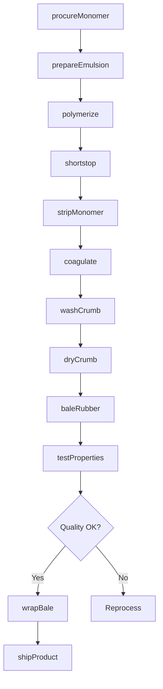
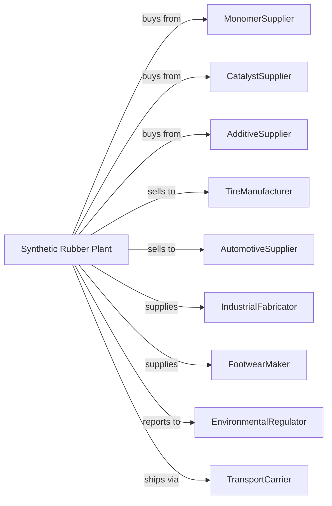

# Synthetic Rubber Manufacturing

> Business-as-Code definition for synthetic rubber production operations. Models the complete elastomer manufacturing lifecycle from monomer polymerization through rubber bale distribution.

## Overview

Synthetic rubber manufacturing involves producing elastomers including styrene-butadiene rubber (SBR), polybutadiene rubber (BR), ethylene-propylene rubber (EPDM), nitrile rubber, and other specialty elastomers. These materials serve tire, automotive, and industrial applications. This definition exposes actions for each phase of production, events for workflow automation, and searches for data retrieval.

## Actors

| Actor | Description |
|-------|-------------|
| MonomerSupplier | Provides butadiene, styrene, and other monomers |
| CatalystSupplier | Supplies polymerization catalysts and initiators |
| AdditiveSupplier | Provides antioxidants, oils, and processing aids |
| TireManufacturer | Purchases rubber for tire production |
| AutomotiveSupplier | Uses rubber for seals, hoses, and belts |
| IndustrialFabricator | Employs rubber in conveyor belts and rollers |
| FootwearMaker | Uses rubber for soles and components |
| EnvironmentalRegulator | Oversees emissions and chemical handling |
| TransportCarrier | Handles bulk rubber shipments |

## Roles

| Role | Description |
|------|-------------|
| PlantManager | Oversees facility operations and customer relations |
| PolymerChemist | Develops and optimizes rubber formulations |
| ReactorOperator | Monitors and controls emulsion or solution polymerization |
| FinishingOperator | Operates coagulation, drying, and baling equipment |
| QualityAnalyst | Tests rubber properties and specifications |
| ProcessEngineer | Optimizes production efficiency and quality |
| TechnicalServiceRep | Supports customers with application guidance |
| EnvironmentalTechnician | Monitors wastewater and emissions |

## Entities

| Entity | Description |
|--------|-------------|
| Monomer | Butadiene, styrene, or other polymerizable compounds |
| Elastomer | Rubber-like polymer with elastic properties |
| Latex | Colloidal suspension of rubber particles in water |
| Crumb | Coagulated rubber particles before drying |
| Bale | Compressed block of finished rubber |
| Catalyst | Material controlling polymerization reaction |
| Antioxidant | Additive preventing rubber degradation |
| MooneyViscosity | Measure of rubber processability |
| Reactor | Vessel for emulsion or solution polymerization |
| Coagulator | Equipment that precipitates rubber from latex |

## Actions

| Action | Description |
|--------|-------------|
| procureMonomer | Source and receive monomer feedstocks |
| prepareEmulsion | Mix monomers with soap and water for polymerization |
| polymerize | Conduct emulsion or solution polymerization |
| shortstop | Add chemical to terminate polymerization |
| stripMonomer | Remove unreacted monomer from latex |
| coagulate | Precipitate rubber particles from latex |
| washCrumb | Remove residual chemicals from rubber crumb |
| dryCrumb | Remove moisture using heated dryers |
| baleRubber | Compress dried rubber into bales |
| testProperties | Analyze Mooney viscosity and other specifications |
| wrapBale | Package bales in protective film |
| shipProduct | Load bales for transport to customers |

## Events

| Event | Description |
|-------|-------------|
| monomerReceived | Feedstock delivered and verified |
| emulsionPrepared | Polymerization mixture ready |
| polymerizationCompleted | Target conversion achieved |
| latexStripped | Unreacted monomer recovered |
| rubberCoagulated | Crumb separated from serum |
| crumbDried | Moisture removed to specification |
| baleFormed | Rubber compressed and weighed |
| qualityApproved | Product meets specification requirements |
| shipmentLoaded | Bales ready for transport |
| wastewaterTreated | Process water meets discharge limits |

## Searches

| Search | Description |
|--------|-------------|
| findProducts | List rubber grades by type and application |
| getInventory | Retrieve stock levels and bale availability |
| checkQuality | Get Mooney and property test results |
| findMonomers | List available feedstocks and pricing |
| findCustomers | List buyers by industry and volume |
| getProductionMetrics | Retrieve yield and efficiency data |
| getPricing | Get current rubber market prices |
| getSpecifications | Retrieve technical data sheets |

## Workflow

## Actor Relationships

