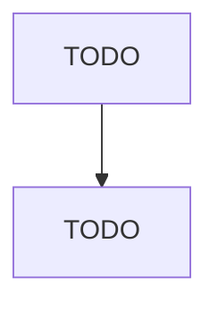

# Artificial and Synthetic Fibers and Filaments Manufacturing

> TODO: Business-as-Code definition

## Overview

This industry comprises establishments primarily engaged in (1) manufacturing cellulosic (e.g., rayon, acetate) and noncellulosic (e.g., nylon, polyolefin, polyester) fibers and filaments in the form of monofilament, filament yarn, staple, or tow or (2) manufacturing and texturizing cellulosic and noncellulosic fibers and filaments. Cross-References. Establishments primarily engaged in--

## Actors

| Actor | Description |
|-------|-------------|
| TODO | TODO |

## Roles

| Role | Description |
|------|-------------|
| TODO | TODO |

## Entities

| Entity | Description |
|--------|-------------|
| TODO | TODO |

## Actions

| Action | Description |
|--------|-------------|
| TODO | TODO |

## Events

| Event | Description |
|-------|-------------|
| TODO | TODO |

## Searches

| Search | Description |
|--------|-------------|
| TODO | TODO |

## Workflow

## Actor Relationships

