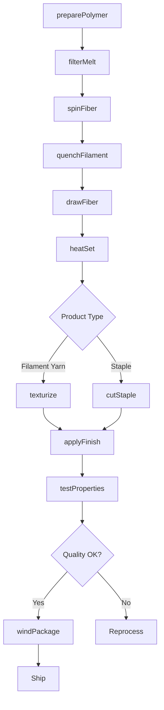
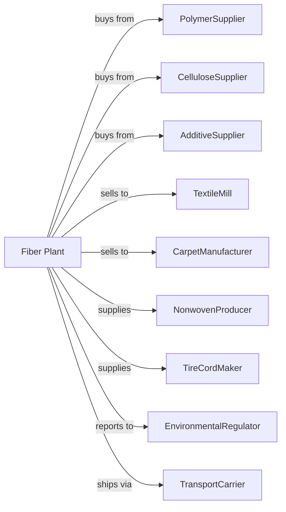

# Artificial and Synthetic Fibers and Filaments Manufacturing

> Business-as-Code definition for synthetic fiber and filament production operations. Models the complete fiber manufacturing lifecycle from polymer preparation through textile fiber distribution.

## Overview

Artificial and synthetic fibers and filaments manufacturing involves producing cellulosic fibers like rayon and acetate, and noncellulosic fibers including nylon, polyester, polypropylene, and acrylic in forms such as monofilament, filament yarn, staple, and tow. This definition exposes actions for each phase of production, events for workflow automation, and searches for data retrieval.

## Actors

| Actor | Description |
|-------|-------------|
| PolymerSupplier | Provides nylon, polyester, and other polymer chips |
| CelluloseSupplier | Supplies wood pulp and cellulose for rayon production |
| AdditiveSupplier | Provides delusterants, dyes, and spin finishes |
| TextileMill | Purchases fibers for fabric production |
| CarpetManufacturer | Uses fibers for carpet and rug production |
| NonwovenProducer | Employs fibers in nonwoven fabric production |
| TireCordMaker | Uses high-tenacity fibers for tire reinforcement |
| EnvironmentalRegulator | Oversees emissions and chemical discharge |
| TransportCarrier | Handles fiber shipments to customers |

## Roles

| Role | Description |
|------|-------------|
| PlantManager | Oversees facility operations and production planning |
| FiberEngineer | Develops and optimizes fiber properties and processes |
| SpinningOperator | Monitors and controls fiber extrusion equipment |
| DrawingOperator | Operates stretching and heat-setting equipment |
| QualityAnalyst | Tests fiber properties and specifications |
| ProcessEngineer | Optimizes throughput and quality |
| TexturizingOperator | Creates bulk and stretch in filament yarns |
| PackagingOperator | Winds and packages finished fiber products |

## Entities

| Entity | Description |
|--------|-------------|
| Polymer | Base material melted or dissolved for spinning |
| Spinneret | Die with fine holes for extruding fibers |
| Filament | Continuous strand of fiber material |
| Staple | Short-cut fibers for spinning into yarn |
| Tow | Bundle of continuous filaments for cutting |
| Denier | Unit of fiber linear density |
| Tenacity | Fiber strength per unit of linear density |
| Crimp | Wave or curl added to fibers for bulk |
| SpinFinish | Lubricant applied to fibers for processing |
| Package | Wound spool or bale of finished fiber |

## Actions

| Action | Description |
|--------|-------------|
| preparePolymer | Melt or dissolve polymer for spinning |
| filterMelt | Remove contaminants from molten polymer |
| spinFiber | Extrude polymer through spinneret to form filaments |
| quenchFilament | Cool extruded filaments to solidify |
| drawFiber | Stretch filaments to orient molecules and increase strength |
| heatSet | Apply heat to stabilize fiber dimensions |
| texturize | Add bulk and stretch to filament yarns |
| cutStaple | Convert tow to staple fibers of specified length |
| applyFinish | Apply spin finish for downstream processing |
| testProperties | Analyze denier, tenacity, and other specifications |
| windPackage | Wind finished fiber onto spools or bobbins |
| baleStaple | Compress staple fiber into bales |

## Events

| Event | Description |
|-------|-------------|
| polymerReceived | Raw material delivered and verified |
| meltPrepared | Polymer ready for spinning |
| fiberSpun | Filaments extruded and quenched |
| fiberDrawn | Filaments stretched to target properties |
| fiberHeatSet | Dimensional stability achieved |
| fiberTexturized | Bulk and stretch added to yarn |
| stapleCut | Tow converted to staple fiber |
| qualityApproved | Product meets specification requirements |
| packageWound | Fiber wound onto delivery package |
| shipmentReady | Product prepared for transport |

## Searches

| Search | Description |
|--------|-------------|
| findProducts | List fibers by type, denier, and application |
| getInventory | Retrieve stock levels and package availability |
| checkQuality | Get property test results for specific lots |
| findPolymers | List available feedstocks and pricing |
| findCustomers | List buyers by industry and volume |
| getProductionMetrics | Retrieve throughput and efficiency data |
| getPricing | Get current fiber market prices |
| getSpecifications | Retrieve technical product data |

## Workflow

## Actor Relationships

