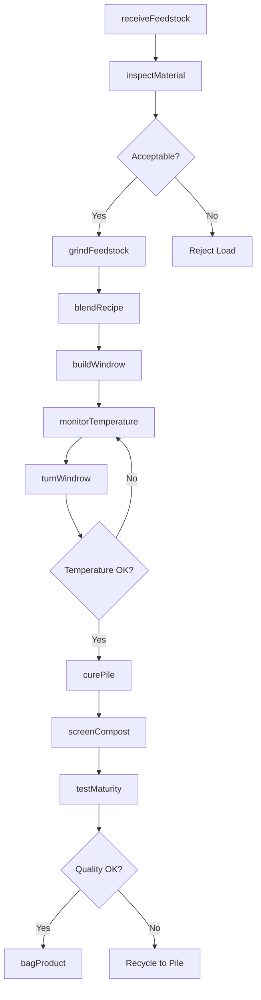
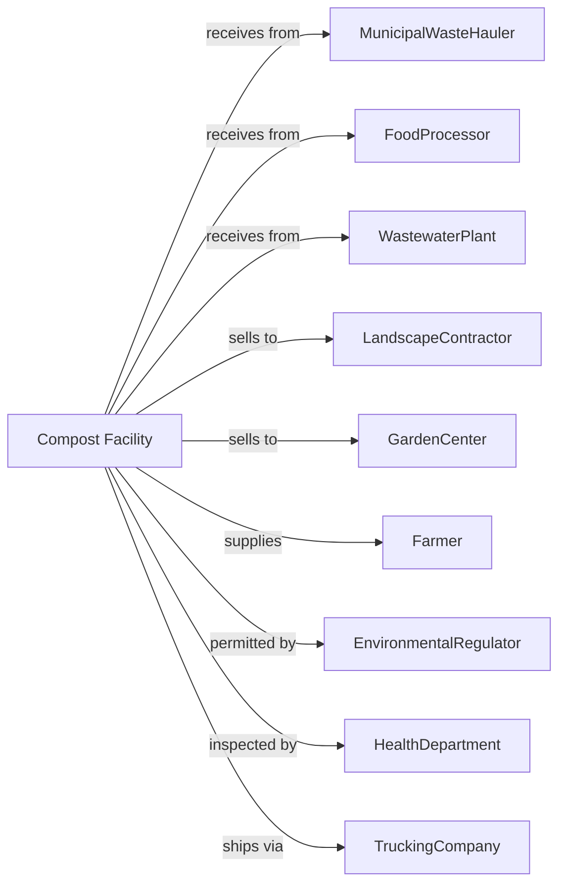

# Compost Manufacturing

> Business-as-Code definition for compost production operations. Models the complete composting lifecycle from feedstock collection through finished soil amendment distribution.

## Overview

Compost manufacturing involves producing compost through controlled aerobic biological decomposition and curing of biodegradable materials including yard waste, food scraps, biosolids, and agricultural residues. Products include bulk compost, bagged amendments, and specialty growing media. This definition exposes actions for each phase of production, events for workflow automation, and searches for data retrieval.

## Actors

| Actor | Description |
|-------|-------------|
| MunicipalWasteHauler | Delivers yard waste and food scraps from collection |
| FoodProcessor | Supplies food manufacturing waste and byproducts |
| WastewaterPlant | Provides biosolids for co-composting |
| LandscapeContractor | Purchases bulk compost for projects |
| GardenCenter | Buys bagged compost for retail sale |
| Farmer | Uses compost for soil improvement |
| EnvironmentalRegulator | Oversees facility permits and operations |
| HealthDepartment | Monitors pathogen reduction and public health |
| TruckingCompany | Transports feedstocks and finished compost |

## Roles

| Role | Description |
|------|-------------|
| FacilityManager | Oversees composting operations and compliance |
| ProcessOperator | Manages windrow turning and monitoring |
| EquipmentOperator | Operates loaders, grinders, and screeners |
| QualityTechnician | Tests compost maturity and specifications |
| FeedstockCoordinator | Manages incoming material acceptance |
| SalesRepresentative | Markets finished compost products |
| EnvironmentalTechnician | Monitors runoff and odor control |
| MaintenanceMechanic | Services composting equipment |

## Entities

| Entity | Description |
|--------|-------------|
| Feedstock | Organic material input for composting |
| Windrow | Long pile of composting material |
| Recipe | Blend ratio of carbon and nitrogen materials |
| Temperature | Indicator of microbial activity and pathogen kill |
| Moisture | Water content critical for decomposition |
| Maturity | Degree of stabilization and readiness for use |
| Screen | Equipment for sizing finished compost |
| Overs | Material too large to pass through screen |
| Fines | Small particles of finished compost |
| Curing | Final stabilization phase after active composting |

## Actions

| Action | Description |
|--------|-------------|
| receiveFeedstock | Accept and weigh incoming organic materials |
| inspectMaterial | Check feedstock for contaminants |
| grindFeedstock | Reduce particle size for faster decomposition |
| blendRecipe | Mix carbon and nitrogen materials to ratio |
| buildWindrow | Form feedstock into composting piles |
| turnWindrow | Aerate pile to maintain aerobic conditions |
| monitorTemperature | Track pile temperature for process control |
| addMoisture | Apply water to maintain optimal moisture |
| curePile | Allow compost to stabilize after active phase |
| screenCompost | Separate finished compost by particle size |
| testMaturity | Analyze stability and quality parameters |
| bagProduct | Package compost for retail sale |

## Events

| Event | Description |
|-------|-------------|
| feedstockReceived | Organic materials delivered and recorded |
| contaminantRejected | Load refused due to prohibited materials |
| windrowBuilt | Composting pile formed and documented |
| temperaturePeak | Pile reached pathogen-kill temperature |
| windrowTurned | Pile aerated and remixed |
| curingStarted | Active composting complete, curing begun |
| maturityReached | Compost stable and ready for use |
| productScreened | Finished compost sized for market |
| qualityApproved | Product meets specifications |
| orderShipped | Compost delivered to customer |

## Searches

| Search | Description |
|--------|-------------|
| findProducts | List compost grades and availability |
| getInventory | Retrieve finished compost stock levels |
| checkQuality | Get maturity and analysis test results |
| getFeedstockSchedule | List incoming material deliveries |
| findCustomers | List buyers by type and volume |
| getPileStatus | Monitor windrow temperatures and progress |
| getComplianceReports | Retrieve regulatory monitoring data |
| getPricing | Get current bulk and bagged prices |

## Workflow

## Actor Relationships

