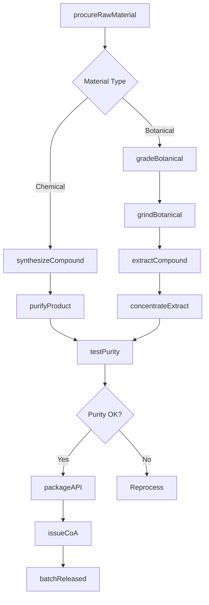
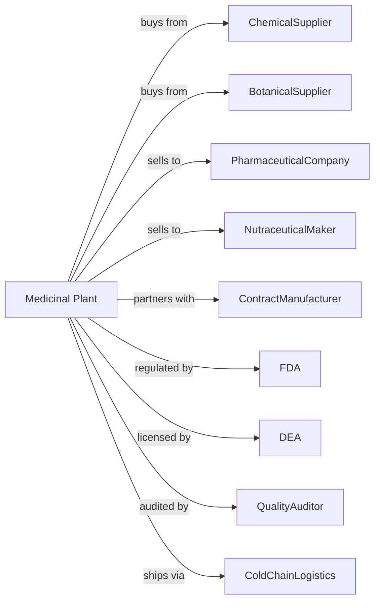

# Medicinal and Botanical Manufacturing

> Business-as-Code definition for medicinal chemical and botanical manufacturing operations. Models the complete production lifecycle from raw material processing through active pharmaceutical ingredient distribution.

## Overview

Medicinal and botanical manufacturing involves producing uncompounded medicinal chemicals and their derivatives for pharmaceutical preparation manufacturers, as well as grading, grinding, and milling uncompounded botanicals. Products include active pharmaceutical ingredients (APIs), botanical extracts, and plant-derived compounds. This definition exposes actions for each phase of production, events for workflow automation, and searches for data retrieval.

## Actors

| Actor | Description |
|-------|-------------|
| ChemicalSupplier | Provides starting materials and reagents for synthesis |
| BotanicalSupplier | Supplies raw plant materials and herbs |
| PharmaceuticalCompany | Purchases APIs for drug formulation |
| NutraceuticalMaker | Uses botanical extracts for supplements |
| ContractManufacturer | Provides custom synthesis services |
| FDA | Regulates drug manufacturing and GMP compliance |
| DEA | Controls scheduled substance manufacturing |
| QualityAuditor | Conducts third-party GMP audits |
| ColdChainLogistics | Handles temperature-sensitive shipments |

## Roles

| Role | Description |
|------|-------------|
| PlantManager | Oversees facility operations and regulatory compliance |
| ProcessChemist | Develops and optimizes synthesis routes |
| SynthesisOperator | Executes chemical reactions and purification |
| BotanicalProcessor | Grades, grinds, and extracts plant materials |
| QualityAnalyst | Tests purity, potency, and specifications |
| RegulatoryAffairs | Manages FDA filings and compliance documentation |
| ValidationEngineer | Qualifies equipment and validates processes |
| SupplyChainManager | Coordinates raw material and API logistics |

## Entities

| Entity | Description |
|--------|-------------|
| API | Active pharmaceutical ingredient for drug formulation |
| Intermediate | Chemical compound in synthesis pathway |
| Botanical | Raw plant material for processing |
| Extract | Concentrated plant compound from extraction |
| Reagent | Chemical used in synthesis reactions |
| Batch | Quantity produced in single production run |
| Certificate | CoA documenting quality specifications |
| DMF | Drug Master File for regulatory submissions |
| Impurity | Unwanted compound requiring control |
| Solvent | Liquid used in extraction and purification |

## Actions

| Action | Description |
|--------|-------------|
| procureRawMaterial | Source and receive starting materials |
| synthesizeCompound | Execute chemical reactions to form API |
| purifyProduct | Remove impurities through crystallization or chromatography |
| gradeBotanical | Sort plant material by quality standards |
| grindBotanical | Reduce particle size of dried plant material |
| extractCompound | Remove active compounds from plant material |
| concentrateExtract | Remove solvent to increase potency |
| testPurity | Analyze product for identity and impurities |
| packageAPI | Container product for shipment |
| issueCoA | Generate certificate of analysis |
| validateProcess | Confirm process consistently produces specification |
| fileRegulatory | Submit documentation to FDA or DEA |

## Events

| Event | Description |
|-------|-------------|
| rawMaterialReceived | Starting materials delivered and quarantined |
| synthesisCompleted | Chemical reaction finished |
| productPurified | Impurities removed to specification |
| botanicalGraded | Plant material sorted and accepted |
| extractConcentrated | Active compound concentrated |
| purityVerified | Product meets specification |
| batchReleased | Quality approved for shipment |
| coaIssued | Certificate of analysis generated |
| deviationReported | Out-of-spec condition documented |
| auditCompleted | Regulatory or quality audit finished |

## Searches

| Search | Description |
|--------|-------------|
| findProducts | List APIs and botanicals by compound and grade |
| getInventory | Retrieve stock levels and batch availability |
| checkQuality | Get purity and potency test results |
| findSuppliers | List raw material sources and pricing |
| findCustomers | List pharmaceutical companies by volume |
| getProductionMetrics | Retrieve yield and efficiency data |
| getRegulatoryStatus | Check DMF and registration status |
| getBatchHistory | Retrieve complete batch records |

## Workflow

## Actor Relationships

