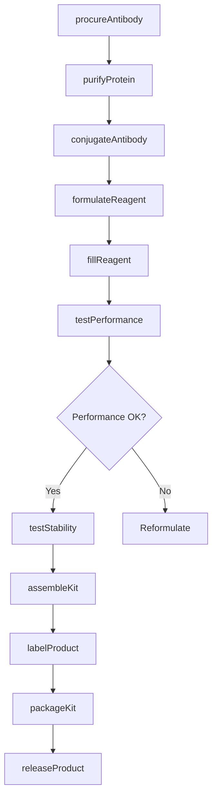
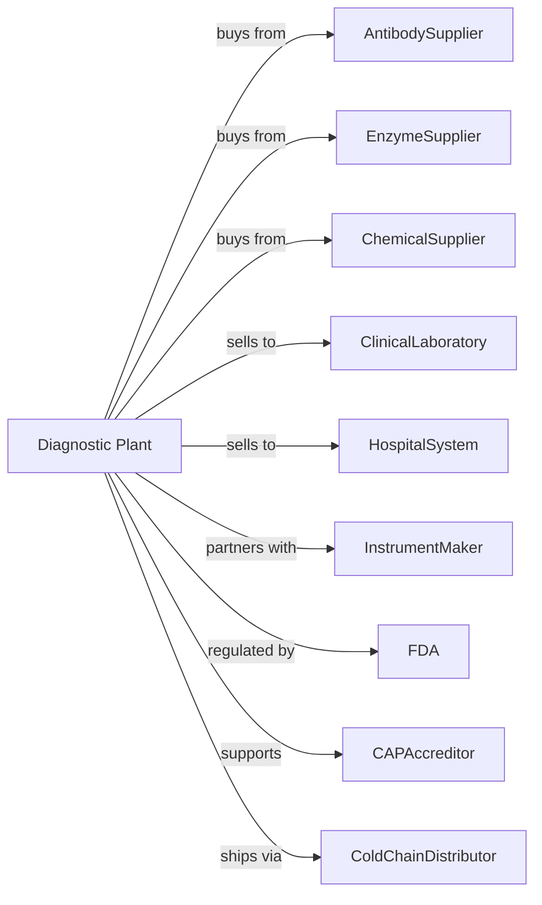

# In-Vitro Diagnostic Substance Manufacturing

> Business-as-Code definition for in-vitro diagnostic substance production operations. Models the complete manufacturing lifecycle from reagent development through diagnostic kit distribution.

## Overview

In-vitro diagnostic substance manufacturing involves producing chemical, biological, and radioactive substances used for diagnostic tests performed outside the body in test tubes, petri dishes, analyzers, and other diagnostic devices. Products include reagent kits, test strips, control materials, and calibrators for clinical laboratories. This definition exposes actions for each phase of production, events for workflow automation, and searches for data retrieval.

## Actors

| Actor | Description |
|-------|-------------|
| AntibodySupplier | Provides monoclonal and polyclonal antibodies |
| EnzymeSupplier | Supplies enzymes for assay reactions |
| ChemicalSupplier | Provides reagent-grade chemicals and buffers |
| ClinicalLaboratory | Purchases diagnostic kits for patient testing |
| HospitalSystem | Buys high-volume diagnostic supplies |
| InstrumentMaker | Manufactures analyzers that use reagent kits |
| FDA | Regulates diagnostic device approval and compliance |
| CAPAccreditor | Accredits clinical laboratories using products |
| ColdChainDistributor | Ships temperature-sensitive diagnostics |

## Roles

| Role | Description |
|------|-------------|
| PlantManager | Oversees manufacturing operations and quality systems |
| AssayDeveloper | Designs and validates diagnostic tests |
| ProductionOperator | Manufactures reagents and assembles kits |
| QualityControlAnalyst | Tests reagent performance and stability |
| RegulatoryAffairs | Manages 510(k) submissions and labeling |
| ValidationScientist | Validates assay performance and specifications |
| TechnicalSupport | Assists customers with product applications |
| SupplyChainManager | Coordinates raw material and kit logistics |

## Entities

| Entity | Description |
|--------|-------------|
| Reagent | Chemical or biological substance for diagnostic reaction |
| Kit | Complete set of reagents and materials for testing |
| Antibody | Protein that binds specific target molecules |
| Enzyme | Catalyst enabling detection reactions |
| Control | Material with known concentration for QC |
| Calibrator | Standard used to set instrument response |
| Assay | Diagnostic test method and procedure |
| IFU | Instructions for use documentation |
| LotNumber | Tracking identifier for production batch |
| ShelfLife | Period reagents maintain performance |

## Actions

| Action | Description |
|--------|-------------|
| procureAntibody | Source and receive antibody reagents |
| formulateReagent | Mix components to create working reagent |
| purifyProtein | Remove contaminants from biological materials |
| conjugateAntibody | Attach enzymes or labels to antibodies |
| fillReagent | Dispense reagents into vials or bottles |
| assembleKit | Combine reagents and materials into kits |
| testPerformance | Validate sensitivity, specificity, and precision |
| testStability | Confirm reagent performance over time |
| labelProduct | Apply required regulatory labeling |
| packageKit | Prepare kits for cold chain shipment |
| releaseProduct | Quality approve for distribution |
| supportCustomer | Provide technical assistance |

## Events

| Event | Description |
|-------|-------------|
| antibodyReceived | Biological material delivered and tested |
| reagentFormulated | Reagent mixture prepared and sampled |
| antibodyConjugated | Label attached and verified |
| kitAssembled | Components packaged together |
| performanceValidated | Assay meets sensitivity and specificity |
| stabilityConfirmed | Reagents stable through shelf life |
| productLabeled | Regulatory labels applied |
| productReleased | Quality approved for sale |
| customerComplaint | Issue reported from field |
| fdaClearance | 510(k) approval received |

## Searches

| Search | Description |
|--------|-------------|
| findProducts | List diagnostic kits by analyte and platform |
| getInventory | Retrieve kit stock and lot availability |
| checkQuality | Get performance and stability data |
| findCustomers | List laboratories by testing volume |
| getLotHistory | Retrieve complete production records |
| getRegulatoryStatus | Check 510(k) clearance status |
| getComplaintTrends | Analyze field performance issues |
| getShelfLife | Review expiration dates by lot |

## Workflow

## Actor Relationships

