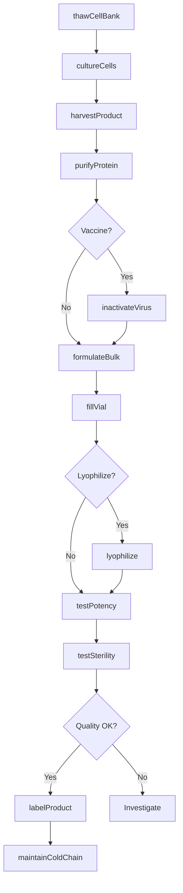
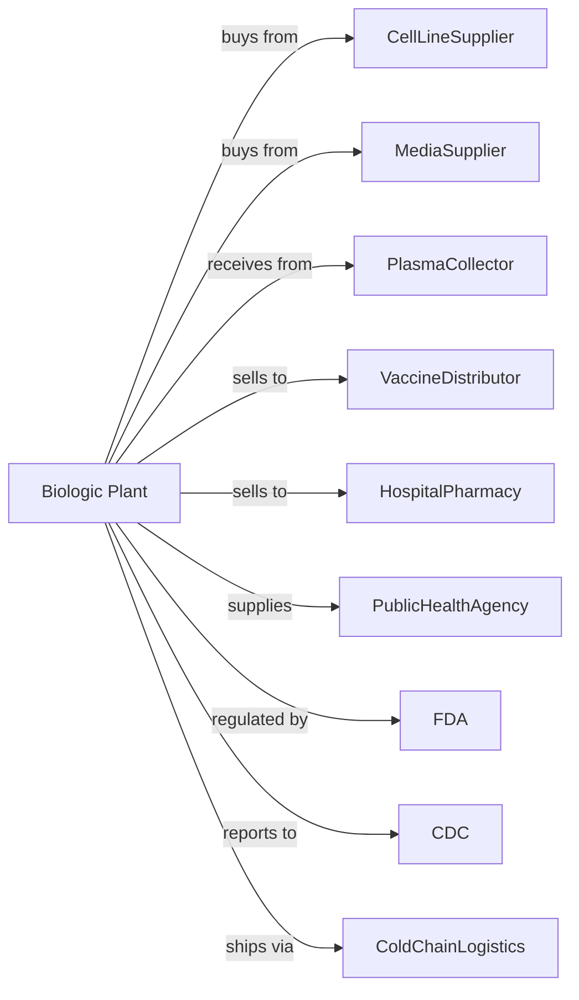

# Biological Product (except Diagnostic) Manufacturing

> Business-as-Code definition for biological product manufacturing operations. Models the complete biomanufacturing lifecycle from cell culture through vaccine and biologic distribution.

## Overview

Biological product manufacturing involves producing vaccines, toxoids, blood fractions, and culture media of plant or animal origin. Products include vaccines for infectious diseases, monoclonal antibodies, blood plasma derivatives, allergen extracts, and cell therapy products. This definition exposes actions for each phase of production, events for workflow automation, and searches for data retrieval.

## Actors

| Actor | Description |
|-------|-------------|
| CellLineSupplier | Provides master cell banks and expression systems |
| MediaSupplier | Supplies cell culture media and supplements |
| PlasmaCollector | Provides human plasma for fractionation |
| VaccineDistributor | Purchases vaccines for distribution |
| HospitalPharmacy | Buys biologics for patient treatment |
| PublicHealthAgency | Procures vaccines for immunization programs |
| FDA | Regulates biologic approval and GMP compliance |
| CDC | Recommends vaccines and monitors disease |
| ColdChainLogistics | Handles ultra-cold and refrigerated shipments |

## Roles

| Role | Description |
|------|-------------|
| PlantManager | Oversees biomanufacturing operations and compliance |
| CellCultureScientist | Develops and maintains cell culture processes |
| BioreactorOperator | Operates fermentation and cell culture equipment |
| PurificationSpecialist | Executes chromatography and filtration |
| QualityControlAnalyst | Tests potency, purity, and sterility |
| RegulatoryAffairs | Manages BLA submissions and compliance |
| ValidationEngineer | Qualifies equipment and validates processes |
| ColdChainCoordinator | Manages temperature-controlled distribution |

## Entities

| Entity | Description |
|--------|-------------|
| Vaccine | Biological preparation providing immunity |
| Antibody | Therapeutic monoclonal antibody product |
| PlasmaDerivative | Protein fraction purified from blood plasma |
| CellBank | Stored cells for production seed |
| Bioreactor | Vessel for growing cells or microorganisms |
| CultureMedia | Nutrient solution for cell growth |
| Antigen | Substance that triggers immune response |
| Adjuvant | Additive enhancing vaccine immune response |
| BLA | Biologics License Application for approval |
| Potency | Measure of biological activity |

## Actions

| Action | Description |
|--------|-------------|
| thawCellBank | Revive frozen cells for production |
| cultureCells | Grow cells in bioreactor to target density |
| harvestProduct | Collect cells or secreted protein |
| purifyProtein | Remove impurities through chromatography |
| inactivateVirus | Render viral vaccines safe |
| formulateBulk | Add stabilizers and adjuvants |
| fillVial | Aseptically fill product into vials |
| lyophilize | Freeze-dry product for stability |
| testPotency | Measure biological activity |
| testSterility | Confirm absence of contamination |
| labelProduct | Apply required biologic labeling |
| maintainColdChain | Ensure temperature control through distribution |

## Events

| Event | Description |
|-------|-------------|
| cellBankThawed | Production cells revived and expanded |
| cultureHarvested | Cells or protein collected from bioreactor |
| productPurified | Protein isolated and concentrated |
| virusInactivated | Pathogen rendered non-infectious |
| bulkFormulated | Final product prepared for filling |
| vialsFilled | Sterile filling completed |
| potencyVerified | Biological activity confirmed |
| sterilityConfirmed | No contamination detected |
| batchReleased | QA approved for distribution |
| coldChainDeviation | Temperature excursion detected |

## Searches

| Search | Description |
|--------|-------------|
| findProducts | List biologics by type and indication |
| getInventory | Retrieve stock levels and lot availability |
| checkQuality | Get potency and sterility test results |
| findCustomers | List distributors and health systems |
| getCellBankStatus | Monitor master and working cell banks |
| getBatchRecords | Retrieve complete production documentation |
| getRegulatoryStatus | Check BLA approval status |
| getColdChainData | Review temperature monitoring logs |

## Workflow

## Actor Relationships

