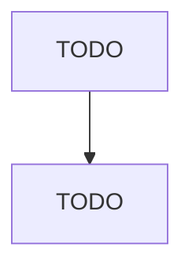

# Paint and Coating Manufacturing

> TODO: Business-as-Code definition

## Overview

This industry comprises establishments primarily engaged in (1) mixing pigments, solvents, and binders into paints and other coatings, such as stains, varnishes, lacquers, enamels, shellacs, and water-repellent coatings for concrete and masonry, and/or (2) manufacturing allied paint products, such as putties, paint and varnish removers, paint brush cleaners, and frit. Cross-References. Establishments primarily engaged in--

## Actors

| Actor | Description |
|-------|-------------|
| TODO | TODO |

## Roles

| Role | Description |
|------|-------------|
| TODO | TODO |

## Entities

| Entity | Description |
|--------|-------------|
| TODO | TODO |

## Actions

| Action | Description |
|--------|-------------|
| TODO | TODO |

## Events

| Event | Description |
|-------|-------------|
| TODO | TODO |

## Searches

| Search | Description |
|--------|-------------|
| TODO | TODO |

## Workflow

## Actor Relationships

