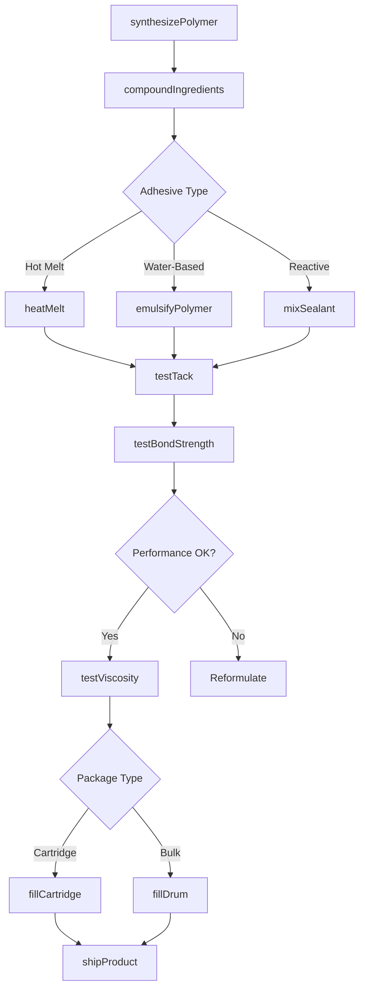
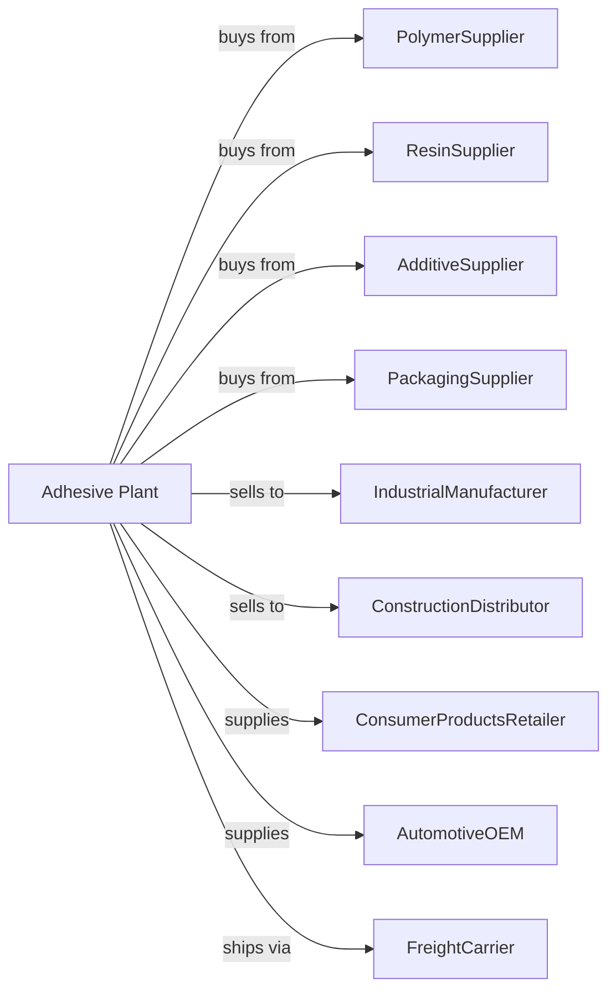

# Adhesive Manufacturing

> Business-as-Code definition for adhesive, glue, and sealant production operations. Models the complete manufacturing lifecycle from polymer preparation through bonding product distribution.

## Overview

Adhesive manufacturing involves producing adhesives, glues, caulking compounds, and sealants for industrial, construction, and consumer applications. Products include hot-melt adhesives, pressure-sensitive adhesives, epoxies, polyurethanes, silicones, and water-based glues. This definition exposes actions for each phase of production, events for workflow automation, and searches for data retrieval.

## Actors

| Actor | Description |
|-------|-------------|
| PolymerSupplier | Provides base polymers and elastomers |
| ResinSupplier | Supplies tackifiers and film-forming resins |
| AdditiveSupplier | Provides plasticizers, fillers, and stabilizers |
| PackagingSupplier | Supplies cartridges, tubes, and bulk containers |
| IndustrialManufacturer | Uses adhesives in assembly operations |
| ConstructionDistributor | Sells sealants and construction adhesives |
| ConsumerProductsRetailer | Stocks household glues and tapes |
| AutomotiveOEM | Employs structural adhesives in vehicle assembly |
| FreightCarrier | Handles adhesive shipments |

## Roles

| Role | Description |
|------|-------------|
| PlantManager | Oversees production operations and quality |
| FormulationChemist | Develops adhesive and sealant formulations |
| ReactorOperator | Synthesizes polymers and conducts reactions |
| CompoundingOperator | Mixes and blends adhesive formulations |
| QualityTechnician | Tests bond strength and product properties |
| ApplicationEngineer | Supports customers with bonding solutions |
| PackagingOperator | Fills cartridges, tubes, and bulk containers |
| EnvironmentalCoordinator | Manages solvent emissions and waste |

## Entities

| Entity | Description |
|--------|-------------|
| HotMelt | Thermoplastic adhesive applied molten |
| PSA | Pressure-sensitive adhesive for tapes and labels |
| Epoxy | Two-part structural adhesive |
| Polyurethane | Flexible structural adhesive |
| Silicone | Flexible sealant and adhesive |
| WaterBased | Adhesive using water as carrier |
| Tackifier | Resin providing initial tack |
| Crosslinker | Agent providing chemical cure |
| Substrate | Material being bonded |
| BondStrength | Measure of adhesive performance |

## Actions

| Action | Description |
|--------|-------------|
| synthesizePolymer | Produce base adhesive polymer |
| compoundIngredients | Mix polymer with additives and fillers |
| heatMelt | Melt hot-melt adhesive for processing |
| emulsifyPolymer | Create water-based adhesive dispersion |
| reactComponents | Combine reactive components for cure |
| mixSealant | Blend silicone or polyurethane sealant |
| testTack | Measure initial adhesion properties |
| testBondStrength | Evaluate cured bond performance |
| testViscosity | Measure flow properties for application |
| fillCartridge | Package adhesive in applicator cartridges |
| fillDrum | Package bulk adhesive for industrial use |
| shipProduct | Dispatch products to customers |

## Events

| Event | Description |
|-------|-------------|
| polymerSynthesized | Base polymer produced |
| ingredientsCompounded | Formulation mixed and homogenized |
| hotMeltMelted | Thermoplastic adhesive ready for fill |
| emulsionPrepared | Water-based adhesive created |
| tackVerified | Initial adhesion meets specification |
| bondStrengthApproved | Cured performance meets requirements |
| viscosityAdjusted | Flow properties set for application |
| productPackaged | Adhesive containerized for shipment |
| orderShipped | Products dispatched to customer |
| shelfLifeExpired | Product exceeded storage time |

## Searches

| Search | Description |
|--------|-------------|
| findProducts | List adhesives by type and application |
| getInventory | Retrieve stock levels and batch availability |
| checkQuality | Get bond strength and property test results |
| findFormulas | List product specifications and data sheets |
| findCustomers | List buyers by industry and volume |
| findSubstrates | Match adhesive to bonding application |
| getProductionMetrics | Retrieve throughput and efficiency data |
| getPricing | Get current wholesale prices |

## Workflow

## Actor Relationships

