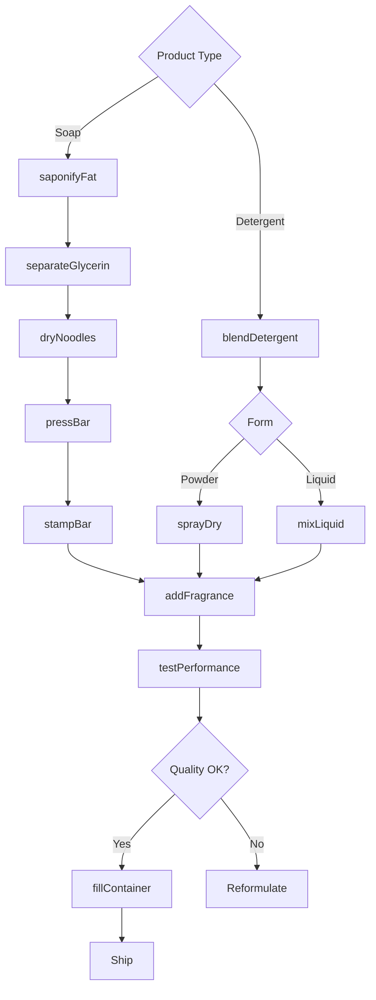
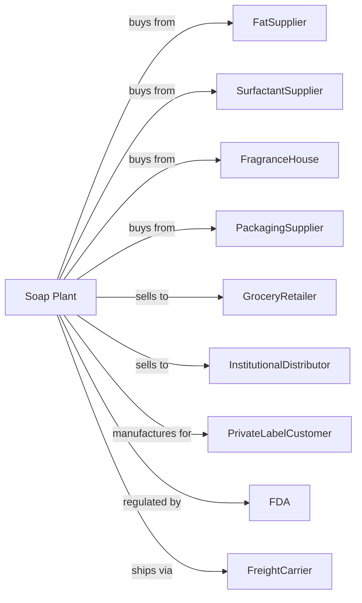

# Soap and Other Detergent Manufacturing

> Business-as-Code definition for soap and detergent production operations. Models the complete manufacturing lifecycle from saponification through packaged cleaning product distribution.

## Overview

Soap and detergent manufacturing involves producing and packaging bath, facial, and hand soaps, hand sanitizers, laundry detergents, dishwashing detergents, toothpaste, and natural glycerin. Products serve consumer, commercial, and industrial cleaning applications. This definition exposes actions for each phase of production, events for workflow automation, and searches for data retrieval.

## Actors

| Actor | Description |
|-------|-------------|
| FatSupplier | Provides tallow, vegetable oils, and fatty acids |
| SurfactantSupplier | Supplies synthetic detergent bases |
| FragranceHouse | Provides scents and essential oils |
| PackagingSupplier | Supplies bottles, boxes, and dispensers |
| GroceryRetailer | Stocks cleaning products for consumers |
| InstitutionalDistributor | Serves hotels, hospitals, and facilities |
| PrivateLabelCustomer | Contracts for store-brand products |
| FDA | Regulates antibacterial and drug claims |
| FreightCarrier | Handles product distribution |

## Roles

| Role | Description |
|------|-------------|
| PlantManager | Oversees production operations and quality |
| FormulationChemist | Develops soap and detergent formulations |
| SaponificationOperator | Runs soap making kettles and processes |
| MixingOperator | Blends detergent ingredients |
| QualityTechnician | Tests pH, viscosity, and cleaning performance |
| PackagingOperator | Fills bottles, bars, and boxes |
| RegulatorySpecialist | Manages ingredient labeling and claims |
| SupplyChainManager | Coordinates raw materials and distribution |

## Entities

| Entity | Description |
|--------|-------------|
| Soap | Cleansing agent from fat saponification |
| Detergent | Synthetic cleaning agent |
| Surfactant | Surface-active ingredient enabling cleaning |
| Fragrance | Scent added to cleaning products |
| Glycerin | Coproduct of soap making |
| Bar | Solid soap formed in molds |
| Liquid | Pourable cleaning product |
| Powder | Dry granular detergent form |
| Enzyme | Protein catalyst for stain removal |
| Batch | Quantity produced in single run |

## Actions

| Action | Description |
|--------|-------------|
| saponifyFat | React fats with alkali to make soap |
| separateGlycerin | Recover glycerin byproduct |
| dryNoodles | Form and dry soap for bar production |
| pressBar | Mold soap noodles into bars |
| stampBar | Emboss brand and shape onto bars |
| blendDetergent | Mix surfactants with builders and additives |
| sprayDry | Form powder detergent from slurry |
| mixLiquid | Combine ingredients for liquid products |
| addFragrance | Incorporate scent into formulation |
| testPerformance | Evaluate cleaning efficacy |
| fillContainer | Package products in bottles or boxes |
| wrapBar | Package soap bars for retail |

## Events

| Event | Description |
|-------|-------------|
| fatSaponified | Soap formed from fat reaction |
| glycerinSeparated | Byproduct recovered for sale |
| barsPressed | Soap formed into bar shape |
| detergentBlended | Ingredients combined |
| powderDried | Spray drying completed |
| fragranceAdded | Scent incorporated |
| performanceVerified | Cleaning tests passed |
| productPackaged | Items ready for shipment |
| orderShipped | Products dispatched |
| qualityHold | Product quarantined for investigation |

## Searches

| Search | Description |
|--------|-------------|
| findProducts | List soaps and detergents by type and form |
| getInventory | Retrieve stock levels and batch availability |
| checkQuality | Get performance and specification test results |
| findFormulas | List product formulations |
| findCustomers | List retailers and distributors |
| getProductionMetrics | Retrieve throughput and efficiency data |
| getPricing | Get current wholesale prices |
| getIngredientCosts | Review raw material pricing |

## Workflow

## Actor Relationships

