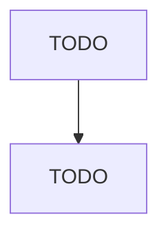

# Toilet Preparation Manufacturing

> TODO: Business-as-Code definition

## Overview

This industry comprises establishments primarily engaged in preparing, blending, compounding, and packaging toilet preparations, such as perfumes, shaving preparations, hair preparations, face creams, lotions (including sunscreens), and other cosmetic preparations. Cross-References.

## Actors

| Actor | Description |
|-------|-------------|
| TODO | TODO |

## Roles

| Role | Description |
|------|-------------|
| TODO | TODO |

## Entities

| Entity | Description |
|--------|-------------|
| TODO | TODO |

## Actions

| Action | Description |
|--------|-------------|
| TODO | TODO |

## Events

| Event | Description |
|-------|-------------|
| TODO | TODO |

## Searches

| Search | Description |
|--------|-------------|
| TODO | TODO |

## Workflow

## Actor Relationships

