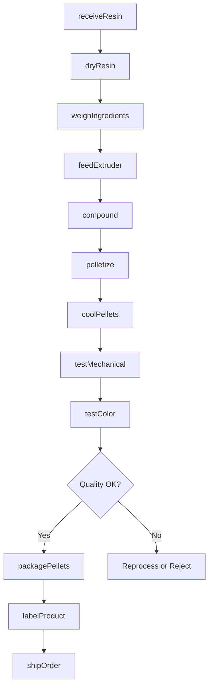
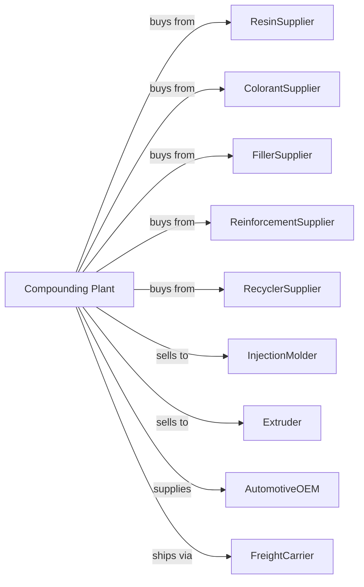

# Custom Compounding of Purchased Resins

> Business-as-Code definition for custom plastics compounding operations. Models the complete manufacturing lifecycle from resin blending through compounded pellet distribution.

## Overview

Custom compounding of purchased resins involves mixing and blending plastics resins made elsewhere or reformulating plastics resins from recycled materials. Products include color concentrates, filled compounds, reinforced plastics, and specialty formulations for specific customer applications. This definition exposes actions for each phase of production, events for workflow automation, and searches for data retrieval.

## Actors

| Actor | Description |
|-------|-------------|
| ResinSupplier | Provides base polymer resins |
| ColorantSupplier | Supplies pigments and dyes for compounds |
| FillerSupplier | Provides calcium carbonate, talc, and minerals |
| ReinforcementSupplier | Supplies glass fiber and carbon fiber |
| RecyclerSupplier | Provides post-consumer and post-industrial regrind |
| InjectionMolder | Purchases compounds for part production |
| Extruder | Uses compounds for film, sheet, and profile |
| AutomotiveOEM | Requires custom compounds for vehicle parts |
| FreightCarrier | Handles pellet shipments |

## Roles

| Role | Description |
|------|-------------|
| PlantManager | Oversees compounding operations and scheduling |
| CompoundingEngineer | Develops custom formulations |
| ExtrusionOperator | Operates twin-screw compounding extruders |
| ColorMatchSpecialist | Matches pellet color to customer standards |
| QualityTechnician | Tests mechanical and physical properties |
| MaterialHandler | Manages resin inventory and feeding |
| CustomerServiceRep | Coordinates orders and specifications |
| MaintenanceTechnician | Services extruders and auxiliary equipment |

## Entities

| Entity | Description |
|--------|-------------|
| Compound | Blended resin with additives for specific properties |
| BaseResin | Virgin or recycled polymer for compounding |
| Colorant | Pigment or dye added for color |
| Filler | Mineral additive reducing cost or adding properties |
| Reinforcement | Fiber adding strength and stiffness |
| Masterbatch | Concentrated additive for letdown |
| Regrind | Recycled plastics for reformulation |
| Pellet | Compounded material in pellet form |
| ExtruderTwinScrew | Machine blending and pelletizing compounds |
| Specification | Customer requirements for compound properties |

## Actions

| Action | Description |
|--------|-------------|
| receiveResin | Accept and verify base polymer deliveries |
| dryResin | Remove moisture before processing |
| weighIngredients | Measure components per formula |
| feedExtruder | Load materials into compounding line |
| compound | Melt blend ingredients in twin-screw extruder |
| pelletize | Cut extruded strands into pellets |
| coolPellets | Reduce temperature after cutting |
| testMechanical | Measure tensile, impact, and flexural properties |
| testColor | Compare to customer color standard |
| packagePellets | Fill bags, boxes, or gaylords |
| labelProduct | Apply lot numbers and specifications |
| shipOrder | Dispatch compounds to customers |

## Events

| Event | Description |
|-------|-------------|
| resinReceived | Base polymer delivered and verified |
| resinDried | Moisture removed to specification |
| ingredientsWeighed | Formula components measured |
| compoundingCompleted | Extrusion run finished |
| pelletsFormed | Compound pelletized |
| mechanicalPropertiesApproved | Strength tests passed |
| colorMatched | Pellets match customer standard |
| productPackaged | Compound containerized |
| orderShipped | Products dispatched |
| offSpecBatch | Compound fails specifications |

## Searches

| Search | Description |
|--------|-------------|
| findCompounds | List formulations by resin and properties |
| getInventory | Retrieve pellet stock and lot availability |
| checkQuality | Get mechanical and color test results |
| findCustomers | List molders and extruders by volume |
| getFormulas | Retrieve compound recipes |
| getProductionSchedule | View extruder capacity and queue |
| getPricing | Get current pricing by compound |
| getRecycledContent | Track post-consumer material usage |

## Workflow

## Actor Relationships

