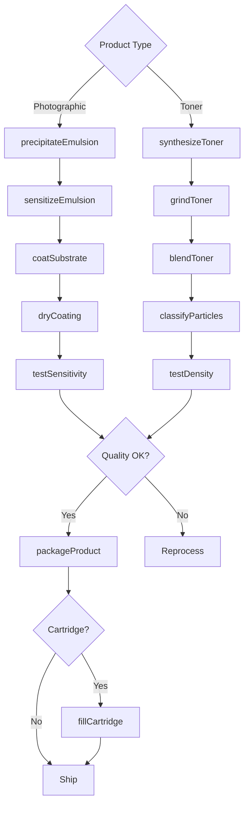
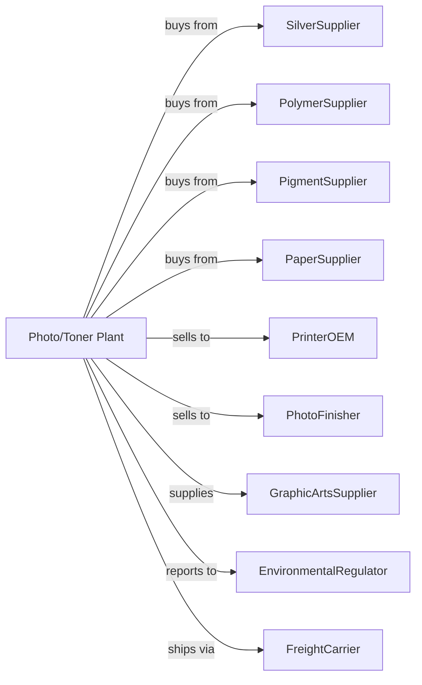

# Photographic Film, Paper, Plate, Chemical, and Copy Toner Manufacturing

> Business-as-Code definition for photographic materials and toner production operations. Models the complete manufacturing lifecycle from sensitized material coating through imaging product distribution.

## Overview

This industry involves manufacturing sensitized film, paper, cloth, and plates for photography, as well as toners for photocopiers, laser printers, and similar electrostatic printing devices, plus toner cartridges and photographic chemicals. This definition exposes actions for each phase of production, events for workflow automation, and searches for data retrieval.

## Actors

| Actor | Description |
|-------|-------------|
| SilverSupplier | Provides silver halide for photographic emulsions |
| PolymerSupplier | Supplies toner base resins |
| PigmentSupplier | Provides colorants for toner formulations |
| PaperSupplier | Supplies base stock for photographic paper |
| PrinterOEM | Purchases toner and cartridges for devices |
| PhotoFinisher | Buys film, paper, and chemicals |
| GraphicArtsSupplier | Sells plates and films to printers |
| EnvironmentalRegulator | Oversees silver recovery and waste |
| FreightCarrier | Handles product distribution |

## Roles

| Role | Description |
|------|-------------|
| PlantManager | Oversees manufacturing operations and quality |
| EmulsionChemist | Develops silver halide photographic emulsions |
| TonerChemist | Formulates toner compositions |
| CoatingOperator | Applies sensitized coatings to substrates |
| MillingOperator | Produces toner particles by grinding or polymerization |
| QualityTechnician | Tests sensitivity, density, and toner properties |
| CartridgeFiller | Assembles and fills toner cartridges |
| EnvironmentalEngineer | Manages silver recovery and waste treatment |

## Entities

| Entity | Description |
|--------|-------------|
| Film | Sensitized base for capturing photographic images |
| PhotoPaper | Sensitized paper for printing photographs |
| Plate | Sensitized surface for offset printing |
| Emulsion | Silver halide coating on substrates |
| Toner | Fine powder for electrostatic printing |
| Cartridge | Container holding toner for printers |
| Developer | Chemical processing photographic images |
| Fixer | Chemical stabilizing developed images |
| SilverHalide | Light-sensitive silver compound |
| ParticleSize | Critical toner property for print quality |

## Actions

| Action | Description |
|--------|-------------|
| precipitateEmulsion | Form silver halide crystals |
| sensitizeEmulsion | Add spectral sensitizers and additives |
| coatSubstrate | Apply emulsion to film, paper, or plate |
| dryCoating | Remove solvent and set coating |
| synthesizeToner | Produce toner particles by polymerization |
| grindToner | Mill toner to target particle size |
| blendToner | Add colorant and additives to base |
| classifyParticles | Separate toner by particle size |
| fillCartridge | Load toner into printer cartridges |
| testSensitivity | Measure light response of photographic materials |
| testDensity | Evaluate toner print density |
| packageProduct | Prepare products for shipment |

## Events

| Event | Description |
|-------|-------------|
| emulsionPrecipitated | Silver halide crystals formed |
| substratePrepared | Film or paper coated |
| coatingDried | Sensitized material ready |
| tonerSynthesized | Toner particles produced |
| particlesSized | Toner classified to specification |
| sensitivityVerified | Photographic material meets ISO speed |
| densityApproved | Toner produces target print density |
| cartridgesFilled | Toner loaded into cartridges |
| productPackaged | Items prepared for shipment |
| silverRecovered | Waste silver reclaimed |

## Searches

| Search | Description |
|--------|-------------|
| findProducts | List films, papers, toners by type and format |
| getInventory | Retrieve stock levels and lot availability |
| checkQuality | Get sensitivity and density test results |
| findCustomers | List OEMs, finishers, and distributors |
| getProductionMetrics | Retrieve throughput and yield data |
| getPricing | Get current wholesale prices |
| getSilverRecovery | Track precious metal reclamation |
| getCartridgeCompatibility | Match toner to printer models |

## Workflow

## Actor Relationships

