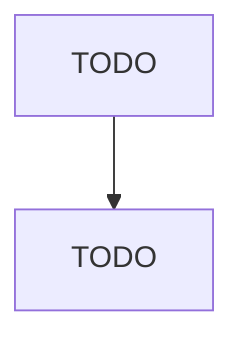

# All Other Miscellaneous Chemical Product and Preparation Manufacturing

> TODO: Business-as-Code definition

## Overview

This U.S. industry comprises establishments primarily engaged in manufacturing chemical products (except basic chemicals, resins, and synthetic rubber; cellulosic and noncellulosic fibers and filaments; pesticides, fertilizers, and other agricultural chemicals; pharmaceuticals and medicines; paints, coatings and adhesives; soaps, cleaning compounds, and toilet preparations; printing inks; explosives; custom compounding of purchased resins; and photographic films, papers, plates, chemicals, and c

## Actors

| Actor | Description |
|-------|-------------|
| TODO | TODO |

## Roles

| Role | Description |
|------|-------------|
| TODO | TODO |

## Entities

| Entity | Description |
|--------|-------------|
| TODO | TODO |

## Actions

| Action | Description |
|--------|-------------|
| TODO | TODO |

## Events

| Event | Description |
|-------|-------------|
| TODO | TODO |

## Searches

| Search | Description |
|--------|-------------|
| TODO | TODO |

## Workflow

## Actor Relationships

