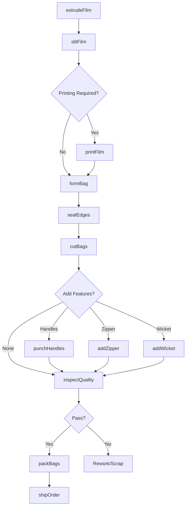
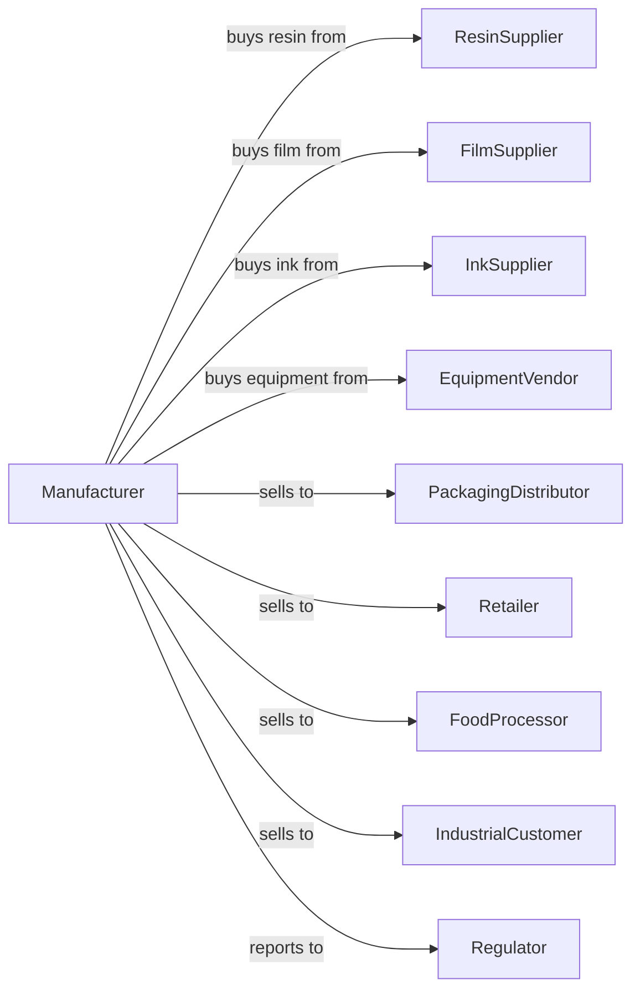

# Plastics Bag and Pouch Manufacturing

> Business-as-Code definition for plastics bag and pouch production operations. Models the complete manufacturing process from resin conversion through finished product delivery.

## Overview

This U.S. industry comprises establishments primarily engaged in (1) converting plastics resins into plastics bags or pouches and/or (2) forming, coating, or laminating plastics film or sheet into single-web or multiweb plastics bags or pouches. Establishments in this industry may print on the bags or pouches they manufacture.

## Actors

| Actor | Description |
|-------|-------------|
| ResinSupplier | Provides polyethylene, polypropylene, and other plastics resins |
| FilmSupplier | Supplies pre-made plastics film and sheet for conversion |
| InkSupplier | Provides printing inks and coatings for bag decoration |
| EquipmentVendor | Sells and services bag-making machinery and extruders |
| PackagingDistributor | Wholesales finished bags to end users |
| Retailer | Purchases bags for retail checkout and merchandise |
| FoodProcessor | Buys pouches for food packaging applications |
| IndustrialCustomer | Purchases bags for shipping and storage needs |
| PrintBroker | Coordinates custom printing requirements |
| Regulator | Oversees environmental compliance and product safety |

## Roles

| Role | Description |
|------|-------------|
| PlantManager | Oversees daily manufacturing operations and production targets |
| ExtrusionOperator | Runs extrusion equipment to produce film from resin |
| BagMachineOperator | Operates bag-making and sealing machinery |
| PrintingTechnician | Sets up and operates flexographic printing equipment |
| QualityInspector | Tests products for seal strength, thickness, and print quality |
| MaintenanceTechnician | Maintains and repairs production equipment |
| MaterialHandler | Manages raw material inventory and finished goods movement |
| ProductionScheduler | Plans manufacturing runs and coordinates orders |

## Entities

| Entity | Description |
|--------|-------------|
| Resin | Raw plastics pellets used as primary input material |
| Film | Extruded plastics sheet ready for bag conversion |
| Bag | Finished container with sealed edges and opening |
| Pouch | Flexible package with specialized closure or spout |
| PrintPlate | Flexographic printing plate for custom graphics |
| Ink | Pigmented coating applied during printing process |
| Die | Cutting tool that shapes bags to specification |
| Seal | Heat-bonded edge that closes the bag |
| Order | Customer specification for quantity and design |
| Batch | Production run of specific bag type and size |

## Actions

| Action | Description |
|--------|-------------|
| extrudeFilm | Convert resin pellets into flat or tubular film |
| slitFilm | Cut film to required width for bag production |
| printFilm | Apply graphics and text using flexographic printing |
| formBag | Shape film into bag configuration on forming machine |
| sealEdges | Apply heat to bond bag edges and create seams |
| cutBags | Separate individual bags from continuous web |
| punchHandles | Create handle cutouts for shopping bags |
| addWicket | Attach bags to wicket for automated filling |
| addZipper | Install reclosable zipper for pouches |
| inspectQuality | Test seal integrity, dimensions, and print registration |
| packBags | Bundle finished bags for shipment |
| shipOrder | Deliver completed order to customer |

## Events

| Event | Description |
|-------|-------------|
| filmExtruded | Plastics film has been produced from resin |
| filmPrinted | Graphics have been applied to film |
| bagsFormed | Film has been converted into bag shapes |
| bagsSealed | Edges have been heat-sealed |
| bagsCut | Individual bags separated from web |
| qualityPassed | Inspection confirmed product meets specifications |
| qualityFailed | Defects detected requiring rework or scrap |
| orderCompleted | Full quantity produced and ready for shipment |
| orderShipped | Products delivered to customer |
| inventoryLow | Raw material stock below reorder threshold |

## Searches

| Search | Description |
|--------|-------------|
| findOrders | List open orders by customer, due date, or product type |
| getInventory | Check raw material and finished goods stock levels |
| findMachines | List available equipment by type and status |
| getProductionRuns | Retrieve active and scheduled production batches |
| checkQuality | Get quality test results for specific batches |
| findCustomers | List customers by volume, region, or product type |
| getCapacity | Calculate available production capacity by machine |
| findSpecifications | Retrieve product specs by size, material, and features |

## Workflow

## Actor Relationships

