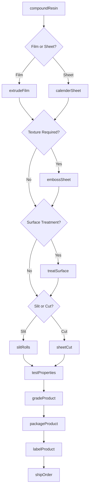
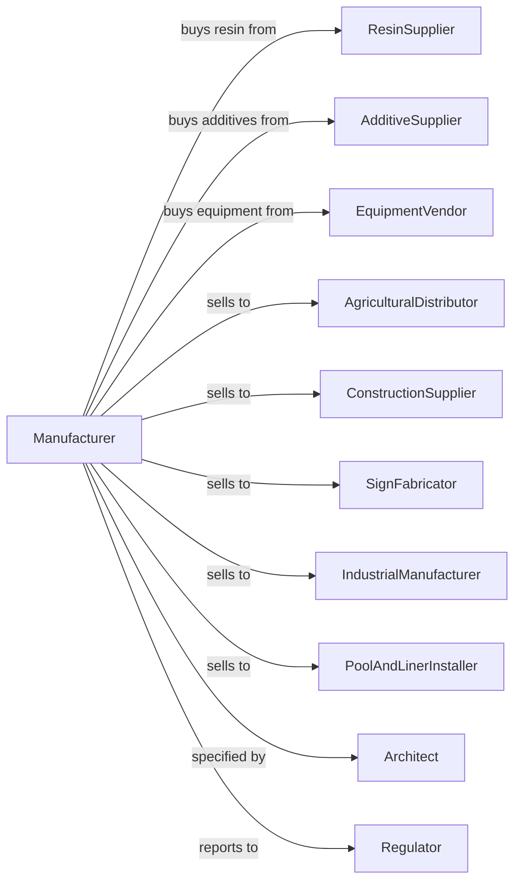

# Unlaminated Plastics Film and Sheet (except Packaging) Manufacturing

> Business-as-Code definition for unlaminated plastics film and sheet production operations. Models the complete manufacturing process from resin extrusion through non-packaging film delivery.

## Overview

This U.S. industry comprises establishments primarily engaged in converting plastics resins into plastics film and unlaminated sheet (except packaging). Products include agricultural films, construction vapor barriers, geomembranes, sign substrates, and industrial sheeting used across diverse applications.

## Actors

| Actor | Description |
|-------|-------------|
| ResinSupplier | Provides polyethylene, PVC, polycarbonate, and specialty resins |
| AdditiveSupplier | Supplies UV stabilizers, flame retardants, and colorants |
| EquipmentVendor | Sells extrusion lines and calendering equipment |
| AgriculturalDistributor | Wholesales greenhouse and mulch films to farms |
| ConstructionSupplier | Distributes vapor barriers and weatherization films |
| SignFabricator | Purchases substrates for signage and graphics |
| IndustrialManufacturer | Uses films for protective and functional applications |
| PoolAndLinerInstaller | Purchases geomembranes for containment applications |
| Architect | Specifies films for building envelope systems |
| Regulator | Oversees environmental and safety compliance |

## Roles

| Role | Description |
|------|-------------|
| PlantManager | Oversees production operations and capacity planning |
| ProcessEngineer | Optimizes extrusion and calendering parameters |
| ExtrusionOperator | Operates film and sheet extrusion equipment |
| CalenderOperator | Runs calendering lines for thick sheet production |
| SlittingOperator | Cuts and rewinds rolls to customer specifications |
| QualityTechnician | Tests film properties and dimensional accuracy |
| ApplicationEngineer | Develops products for specific end-use requirements |
| WarehouseCoordinator | Manages inventory and order fulfillment |

## Entities

| Entity | Description |
|--------|-------------|
| Resin | Base polymer material for extrusion processing |
| Additive | Performance modifier for UV resistance, color, or flame retardancy |
| Film | Thin extruded plastics material under 10 mils |
| Sheet | Thicker extruded plastics material 10 mils and above |
| MasterRoll | Full-width production roll before slitting |
| SlitRoll | Customer-width roll ready for shipment |
| FlatSheet | Cut sheet product for thermoforming or fabrication |
| Die | Extrusion tooling that shapes molten plastic |
| Specification | Technical requirements for thickness, width, and properties |
| Certificate | Documentation of material properties and compliance |

## Actions

| Action | Description |
|--------|-------------|
| compoundResin | Blend base resin with additives for specific properties |
| extrudeFilm | Convert resin through flat die or blown film process |
| calenderSheet | Produce thick sheet through heated roller process |
| embossSheet | Apply surface texture using patterned rollers |
| treatSurface | Apply corona or flame treatment for adhesion |
| slitRolls | Cut master rolls to specified customer widths |
| sheetCut | Cut rolls into flat sheet dimensions |
| testProperties | Measure thickness, tensile, and optical properties |
| gradeProduct | Classify product quality level based on testing |
| packageProduct | Wrap and protect rolls or sheets for shipping |
| labelProduct | Apply identification and specification labels |
| shipOrder | Transport finished products to customer |

## Events

| Event | Description |
|-------|-------------|
| resinCompounded | Additives blended with base resin |
| filmExtruded | Film produced through extrusion process |
| sheetCalendered | Thick sheet produced through calendering |
| surfaceTreated | Corona or flame treatment applied |
| rollsSlit | Master roll cut to customer widths |
| sheetsCut | Roll converted to flat sheet products |
| qualityVerified | Testing confirmed product meets specification |
| qualityDeviation | Product out of specification limits |
| orderPacked | Products packaged and labeled for shipment |
| orderDelivered | Products received by customer |
| productionCompleted | Manufacturing run finished |

## Searches

| Search | Description |
|--------|-------------|
| findProducts | List available films and sheets by type and specification |
| getInventory | Check stock levels for resins and finished goods |
| findOrders | List orders by customer, product, or delivery date |
| getProductionSchedule | View planned and active manufacturing runs |
| checkQuality | Retrieve test data for specific lots and rolls |
| findApplications | List products suitable for specific end uses |
| getEquipmentCapacity | Check available production time by line |
| findCertificates | Retrieve compliance and specification documents |

## Workflow

## Actor Relationships

