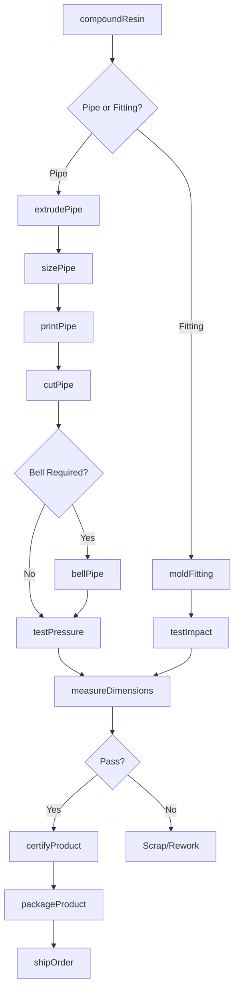
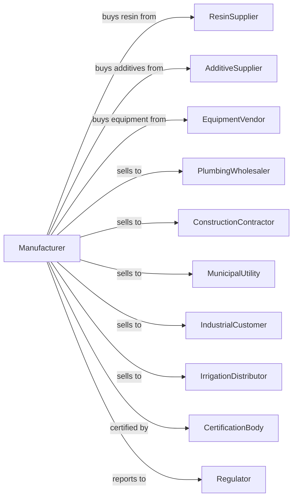

# Plastics Pipe and Pipe Fitting Manufacturing

> Business-as-Code definition for plastics pipe and fitting production operations. Models the complete manufacturing process from resin extrusion through certified pipe system delivery.

## Overview

This U.S. industry comprises establishments primarily engaged in converting plastics resins into plastics pipes and pipe fittings. Products include PVC, CPVC, HDPE, and ABS piping systems used for water distribution, sewer and drainage, gas transmission, and industrial process applications.

## Actors

| Actor | Description |
|-------|-------------|
| ResinSupplier | Provides PVC, HDPE, CPVC, ABS, and other pipe-grade resins |
| AdditiveSupplier | Supplies stabilizers, lubricants, and impact modifiers |
| EquipmentVendor | Sells extrusion lines, molds, and testing equipment |
| PlumbingWholesaler | Distributes pipes and fittings to contractors |
| ConstructionContractor | Purchases piping for building and infrastructure projects |
| MunicipalUtility | Buys large-diameter pipe for water and sewer systems |
| IndustrialCustomer | Uses piping for process and chemical applications |
| IrrigationDistributor | Wholesales agricultural pipe and fittings |
| CertificationBody | Tests and certifies products to NSF, ASTM, or UL standards |
| Regulator | Oversees building codes and material approvals |

## Roles

| Role | Description |
|------|-------------|
| PlantManager | Oversees manufacturing operations and quality systems |
| ExtrusionEngineer | Optimizes pipe extrusion processes and tooling |
| ExtrusionOperator | Runs pipe extrusion lines and monitors output |
| InjectionMoldOperator | Operates fitting molds and monitors quality |
| QualityEngineer | Manages testing protocols and certifications |
| LabTechnician | Performs pressure, impact, and dimensional testing |
| ToolingTechnician | Maintains dies, mandrels, and injection molds |
| ProductionPlanner | Schedules extrusion runs and inventory levels |

## Entities

| Entity | Description |
|--------|-------------|
| Resin | Pipe-grade polymer material for extrusion |
| Compound | Blended resin with stabilizers and modifiers |
| Pipe | Hollow cylindrical product for fluid conveyance |
| Fitting | Connector, elbow, tee, or coupling for pipe systems |
| Die | Extrusion tooling that forms pipe wall and diameter |
| Mandrel | Internal tooling that maintains pipe interior diameter |
| Mold | Injection mold cavity for fitting production |
| Certification | Third-party approval for specific applications |
| Specification | ASTM or other standard defining product requirements |
| TestSample | Product specimen for destructive testing |

## Actions

| Action | Description |
|--------|-------------|
| compoundResin | Blend resin with stabilizers and processing aids |
| extrudePipe | Form pipe through die and sizing equipment |
| sizePipe | Cool and calibrate pipe to exact diameter |
| printPipe | Apply product identification and specification marking |
| cutPipe | Sever continuous extrusion to specified lengths |
| bellPipe | Form socket end for push-fit joining |
| moldFitting | Injection mold fittings from plastics compound |
| testPressure | Verify pipe can withstand rated pressure |
| testImpact | Confirm impact resistance meets specification |
| measureDimensions | Verify wall thickness and diameter tolerances |
| certifyProduct | Obtain third-party certification for standards |
| packageProduct | Bundle pipes and box fittings for shipment |
| shipOrder | Deliver products to distributor or job site |

## Events

| Event | Description |
|-------|-------------|
| compoundBlended | Resin and additives mixed for production |
| pipeExtruded | Continuous pipe produced from extrusion line |
| pipeSized | Diameter calibrated through vacuum sizing |
| pipePrinted | Specification marking applied to surface |
| pipeCut | Individual lengths separated from extrusion |
| pipeBelled | Socket end formed for joining |
| fittingMolded | Fitting produced from injection mold |
| pressureTestPassed | Hydrostatic test confirmed rating |
| certificationObtained | Third-party approval granted |
| orderShipped | Products delivered to customer |
| equipmentMaintained | Tooling serviced or replaced |

## Searches

| Search | Description |
|--------|-------------|
| findPipes | List pipe products by material, diameter, and schedule |
| findFittings | List fittings by type, size, and material |
| getInventory | Check stock levels for pipes and fittings |
| findOrders | List orders by customer, product, or ship date |
| getCertifications | Retrieve certification status by product |
| getTestResults | Access pressure and impact test data |
| findCustomers | List customers by region or application type |
| getProductionSchedule | View planned extrusion and molding runs |

## Workflow

## Actor Relationships

