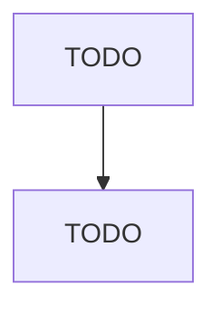

# Laminated Plastics Plate, Sheet (except Packaging), and Shape Manufacturing

> TODO: Business-as-Code definition

## Overview

This industry comprises establishments primarily engaged in laminating plastics profile shapes such as plate, sheet (except packaging), and rod. The lamination process generally involves bonding or impregnating profiles with plastics resins and compressing them under heat. Cross-References. Establishments primarily engaged in--

## Actors

| Actor | Description |
|-------|-------------|
| TODO | TODO |

## Roles

| Role | Description |
|------|-------------|
| TODO | TODO |

## Entities

| Entity | Description |
|--------|-------------|
| TODO | TODO |

## Actions

| Action | Description |
|--------|-------------|
| TODO | TODO |

## Events

| Event | Description |
|-------|-------------|
| TODO | TODO |

## Searches

| Search | Description |
|--------|-------------|
| TODO | TODO |

## Workflow

## Actor Relationships

