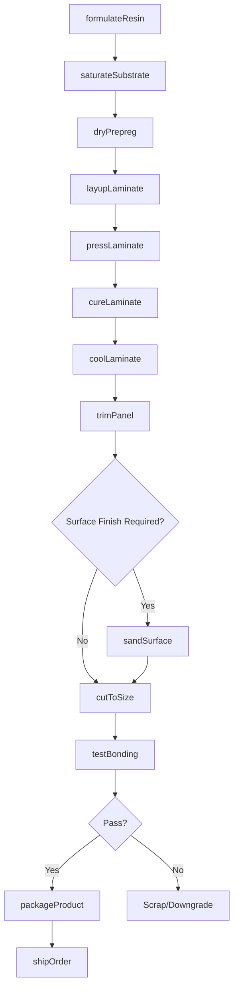
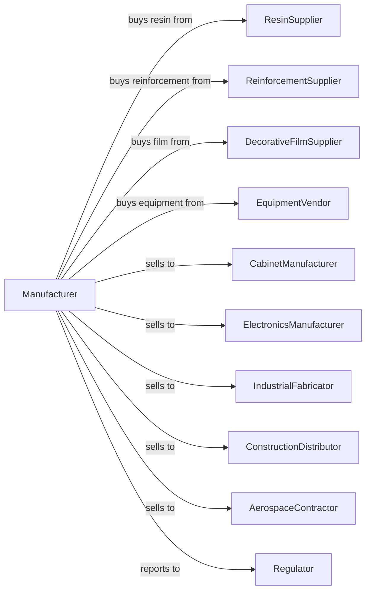

# Laminated Plastics Plate, Sheet (except Packaging), and Shape Manufacturing

> Business-as-Code definition for laminated plastics plate and sheet production operations. Models the complete manufacturing process from lamination through finished industrial material delivery.

## Overview

This industry comprises establishments primarily engaged in laminating plastics profile shapes such as plate, sheet (except packaging), and rod. The lamination process generally involves bonding or impregnating profiles with plastics resins and compressing them under heat. Products include decorative laminates, circuit board substrates, industrial laminates, and reinforced plastics shapes.

## Actors

| Actor | Description |
|-------|-------------|
| ResinSupplier | Provides phenolic, melamine, epoxy, and polyester resins |
| ReinforcementSupplier | Supplies fiberglass, paper, and fabric substrates |
| DecorativeFilmSupplier | Provides printed and solid color decorative papers |
| EquipmentVendor | Sells laminating presses and cutting equipment |
| CabinetManufacturer | Purchases decorative laminates for surfaces |
| ElectronicsManufacturer | Buys PCB substrates and electrical laminates |
| IndustrialFabricator | Uses industrial laminates for structural parts |
| ConstructionDistributor | Wholesales laminates for building applications |
| AerospaceContractor | Purchases high-performance composite laminates |
| Regulator | Oversees safety and environmental compliance |

## Roles

| Role | Description |
|------|-------------|
| PlantManager | Directs manufacturing operations and quality systems |
| ProcessEngineer | Develops lamination cycles and resin formulations |
| PressOperator | Runs laminating presses and monitors cure cycles |
| SaturationOperator | Applies resin to paper or fabric substrates |
| FinishingOperator | Sands, trims, and cuts laminated sheets |
| QualityTechnician | Tests bonding strength and dimensional properties |
| MaterialHandler | Manages resin and substrate inventory |
| MaintenanceTechnician | Maintains presses and material handling systems |

## Entities

| Entity | Description |
|--------|-------------|
| Resin | Thermosetting polymer that bonds and impregnates substrates |
| Substrate | Paper, fabric, or fiberglass layer for reinforcement |
| Prepreg | Resin-saturated substrate ready for lamination |
| Plate | Thick laminated product over 1/8 inch |
| Sheet | Thin laminated product under 1/8 inch |
| Rod | Cylindrical laminated profile shape |
| Tube | Hollow cylindrical laminated shape |
| Press | Equipment that applies heat and pressure for curing |
| CureCycle | Time, temperature, and pressure schedule for lamination |
| Panel | Large-format laminated sheet product |

## Actions

| Action | Description |
|--------|-------------|
| formulateResin | Develop resin mixture for specific application |
| saturateSubstrate | Impregnate paper or fabric with liquid resin |
| dryPrepreg | Remove solvent and advance resin to B-stage |
| layupLaminate | Stack prepreg layers to build up thickness |
| pressLaminate | Apply heat and pressure in laminating press |
| cureLaminate | Complete crosslinking of thermoset resin |
| coolLaminate | Reduce temperature before press opening |
| trimPanel | Cut laminated panels to rough dimensions |
| sandSurface | Smooth surfaces for decorative or bonding finish |
| cutToSize | Fabricate panels to customer dimensions |
| testBonding | Verify interlaminar bond strength |
| packageProduct | Protect finished laminates for shipping |
| shipOrder | Deliver products to customer facility |

## Events

| Event | Description |
|-------|-------------|
| resinFormulated | Custom resin mixture prepared for production |
| substrateSaturated | Prepreg produced from treated substrate |
| prepregDried | Solvent removed and resin advanced |
| laminateLaidUp | Layers stacked and ready for pressing |
| laminatePressed | Heat and pressure applied in press |
| laminateCured | Resin fully crosslinked and hardened |
| panelTrimmed | Rough edges removed from pressed panel |
| panelFinished | Surfaces sanded and ready for cutting |
| qualityApproved | Testing confirmed specification compliance |
| orderShipped | Products delivered to customer |
| pressMaintenanced | Laminating press serviced |

## Searches

| Search | Description |
|--------|-------------|
| findProducts | List laminates by type, thickness, and application |
| getInventory | Check stock of resins, substrates, and finished goods |
| findOrders | List orders by customer, product, or due date |
| getProductionSchedule | View planned press runs and capacity |
| checkQuality | Retrieve test results for specific lots |
| findFormulations | List resin recipes for different applications |
| getEquipmentStatus | Check press availability and maintenance schedule |
| findCertifications | Retrieve compliance documents for products |

## Workflow

## Actor Relationships

