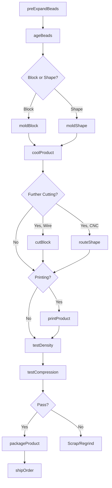
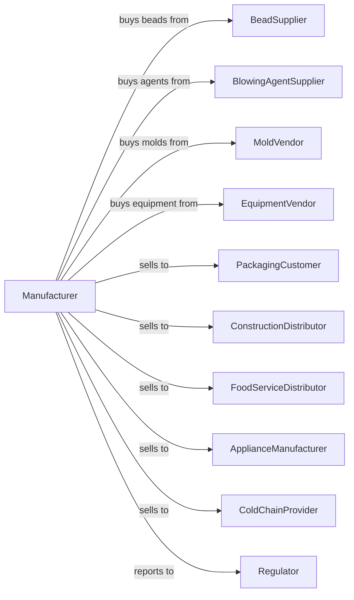

# Polystyrene Foam Product Manufacturing

> Business-as-Code definition for polystyrene foam product production operations. Models the complete manufacturing process from bead expansion through finished foam product delivery.

## Overview

This industry comprises establishments primarily engaged in manufacturing polystyrene foam products. Products include expanded polystyrene (EPS) packaging, insulation boards, disposable food containers, protective packaging shapes, and construction forms used across building, packaging, and consumer goods industries.

## Actors

| Actor | Description |
|-------|-------------|
| BeadSupplier | Provides expandable polystyrene beads and raw material |
| BlowingAgentSupplier | Supplies pentane and other expansion agents |
| MoldVendor | Sells and services block and shape molds |
| EquipmentVendor | Provides expanders, molders, and cutting equipment |
| PackagingCustomer | Purchases protective packaging and cushioning |
| ConstructionDistributor | Buys insulation boards and construction forms |
| FoodServiceDistributor | Wholesales foam cups, containers, and trays |
| ApplianceManufacturer | Uses foam for appliance packaging and insulation |
| ColdChainProvider | Purchases insulated shipping containers |
| Regulator | Oversees environmental and food safety compliance |

## Roles

| Role | Description |
|------|-------------|
| PlantManager | Oversees manufacturing operations and efficiency |
| ProcessEngineer | Optimizes expansion and molding parameters |
| ExpanderOperator | Runs pre-expansion equipment for bead preparation |
| MoldOperator | Operates block and shape molding machines |
| CuttingOperator | Runs hot wire and CNC cutting equipment |
| QualityTechnician | Tests density, dimensions, and compression strength |
| MoldDesigner | Creates custom mold tooling for shapes |
| ShippingCoordinator | Manages logistics for bulky foam products |

## Entities

| Entity | Description |
|--------|-------------|
| Bead | Unexpanded polystyrene raw material |
| ExpandedBead | Pre-expanded beads ready for molding |
| Block | Large rectangular foam block for cutting |
| Shape | Molded foam part with specific geometry |
| InsulationBoard | Flat foam panel for thermal insulation |
| Mold | Tooling cavity that shapes foam products |
| HotWire | Heated cutting element for foam shaping |
| Density | Mass per volume measurement of foam |
| CompressiveStrength | Load-bearing capacity of foam product |
| Container | Foam cup, tray, or clamshell package |

## Actions

| Action | Description |
|--------|-------------|
| preExpandBeads | Heat beads to initial expansion with steam |
| ageBeads | Allow expanded beads to stabilize and cure |
| moldBlock | Fill mold with beads and fuse with steam |
| moldShape | Create custom shapes in specialized molds |
| coolProduct | Remove heat after molding before ejection |
| cutBlock | Slice blocks into sheets or shapes with hot wire |
| routeShape | CNC machine complex geometries from blocks |
| printProduct | Apply customer graphics or identification |
| testDensity | Verify foam density meets specification |
| testCompression | Measure load-bearing capacity |
| packageProduct | Bundle and protect products for shipping |
| shipOrder | Deliver products to customer location |

## Events

| Event | Description |
|-------|-------------|
| beadsExpanded | Pre-expansion completed to target density |
| beadsAged | Stabilization period completed |
| blockMolded | Large block fused and cooled |
| shapeMolded | Custom shape produced from mold |
| blockCut | Hot wire cutting completed |
| shapeRouted | CNC machining finished |
| productPrinted | Graphics applied to surface |
| qualityApproved | Testing confirmed specification compliance |
| qualityFailed | Product out of density or strength limits |
| orderShipped | Products delivered to customer |
| moldChanged | Tooling swapped for different product |

## Searches

| Search | Description |
|--------|-------------|
| findProducts | List foam products by type, density, and size |
| getInventory | Check stock of beads and finished products |
| findOrders | List orders by customer, product, or delivery date |
| getMoldLibrary | List available molds and specifications |
| getProductionSchedule | View planned molding and cutting runs |
| checkQuality | Retrieve density and compression test data |
| findCustomers | List customers by application or volume |
| getCapacity | Calculate available production capacity |

## Workflow

## Actor Relationships

