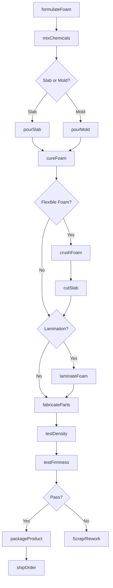
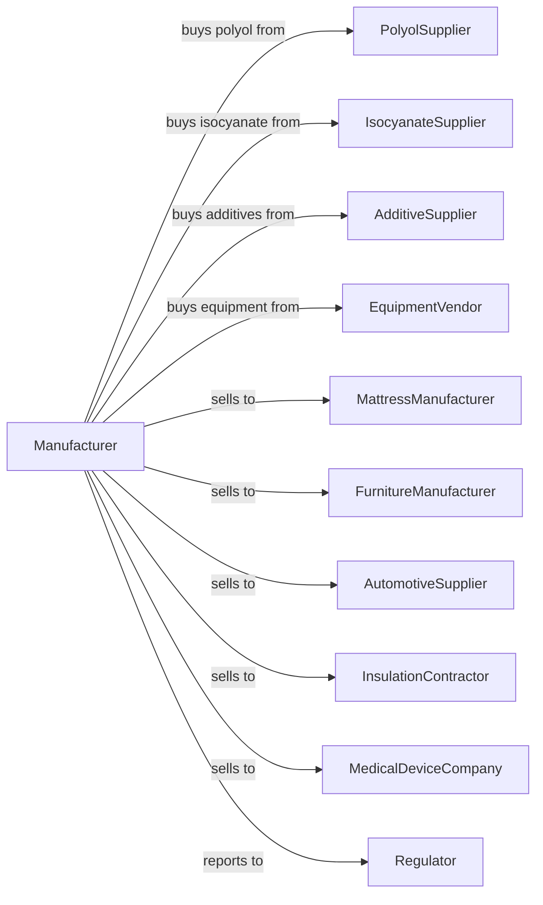

# Urethane and Other Foam Product (except Polystyrene) Manufacturing

> Business-as-Code definition for urethane and specialty foam product production operations. Models the complete manufacturing process from chemical mixing through finished foam product delivery.

## Overview

This industry comprises establishments primarily engaged in manufacturing plastics foam products (except polystyrene). Products include polyurethane flexible foam for bedding and furniture, rigid foam insulation panels, spray foam systems, automotive seating, and specialty foams for medical, filtration, and industrial applications.

## Actors

| Actor | Description |
|-------|-------------|
| PolyolSupplier | Provides polyether and polyester polyols |
| IsocyanateSupplier | Supplies MDI and TDI isocyanate components |
| AdditiveSupplier | Provides surfactants, catalysts, and blowing agents |
| EquipmentVendor | Sells mixing, pouring, and cutting equipment |
| MattressManufacturer | Purchases flexible foam for bedding products |
| FurnitureManufacturer | Buys cushioning foam for seating and upholstery |
| AutomotiveSupplier | Uses foam for seats, headliners, and sound dampening |
| InsulationContractor | Purchases rigid foam boards and spray systems |
| MedicalDeviceCompany | Buys specialty foams for healthcare applications |
| Regulator | Oversees chemical safety and emissions compliance |

## Roles

| Role | Description |
|------|-------------|
| PlantManager | Directs manufacturing operations and safety programs |
| ChemistryEngineer | Develops foam formulations for specific properties |
| MixingOperator | Runs chemical mixing and dispensing equipment |
| PouringOperator | Operates foam pouring lines and mold systems |
| CuttingOperator | Runs horizontal and vertical foam cutting equipment |
| QualityTechnician | Tests density, firmness, and resilience properties |
| SafetyCoordinator | Manages chemical handling and exposure monitoring |
| FabricationOperator | Cuts and assembles foam into finished parts |

## Entities

| Entity | Description |
|--------|-------------|
| Polyol | Hydroxyl-containing component of foam chemistry |
| Isocyanate | Reactive component that crosslinks with polyol |
| Surfactant | Additive that controls cell structure and stability |
| Catalyst | Chemical that controls reaction speed and balance |
| BlowingAgent | Creates gas bubbles for foam expansion |
| Bun | Large continuous slab of flexible foam |
| RigidPanel | Solid foam board for insulation applications |
| MoldedPart | Foam shape produced in closed mold |
| Density | Mass per volume defining foam hardness |
| IFD | Indentation Force Deflection firmness measurement |

## Actions

| Action | Description |
|--------|-------------|
| formulateFoam | Develop polyol and isocyanate blend for specifications |
| mixChemicals | Combine components in metering and mixing equipment |
| pourSlab | Dispense reactive mixture onto moving conveyor |
| pourMold | Fill closed mold with reactive foam mixture |
| cureFoam | Allow exothermic reaction to complete crosslinking |
| crushFoam | Mechanically open cells in flexible foam |
| cutSlab | Slice bun into sheets of specified thickness |
| fabricateParts | Cut foam into shapes for end-use applications |
| laminateFoam | Bond foam to fabric or other substrates |
| testDensity | Measure foam weight per volume |
| testFirmness | Determine IFD or compression values |
| packageProduct | Compress and wrap foam for efficient shipping |
| shipOrder | Deliver products to customer location |

## Events

| Event | Description |
|-------|-------------|
| formulaDeveloped | New foam recipe validated for production |
| chemicalsMixed | Reactive components combined and dispensing |
| slabPoured | Continuous foam bun produced on line |
| moldFilled | Closed mold foam part produced |
| foamCured | Crosslinking reaction completed |
| foamCrushed | Cell opening completed for flexibility |
| slabCut | Bun converted to specified thickness sheets |
| partsFabricated | Finished shapes cut from foam |
| qualityApproved | Testing confirmed specification compliance |
| orderShipped | Products delivered to customer |
| chemicalDelivered | Raw material shipment received |

## Searches

| Search | Description |
|--------|-------------|
| findProducts | List foam products by type, density, and application |
| getInventory | Check stock of chemicals and finished foam |
| findOrders | List orders by customer, product, or due date |
| getFormulations | List foam recipes by application and properties |
| getProductionSchedule | View planned pouring and cutting runs |
| checkQuality | Retrieve density and firmness test data |
| findCustomers | List customers by industry or volume |
| getChemicalUsage | Track polyol and isocyanate consumption |

## Workflow

## Actor Relationships

