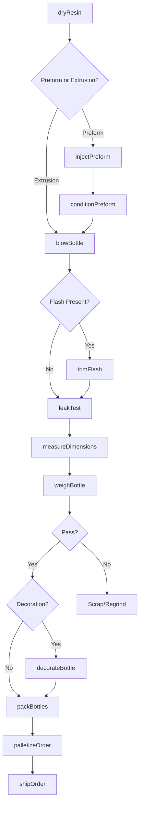
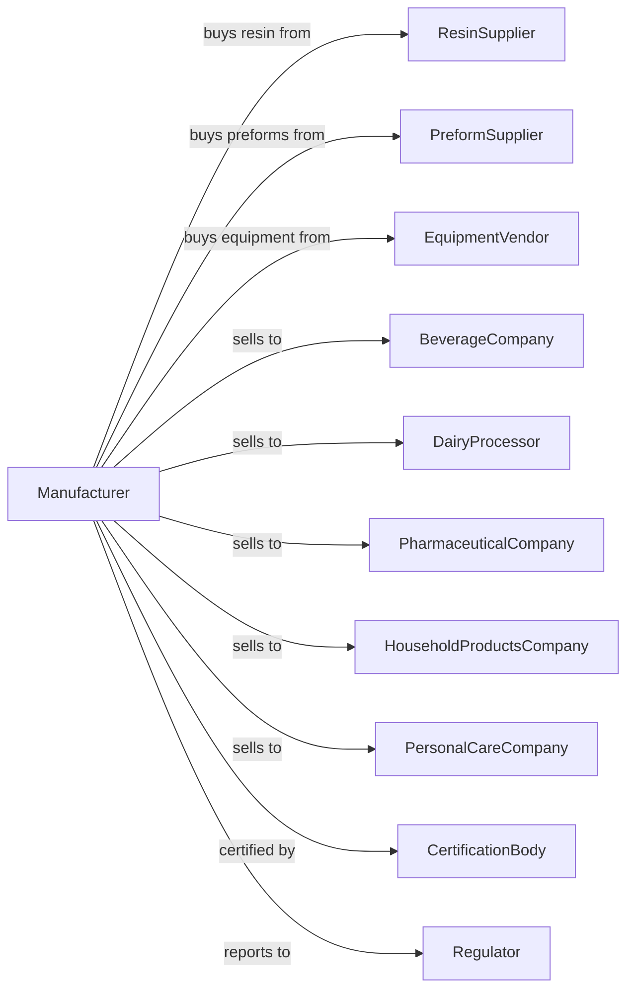

# Plastics Bottle Manufacturing

> Business-as-Code definition for plastics bottle production operations. Models the complete manufacturing process from resin processing through finished bottle delivery.

## Overview

This industry comprises establishments primarily engaged in manufacturing plastics bottles. Products include PET beverage bottles, HDPE dairy and household chemical containers, pharmaceutical bottles, and specialty containers for food, personal care, and industrial applications produced through blow molding and injection stretch blow molding processes.

## Actors

| Actor | Description |
|-------|-------------|
| ResinSupplier | Provides PET, HDPE, PP, and specialty bottle-grade resins |
| PreformSupplier | Supplies pre-made PET preforms for stretch blow molding |
| EquipmentVendor | Sells blow molding machines and auxiliary equipment |
| BeverageCompany | Purchases bottles for soft drinks, water, and juices |
| DairyProcessor | Buys HDPE bottles for milk and dairy products |
| PharmaceuticalCompany | Uses bottles for medications and supplements |
| HouseholdProductsCompany | Purchases containers for cleaners and chemicals |
| PersonalCareCompany | Buys bottles for shampoos, lotions, and cosmetics |
| CertificationBody | Tests and certifies bottles for food and drug contact |
| Regulator | Oversees FDA compliance and recycling requirements |

## Roles

| Role | Description |
|------|-------------|
| PlantManager | Oversees manufacturing operations and customer relationships |
| ProcessEngineer | Optimizes blow molding parameters and cycle times |
| MoldOperator | Runs blow molding machines and monitors quality |
| InjectionOperator | Operates preform injection molding equipment |
| QualityTechnician | Tests bottle dimensions, weight, and performance |
| MoldTechnician | Maintains and repairs blow molds and tooling |
| MaterialHandler | Manages resin inventory and regrind systems |
| ProductionScheduler | Plans production runs and changeovers |

## Entities

| Entity | Description |
|--------|-------------|
| Resin | Bottle-grade polymer pellets for processing |
| Preform | Injection molded tube with finished neck threads |
| Bottle | Hollow container produced through blow molding |
| Mold | Tooling cavity that shapes bottle body and features |
| Neck | Threaded opening designed for closure compatibility |
| Handle | Integrated or applied grip for larger containers |
| Label | Printed sleeve or applied decoration |
| Closure | Cap or lid designed for specific bottle finish |
| Regrind | Reprocessed scrap material for blending |
| Specification | Customer requirements for dimensions and performance |

## Actions

| Action | Description |
|--------|-------------|
| dryResin | Remove moisture from hygroscopic resins before processing |
| injectPreform | Mold PET preforms with finished neck threads |
| conditionPreform | Heat preforms to optimal temperature for stretching |
| blowBottle | Expand heated preform or parison into bottle shape |
| trimFlash | Remove excess material from bottle parting lines |
| leakTest | Verify bottle seal integrity under pressure |
| measureDimensions | Check critical dimensions against specification |
| weighBottle | Confirm bottle weight within tolerance |
| decorateBottle | Apply labels, sleeves, or printing |
| packBottles | Load bottles into cases or bulk containers |
| palletizeOrder | Stack cases onto pallets for shipment |
| shipOrder | Deliver finished bottles to customer |

## Events

| Event | Description |
|-------|-------------|
| resinDried | Moisture removed to acceptable level |
| preformInjected | Preforms produced for stretch blow molding |
| preformConditioned | Preforms heated to stretching temperature |
| bottleBlown | Container formed in blow mold |
| flashTrimmed | Excess material removed from bottle |
| leakTestPassed | Bottle confirmed leak-free |
| dimensionsVerified | Measurements within specification |
| weightConfirmed | Bottle weight within tolerance |
| bottleDecorated | Labels or printing applied |
| orderPacked | Bottles loaded for shipment |
| orderShipped | Products delivered to customer |
| moldChanged | Tooling swapped for different bottle |

## Searches

| Search | Description |
|--------|-------------|
| findBottles | List bottle products by size, material, and neck finish |
| getInventory | Check stock of resins, preforms, and finished bottles |
| findOrders | List orders by customer, product, or ship date |
| getMoldLibrary | List available molds and specifications |
| getProductionSchedule | View planned molding runs by machine |
| checkQuality | Retrieve test data for specific lots |
| findCustomers | List customers by industry or volume |
| getCapacity | Calculate available production hours by machine |

## Workflow

## Actor Relationships

