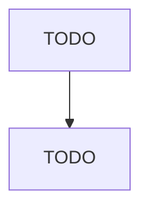

# All Other Plastics Product Manufacturing

> TODO: Business-as-Code definition

## Overview

This U.S. industry comprises establishments primarily engaged in manufacturing plastics products (except film, sheet, bags, profile shapes, pipes, pipe fittings, laminates, foam products, bottles, plumbing fixtures, and hoses). Illustrative Examples: Inflatable plastics swimming pool rafts and similar flotation devices manufacturing Plastics air mattresses manufacturing Plastics bottle caps and lids manufacturing Plastics bowls and bowl covers manufacturing Plastics clothes hangers manufacturing

## Actors

| Actor | Description |
|-------|-------------|
| TODO | TODO |

## Roles

| Role | Description |
|------|-------------|
| TODO | TODO |

## Entities

| Entity | Description |
|--------|-------------|
| TODO | TODO |

## Actions

| Action | Description |
|--------|-------------|
| TODO | TODO |

## Events

| Event | Description |
|-------|-------------|
| TODO | TODO |

## Searches

| Search | Description |
|--------|-------------|
| TODO | TODO |

## Workflow

## Actor Relationships

