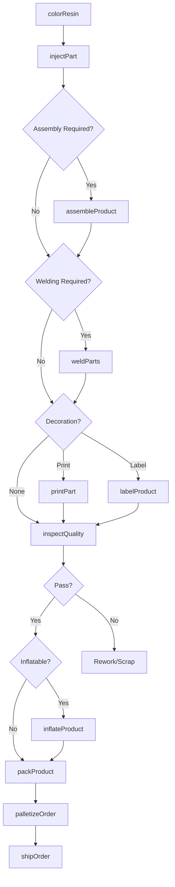
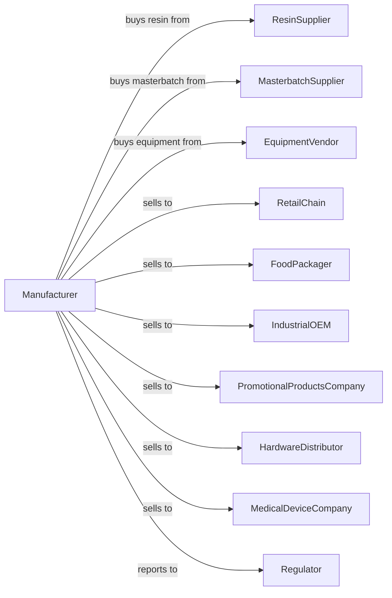

# All Other Plastics Product Manufacturing

> Business-as-Code definition for miscellaneous plastics product production operations. Models the complete manufacturing process from resin processing through diverse finished product delivery.

## Overview

This U.S. industry comprises establishments primarily engaged in manufacturing plastics products (except film, sheet, bags, profile shapes, pipes, pipe fittings, laminates, foam products, bottles, plumbing fixtures, and hoses). Illustrative Examples: Inflatable plastics swimming pool rafts and similar flotation devices manufacturing, plastics air mattresses, bottle caps and lids, bowls and bowl covers, clothes hangers, and diverse molded, extruded, and fabricated plastics goods.

## Actors

| Actor | Description |
|-------|-------------|
| ResinSupplier | Provides polyethylene, polypropylene, ABS, and specialty resins |
| MasterbatchSupplier | Supplies color and additive concentrates |
| EquipmentVendor | Sells injection molding, extrusion, and assembly equipment |
| RetailChain | Purchases housewares and consumer products |
| FoodPackager | Buys closures, caps, and food-contact products |
| IndustrialOEM | Uses custom molded components in products |
| PromotionalProductsCompany | Orders branded and customized plastics items |
| HardwareDistributor | Wholesales fasteners and hardware items |
| MedicalDeviceCompany | Purchases precision molded medical components |
| Regulator | Oversees product safety and environmental compliance |

## Roles

| Role | Description |
|------|-------------|
| PlantManager | Oversees diverse manufacturing operations |
| ToolingEngineer | Designs and maintains injection molds |
| InjectionMoldOperator | Runs molding machines and monitors quality |
| AssemblyOperator | Combines components into finished products |
| PrintingOperator | Applies decoration through pad printing or hot stamping |
| QualityTechnician | Inspects parts for defects and dimensions |
| ProductionPlanner | Schedules diverse product runs |
| PackagingOperator | Packs finished goods for retail or bulk shipment |

## Entities

| Entity | Description |
|--------|-------------|
| Resin | Base polymer material for molding and extrusion |
| Masterbatch | Concentrated color or additive for blending |
| Mold | Tooling cavity that shapes molded parts |
| Part | Individual molded component |
| Assembly | Finished product combining multiple parts |
| Closure | Cap, lid, or seal for container finishing |
| Hanger | Clothes hanging device in various styles |
| Container | Bowl, box, or storage product |
| Flotation | Inflatable or foam recreational product |
| Fastener | Clip, snap, or connecting hardware |

## Actions

| Action | Description |
|--------|-------------|
| colorResin | Blend masterbatch with base resin |
| injectPart | Mold component in injection molding machine |
| assembleProduct | Combine parts into finished assembly |
| weldParts | Join plastics parts using ultrasonic or heat welding |
| printPart | Apply graphics using pad printing or hot stamp |
| labelProduct | Attach identification or branding labels |
| inflateProduct | Test or package inflatable items |
| inspectQuality | Check parts for defects and dimensions |
| packProduct | Package finished goods for shipment |
| palletizeOrder | Stack packed cases for shipping |
| shipOrder | Deliver products to customer |
| changeMold | Swap tooling for different product |

## Events

| Event | Description |
|-------|-------------|
| resinColored | Color blended with base material |
| partInjected | Component molded successfully |
| productAssembled | Parts combined into finished product |
| partsWelded | Components joined permanently |
| partPrinted | Decoration applied to surface |
| productLabeled | Branding or identification attached |
| productInflated | Inflatable tested or packaged |
| qualityApproved | Inspection confirmed specification compliance |
| qualityRejected | Defects detected requiring action |
| orderPacked | Products packaged for shipment |
| orderShipped | Products delivered to customer |
| moldChanged | Tooling swapped for production change |

## Searches

| Search | Description |
|--------|-------------|
| findProducts | List products by type, material, or application |
| getInventory | Check stock of resins and finished products |
| findOrders | List orders by customer, product, or due date |
| getMoldLibrary | List available molds and specifications |
| getProductionSchedule | View planned molding and assembly runs |
| checkQuality | Retrieve inspection data for specific lots |
| findCustomers | List customers by industry or volume |
| getCapacity | Calculate available machine hours |

## Workflow

## Actor Relationships

