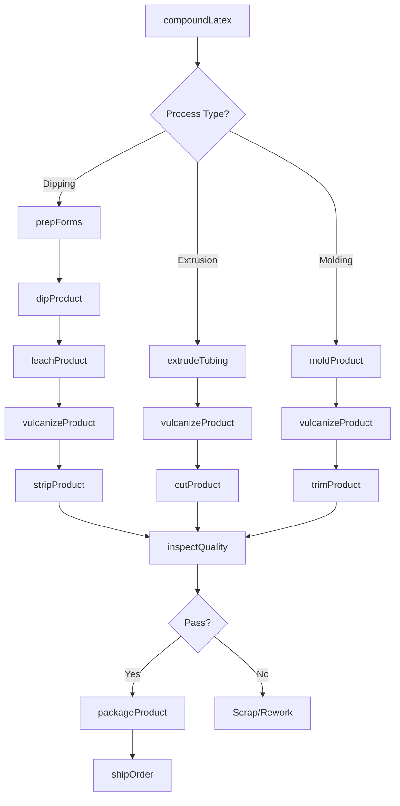
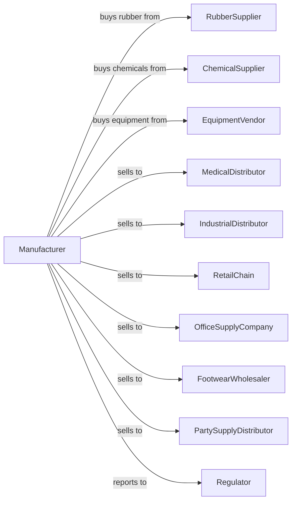

# All Other Rubber Product Manufacturing

> Business-as-Code definition for miscellaneous rubber product production operations. Models the complete manufacturing process from rubber compounding through diverse finished product delivery.

## Overview

This U.S. industry comprises establishments primarily engaged in manufacturing rubber products (except tires; hoses and belting; and molded, extruded, and lathe-cut rubber goods for mechanical applications) from natural and synthetic rubber. Products include rubber tubing, balloons, rubber bands, erasers, rubber gloves, rubber footwear, and prophylactic devices.

## Actors

| Actor | Description |
|-------|-------------|
| RubberSupplier | Provides natural latex and synthetic rubber polymers |
| ChemicalSupplier | Supplies vulcanizing agents, antioxidants, and colorants |
| EquipmentVendor | Sells dipping, molding, and processing equipment |
| MedicalDistributor | Purchases gloves and medical rubber products |
| IndustrialDistributor | Wholesales tubing, bands, and industrial products |
| RetailChain | Buys consumer rubber products for retail sale |
| OfficeSupplyCompany | Purchases rubber bands and erasers |
| FootwearWholesaler | Distributes rubber footwear products |
| PartySupplyDistributor | Buys balloons and novelty rubber items |
| Regulator | Oversees FDA compliance and product safety |

## Roles

| Role | Description |
|------|-------------|
| PlantManager | Directs manufacturing operations and quality systems |
| LatexEngineer | Develops latex compound formulations |
| DippingOperator | Runs latex dipping lines for gloves and balloons |
| ExtrusionOperator | Operates tubing extrusion equipment |
| MoldingOperator | Runs molding presses for formed products |
| VulcanizingOperator | Operates curing ovens and autoclaves |
| PackagingOperator | Packs finished goods for shipment |
| QualityTechnician | Tests product properties and dimensions |

## Entities

| Entity | Description |
|--------|-------------|
| Latex | Natural rubber in liquid emulsion form |
| SyntheticRubber | Manufactured polymer for specific applications |
| Compound | Blended rubber mixture with additives |
| Glove | Hand covering formed by dipping process |
| Tubing | Flexible hollow rubber profile |
| Balloon | Inflatable rubber product |
| Band | Elastic loop for holding items together |
| Eraser | Rubber product for removing pencil marks |
| Footwear | Rubber boots, soles, or overshoes |
| Form | Shaped mold for dipping process |

## Actions

| Action | Description |
|--------|-------------|
| compoundLatex | Blend latex with vulcanizing agents and stabilizers |
| prepForms | Clean and coat dipping forms with coagulant |
| dipProduct | Immerse forms in latex to build up layer |
| leachProduct | Remove water-soluble proteins from dipped items |
| vulcanizeProduct | Cure rubber through heat treatment |
| stripProduct | Remove finished item from dipping form |
| extrudeTubing | Form rubber tubing through extrusion die |
| cutProduct | Sever continuous production into units |
| moldProduct | Form shaped products in compression molds |
| inspectQuality | Check products for defects and dimensions |
| packageProduct | Pack finished goods for distribution |
| shipOrder | Deliver products to customer |

## Events

| Event | Description |
|-------|-------------|
| latexCompounded | Rubber mixture prepared for processing |
| formsPrepared | Dipping forms cleaned and coated |
| productDipped | Latex layer built on form |
| productLeached | Proteins removed from dipped item |
| productVulcanized | Curing completed |
| productStripped | Finished item removed from form |
| tubingExtruded | Continuous tubing produced |
| productCut | Items separated from production |
| productMolded | Shaped item formed in mold |
| qualityApproved | Inspection confirmed specification compliance |
| orderPacked | Products packaged for shipment |
| orderShipped | Products delivered to customer |

## Searches

| Search | Description |
|--------|-------------|
| findProducts | List products by type, material, and application |
| getInventory | Check stock of latex, compounds, and finished goods |
| findOrders | List orders by customer, product, or ship date |
| getProductionSchedule | View planned dipping and processing runs |
| checkQuality | Retrieve test data for specific batches |
| findCustomers | List customers by channel or volume |
| getFormLibrary | List available dipping forms and sizes |
| getCapacity | Calculate available production capacity |

## Workflow

## Actor Relationships

